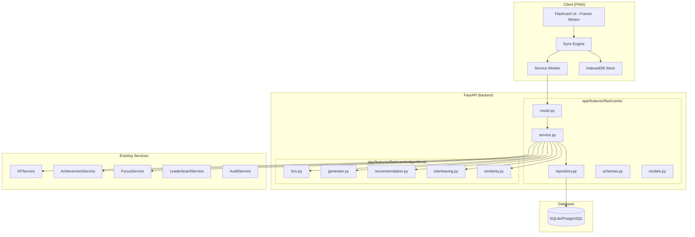
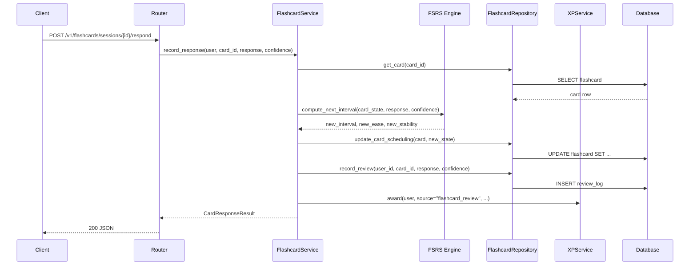
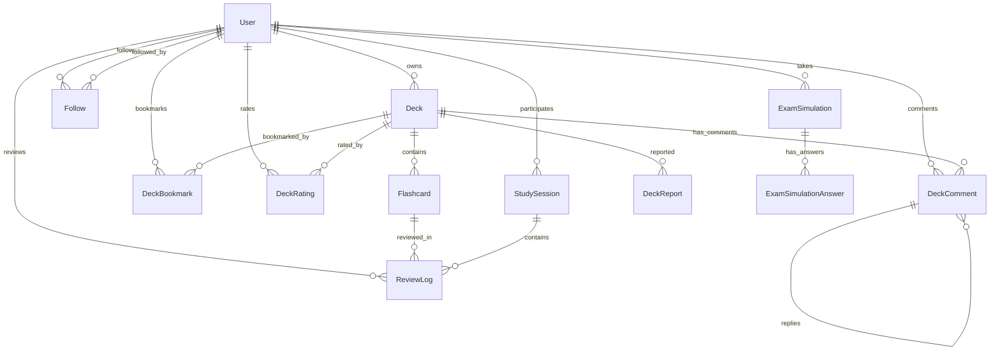
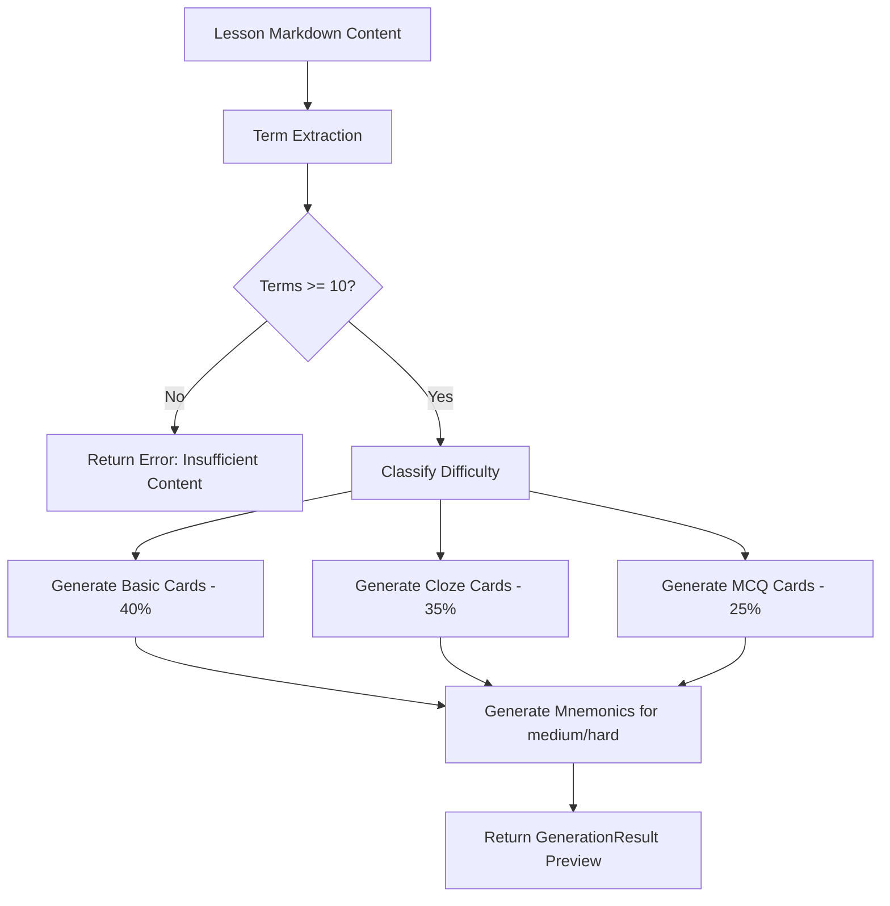

# Design Document: Flashcard Learning Ecosystem

## Overview

This design describes a comprehensive flashcard and adaptive study ecosystem for CSNexus. The system spans seven phases: core CRUD, spaced repetition (FSRS-inspired), deterministic pseudo-AI generation, social marketplace, gamification integration, offline/PWA support, and analytics/admin tooling.

The backend is a single FastAPI feature slice at `app/features/flashcards/` following the existing feature-sliced architecture. Algorithm modules (FSRS scheduling, card generation, recommendations) live under `app/features/flashcards/algorithms/`. The frontend offline layer (IndexedDB, sync engine, service worker) is a client-side concern documented here for API contract clarity but implemented separately.

### Key Design Decisions

1. **Single feature slice** — All flashcard functionality lives under one feature directory rather than splitting into multiple features. The domain is cohesive (decks → cards → reviews → analytics) and splitting would create excessive cross-feature coupling.
2. **Algorithm isolation** — FSRS, generator, and recommendation logic are pure functions in `algorithms/` with no DB access. Services orchestrate between repositories and algorithms.
3. **Soft-delete everywhere** — Decks, cards, and comments use `deleted_at` timestamps. Queries filter on `deleted_at IS NULL` by default.
4. **Deterministic pseudo-AI** — No paid LLM APIs. All generation uses regex, templates, word frequency lists, and heuristic rules.
5. **XP integration via existing service** — Flashcard XP awards go through `XPService.award()` with `client_event_id` for idempotency, matching the existing pattern.

## Architecture

### High-Level System Diagram



### Request Flow



## Components and Interfaces

### File Structure

```
app/features/flashcards/
├── __init__.py
├── models.py              # ORM models: Deck, Flashcard, ReviewLog, StudySession, etc.
├── schemas.py             # Pydantic schemas for all endpoints
├── repository.py          # DB access layer
├── service.py             # Business logic orchestrator
├── router.py              # FastAPI endpoints
└── algorithms/
    ├── __init__.py
    ├── fsrs.py            # FSRS-inspired spaced repetition engine
    ├── generator.py       # Pseudo-AI card generation from lesson content
    ├── recommendation.py  # Study recommendations engine
    ├── interleaving.py    # Category interleaving logic
    └── similarity.py      # Levenshtein distance for typed answer comparison
```

### Core Service Interface

```python
class FlashcardService:
    """Orchestrates all flashcard business logic."""

    def __init__(
        self,
        *,
        flashcard_repo: FlashcardRepository,
        xp_service: XPService,
        achievement_service: AchievementService,
        focus_service: FocusService | None = None,
    ) -> None: ...

    # --- Deck CRUD ---
    def create_deck(self, user: User, payload: DeckCreate) -> Deck: ...
    def update_deck(self, user: User, deck_id: int, payload: DeckUpdate) -> Deck: ...
    def delete_deck(self, user: User, deck_id: int) -> None: ...
    def list_user_decks(self, user: User, filters: DeckFilters, pagination: PaginationParams) -> tuple[list[Deck], int]: ...
    def duplicate_deck(self, user: User, deck_id: int) -> Deck: ...

    # --- Flashcard CRUD ---
    def create_flashcard(self, user: User, deck_id: int, payload: FlashcardCreate) -> Flashcard: ...
    def update_flashcard(self, user: User, card_id: int, payload: FlashcardUpdate) -> Flashcard: ...
    def delete_flashcard(self, user: User, card_id: int) -> None: ...

    # --- Study Sessions ---
    def start_study_session(self, user: User, payload: StudySessionStart) -> StudySession: ...
    def record_response(self, user: User, session_id: int, payload: CardResponse) -> CardResponseResult: ...
    def end_study_session(self, user: User, session_id: int) -> StudySessionSummary: ...

    # --- Review Queue ---
    def get_daily_queue(self, user: User, filters: QueueFilters) -> list[Flashcard]: ...
    def get_queue_summary(self, user: User) -> QueueSummary: ...

    # --- Marketplace ---
    def search_marketplace(self, query: MarketplaceSearch, pagination: PaginationParams) -> tuple[list[Deck], int]: ...
    def rate_deck(self, user: User, deck_id: int, rating: int) -> DeckRating: ...
    def clone_deck(self, user: User, deck_id: int) -> Deck: ...

    # --- Analytics ---
    def get_retention_analytics(self, user: User, filters: AnalyticsFilters) -> RetentionAnalytics: ...
    def get_user_dashboard(self, user: User) -> UserDashboard: ...

    # --- Exam Simulation ---
    def start_exam_simulation(self, user: User, payload: ExamSimulationStart) -> ExamSimulation: ...
    def submit_exam_answer(self, user: User, sim_id: int, payload: ExamAnswer) -> None: ...
    def complete_exam_simulation(self, user: User, sim_id: int) -> ExamSimulationResult: ...
```

### FSRS Engine Interface (Pure Functions)

```python
# app/features/flashcards/algorithms/fsrs.py

@dataclass(frozen=True)
class CardState:
    """Immutable snapshot of a card's scheduling parameters."""
    ease_factor: float        # 1.3–3.5, default 2.5
    retention_score: float    # 0.0–1.0
    memory_stability: float   # days, min 0.1, default 1.0
    review_interval: int      # days, 1–365, default 1
    lapse_count: int          # default 0
    last_review_date: date | None

class ConfidenceLevel(str, Enum):
    GUESSED = "guessed"
    UNSURE = "unsure"
    CONFIDENT = "confident"
    MASTERED = "mastered"

class ResponseType(str, Enum):
    FORGOT = "forgot"
    REMEMBERED = "remembered"
    SKIPPED = "skipped"

@dataclass(frozen=True)
class SchedulingResult:
    """Output of compute_next_interval — new card state after a review."""
    ease_factor: float
    retention_score: float
    memory_stability: float
    review_interval: int
    lapse_count: int
    next_review_date: date

def compute_next_interval(
    state: CardState,
    response: ResponseType,
    confidence: ConfidenceLevel,
    today: date,
) -> SchedulingResult:
    """Pure function: given current state + user response, compute next state.

    Deterministic: same inputs always produce same outputs (Req 5.10).
    """
    ...

def compute_retention_score(
    memory_stability: float,
    elapsed_days: float,
) -> float:
    """retention_score = e^(-elapsed_days / memory_stability) (Req 5.6)."""
    ...

def compute_mastery_percentage(
    successful_reviews: int,
    total_reviews: int,
    retention_score: float,
) -> float:
    """mastery = (successful / total) * retention_score * 100, capped at 100 (Req 5.7)."""
    ...
```

### Pseudo-AI Generator Interface

```python
# app/features/flashcards/algorithms/generator.py

@dataclass
class GeneratedCard:
    """A single card produced by the generator, pending user approval."""
    front: str
    back: str
    card_type: CardType
    difficulty: Difficulty  # easy, medium, hard
    mnemonic: str | None
    source_term: str

@dataclass
class GenerationResult:
    """Complete output of a generation run."""
    cards: list[GeneratedCard]
    terms_extracted: int
    lesson_id: int

def generate_flashcards(
    lesson_content: str,
    lesson_id: int,
    requested_card_count: int = 25,
    word_frequency_list: set[str] | None = None,
) -> GenerationResult:
    """Extract terms and generate cards from lesson markdown content.

    Uses regex patterns for term extraction:
    - "Term: Definition" and "Term — Definition"
    - Bold markdown (**term**) followed by definition sentence
    - Italic markdown (*term*) followed by definition sentence
    - Markdown table rows (first column = term)

    Card distribution target: 40% basic, 35% cloze, 25% MCQ.
    Returns error indication if fewer than 10 terms extracted (Req 11.9).
    """
    ...
```

### Interleaving Algorithm Interface

```python
# app/features/flashcards/algorithms/interleaving.py

def interleave_cards(
    cards: list[Flashcard],
    max_consecutive_same_category: int = 3,
) -> list[Flashcard]:
    """Reorder cards so no more than 3 consecutive share the same category.

    Maintains proportional representation of categories from the input.
    Pure function — does not modify the input list.
    """
    ...
```

### Similarity Engine Interface

```python
# app/features/flashcards/algorithms/similarity.py

@dataclass(frozen=True)
class AnswerComparison:
    is_correct: bool
    similarity_score: float  # 0.0–1.0 Levenshtein ratio
    correct_answer: str

def compare_typed_answer(
    user_answer: str,
    correct_answer: str,
    strictness: Strictness = Strictness.CONTAINS,
) -> AnswerComparison:
    """Compare user's typed answer against the correct answer.

    Strictness modes:
    - EXACT: case-insensitive exact match
    - CONTAINS: correct answer appears within user answer (case-insensitive)
    - FUZZY: Levenshtein ratio >= 0.8 considered correct
    """
    ...
```

### API Endpoints (Router)

| Method | Path | Description | Auth |
|--------|------|-------------|------|
| POST | `/v1/flashcards/decks` | Create deck | Required |
| GET | `/v1/flashcards/decks` | List user's decks | Required |
| GET | `/v1/flashcards/decks/{id}` | Get deck detail | Owner or public |
| PATCH | `/v1/flashcards/decks/{id}` | Update deck | Owner |
| DELETE | `/v1/flashcards/decks/{id}` | Soft-delete deck | Owner |
| POST | `/v1/flashcards/decks/{id}/:duplicate` | Duplicate deck | Required |
| POST | `/v1/flashcards/decks/{id}/cards` | Create card in deck | Owner |
| GET | `/v1/flashcards/decks/{id}/cards` | List cards in deck | Owner or public |
| PATCH | `/v1/flashcards/cards/{id}` | Update card | Owner |
| DELETE | `/v1/flashcards/cards/{id}` | Soft-delete card | Owner |
| POST | `/v1/flashcards/sessions` | Start study session | Required |
| POST | `/v1/flashcards/sessions/{id}/respond` | Record card response | Required |
| POST | `/v1/flashcards/sessions/{id}/:end` | End study session | Required |
| GET | `/v1/flashcards/queue` | Get daily review queue | Required |
| GET | `/v1/flashcards/queue/summary` | Get queue summary | Required |
| GET | `/v1/flashcards/marketplace` | Browse/search public decks | Public |
| POST | `/v1/flashcards/marketplace/{id}/:clone` | Clone public deck | Required |
| POST | `/v1/flashcards/marketplace/{id}/ratings` | Rate a deck | Required |
| GET | `/v1/flashcards/marketplace/{id}/comments` | List deck comments | Public |
| POST | `/v1/flashcards/marketplace/{id}/comments` | Post comment | Required |
| DELETE | `/v1/flashcards/comments/{id}` | Delete own comment | Owner |
| GET | `/v1/flashcards/creators/{id}` | Get creator profile | Public |
| POST | `/v1/flashcards/creators/{id}/:follow` | Follow creator | Required |
| DELETE | `/v1/flashcards/creators/{id}/:follow` | Unfollow creator | Required |
| GET | `/v1/flashcards/feed` | Get followed creators' decks | Required |
| POST | `/v1/flashcards/generate` | Generate cards from lesson | Required |
| GET | `/v1/flashcards/recommendations` | Get study recommendations | Required |
| GET | `/v1/flashcards/analytics/retention` | Retention analytics | Required |
| GET | `/v1/flashcards/analytics/dashboard` | User dashboard | Required |
| GET | `/v1/flashcards/analytics/heatmap` | Retention heatmap | Required |
| POST | `/v1/flashcards/exam-simulations` | Start exam simulation | Required |
| POST | `/v1/flashcards/exam-simulations/{id}/answer` | Submit answer | Required |
| POST | `/v1/flashcards/exam-simulations/{id}/:complete` | Complete simulation | Required |
| GET | `/v1/flashcards/admin/analytics` | Admin analytics | Admin |
| GET | `/v1/flashcards/admin/moderation` | Moderation queue | Admin |
| POST | `/v1/flashcards/admin/decks/{id}/:flag` | Flag deck for removal | Admin |
| POST | `/v1/flashcards/admin/decks/{id}/:feature` | Toggle featured | Admin |
| POST | `/v1/flashcards/sync` | Batch sync offline reviews | Required |

## Data Models

### Entity Relationship Diagram



### SQLAlchemy Models

#### Deck

```python
class DeckVisibility(str, Enum):
    PRIVATE = "private"
    PUBLIC = "public"
    UNLISTED = "unlisted"
    REMOVED = "removed"  # Admin moderation

class DeckCategory(str, Enum):
    VERBAL = "verbal"
    NUMERICAL = "numerical"
    ANALYTICAL = "analytical"

class Deck(Base):
    __tablename__ = "flashcard_decks"

    id: Mapped[int] = mapped_column(Integer, primary_key=True, index=True)
    owner_id: Mapped[int] = mapped_column(Integer, ForeignKey("users.id", ondelete="CASCADE"), nullable=False, index=True)
    title: Mapped[str] = mapped_column(String(255), nullable=False)
    description: Mapped[str | None] = mapped_column(Text, nullable=True)
    category: Mapped[str] = mapped_column(String(16), nullable=False)
    visibility: Mapped[str] = mapped_column(String(16), nullable=False, default="private", server_default="private")
    tags: Mapped[str | None] = mapped_column(Text, nullable=True)  # JSON array stored as text
    clone_count: Mapped[int] = mapped_column(Integer, nullable=False, default=0, server_default="0")
    bookmark_count: Mapped[int] = mapped_column(Integer, nullable=False, default=0, server_default="0")
    average_rating: Mapped[float | None] = mapped_column(Float, nullable=True)
    rating_count: Mapped[int] = mapped_column(Integer, nullable=False, default=0, server_default="0")
    is_featured: Mapped[bool] = mapped_column(Boolean, nullable=False, default=False, server_default="0")
    cloned_from_deck_id: Mapped[int | None] = mapped_column(Integer, nullable=True)
    cloned_from_user_id: Mapped[int | None] = mapped_column(Integer, nullable=True)
    deleted_at: Mapped[datetime | None] = mapped_column(DateTime(timezone=True), nullable=True)
    created_at: Mapped[datetime] = mapped_column(DateTime(timezone=True), server_default=func.now(), nullable=False)
    updated_at: Mapped[datetime] = mapped_column(DateTime(timezone=True), server_default=func.now(), onupdate=func.now(), nullable=False)

    __table_args__ = (
        UniqueConstraint("owner_id", "title", name="uq_flashcard_decks_owner_title"),
        CheckConstraint("category IN ('verbal', 'numerical', 'analytical')", name="ck_flashcard_decks_category"),
        CheckConstraint("visibility IN ('private', 'public', 'unlisted', 'removed')", name="ck_flashcard_decks_visibility"),
    )
```

#### Flashcard

```python
class CardType(str, Enum):
    BASIC = "basic"
    REVERSE = "reverse"
    CLOZE = "cloze"
    MCQ = "mcq"
    TRUE_FALSE = "true_false"
    MATCHING = "matching"
    SEQUENCE = "sequence"

class Flashcard(Base):
    __tablename__ = "flashcards"

    id: Mapped[int] = mapped_column(Integer, primary_key=True, index=True)
    deck_id: Mapped[int] = mapped_column(Integer, ForeignKey("flashcard_decks.id", ondelete="CASCADE"), nullable=False, index=True)
    front: Mapped[str] = mapped_column(Text, nullable=False)  # 1–1000 chars
    back: Mapped[str] = mapped_column(Text, nullable=False)   # 1–2000 chars
    card_type: Mapped[str] = mapped_column(String(16), nullable=False)
    hints: Mapped[str | None] = mapped_column(Text, nullable=True)  # JSON array
    tags: Mapped[str | None] = mapped_column(Text, nullable=True)   # JSON array
    explanation: Mapped[str | None] = mapped_column(Text, nullable=True)
    # FSRS scheduling fields
    ease_factor: Mapped[float] = mapped_column(Float, nullable=False, default=2.5, server_default="2.5")
    retention_score: Mapped[float] = mapped_column(Float, nullable=False, default=0.0, server_default="0.0")
    memory_stability: Mapped[float] = mapped_column(Float, nullable=False, default=1.0, server_default="1.0")
    review_interval: Mapped[int] = mapped_column(Integer, nullable=False, default=1, server_default="1")
    lapse_count: Mapped[int] = mapped_column(Integer, nullable=False, default=0, server_default="0")
    mastery_percentage: Mapped[float] = mapped_column(Float, nullable=False, default=0.0, server_default="0.0")
    next_review_date: Mapped[date | None] = mapped_column(Date, nullable=True)
    last_review_date: Mapped[date | None] = mapped_column(Date, nullable=True)
    total_reviews: Mapped[int] = mapped_column(Integer, nullable=False, default=0, server_default="0")
    successful_reviews: Mapped[int] = mapped_column(Integer, nullable=False, default=0, server_default="0")
    is_graduated: Mapped[bool] = mapped_column(Boolean, nullable=False, default=False, server_default="0")
    is_bookmarked: Mapped[bool] = mapped_column(Boolean, nullable=False, default=False, server_default="0")
    deleted_at: Mapped[datetime | None] = mapped_column(DateTime(timezone=True), nullable=True)
    created_at: Mapped[datetime] = mapped_column(DateTime(timezone=True), server_default=func.now(), nullable=False)
    updated_at: Mapped[datetime] = mapped_column(DateTime(timezone=True), server_default=func.now(), onupdate=func.now(), nullable=False)

    __table_args__ = (
        CheckConstraint("card_type IN ('basic', 'reverse', 'cloze', 'mcq', 'true_false', 'matching', 'sequence')", name="ck_flashcards_card_type"),
        CheckConstraint("ease_factor >= 1.3 AND ease_factor <= 3.5", name="ck_flashcards_ease_factor"),
        CheckConstraint("memory_stability >= 0.1", name="ck_flashcards_memory_stability"),
        CheckConstraint("review_interval >= 1 AND review_interval <= 365", name="ck_flashcards_review_interval"),
        Index("ix_flashcards_deck_next_review", "deck_id", "next_review_date"),
    )
```

#### ReviewLog

```python
class ReviewLog(Base):
    """Append-only log of every card review event."""
    __tablename__ = "flashcard_review_logs"

    id: Mapped[int] = mapped_column(Integer, primary_key=True, index=True)
    user_id: Mapped[int] = mapped_column(Integer, ForeignKey("users.id", ondelete="CASCADE"), nullable=False, index=True)
    card_id: Mapped[int] = mapped_column(Integer, ForeignKey("flashcards.id", ondelete="CASCADE"), nullable=False, index=True)
    session_id: Mapped[int | None] = mapped_column(Integer, ForeignKey("flashcard_study_sessions.id", ondelete="SET NULL"), nullable=True)
    response_type: Mapped[str] = mapped_column(String(16), nullable=False)  # forgot, remembered, skipped
    confidence_level: Mapped[str | None] = mapped_column(String(16), nullable=True)  # guessed, unsure, confident, mastered
    # Snapshot of scheduling state at time of review (for analytics)
    ease_factor_before: Mapped[float] = mapped_column(Float, nullable=False)
    interval_before: Mapped[int] = mapped_column(Integer, nullable=False)
    ease_factor_after: Mapped[float] = mapped_column(Float, nullable=False)
    interval_after: Mapped[int] = mapped_column(Integer, nullable=False)
    # Typed answer comparison (for typing mode)
    typed_answer: Mapped[str | None] = mapped_column(Text, nullable=True)
    similarity_score: Mapped[float | None] = mapped_column(Float, nullable=True)
    client_event_id: Mapped[str | None] = mapped_column(String(64), nullable=True)
    reviewed_at: Mapped[datetime] = mapped_column(DateTime(timezone=True), nullable=False)
    created_at: Mapped[datetime] = mapped_column(DateTime(timezone=True), server_default=func.now(), nullable=False)

    __table_args__ = (
        CheckConstraint("response_type IN ('forgot', 'remembered', 'skipped')", name="ck_review_logs_response_type"),
        CheckConstraint("confidence_level IN ('guessed', 'unsure', 'confident', 'mastered') OR confidence_level IS NULL", name="ck_review_logs_confidence"),
        UniqueConstraint("client_event_id", name="uq_review_logs_client_event_id"),
        Index("ix_review_logs_user_reviewed", "user_id", "reviewed_at"),
    )
```

#### StudySession

```python
class StudyMode(str, Enum):
    SWIPE = "swipe"
    TYPING = "typing"
    RAPID_RECALL = "rapid_recall"
    QUIZ = "quiz"
    TIMED = "timed"
    EXAM_SIMULATION = "exam_simulation"

class StudySession(Base):
    __tablename__ = "flashcard_study_sessions"

    id: Mapped[int] = mapped_column(Integer, primary_key=True, index=True)
    user_id: Mapped[int] = mapped_column(Integer, ForeignKey("users.id", ondelete="CASCADE"), nullable=False, index=True)
    study_mode: Mapped[str] = mapped_column(String(20), nullable=False)
    deck_ids: Mapped[str] = mapped_column(Text, nullable=False)  # JSON array of deck IDs
    interleaving_enabled: Mapped[bool] = mapped_column(Boolean, nullable=False, default=False, server_default="0")
    focus_mode_enabled: Mapped[bool] = mapped_column(Boolean, nullable=False, default=False, server_default="0")
    focus_session_id: Mapped[int | None] = mapped_column(Integer, nullable=True)
    # Session config
    time_limit_seconds: Mapped[int | None] = mapped_column(Integer, nullable=True)
    card_time_limit_seconds: Mapped[int | None] = mapped_column(Integer, nullable=True)
    # Results (populated on session end)
    cards_reviewed: Mapped[int] = mapped_column(Integer, nullable=False, default=0, server_default="0")
    cards_correct: Mapped[int] = mapped_column(Integer, nullable=False, default=0, server_default="0")
    cards_incorrect: Mapped[int] = mapped_column(Integer, nullable=False, default=0, server_default="0")
    cards_skipped: Mapped[int] = mapped_column(Integer, nullable=False, default=0, server_default="0")
    duration_seconds: Mapped[int | None] = mapped_column(Integer, nullable=True)
    started_at: Mapped[datetime] = mapped_column(DateTime(timezone=True), nullable=False)
    ended_at: Mapped[datetime | None] = mapped_column(DateTime(timezone=True), nullable=True)
    created_at: Mapped[datetime] = mapped_column(DateTime(timezone=True), server_default=func.now(), nullable=False)
    updated_at: Mapped[datetime] = mapped_column(DateTime(timezone=True), server_default=func.now(), onupdate=func.now(), nullable=False)

    __table_args__ = (
        CheckConstraint("study_mode IN ('swipe', 'typing', 'rapid_recall', 'quiz', 'timed', 'exam_simulation')", name="ck_study_sessions_mode"),
    )
```

#### Social Models

```python
class DeckRating(Base):
    __tablename__ = "flashcard_deck_ratings"

    id: Mapped[int] = mapped_column(Integer, primary_key=True, index=True)
    deck_id: Mapped[int] = mapped_column(Integer, ForeignKey("flashcard_decks.id", ondelete="CASCADE"), nullable=False, index=True)
    user_id: Mapped[int] = mapped_column(Integer, ForeignKey("users.id", ondelete="CASCADE"), nullable=False, index=True)
    rating: Mapped[int] = mapped_column(Integer, nullable=False)
    created_at: Mapped[datetime] = mapped_column(DateTime(timezone=True), server_default=func.now(), nullable=False)
    updated_at: Mapped[datetime] = mapped_column(DateTime(timezone=True), server_default=func.now(), onupdate=func.now(), nullable=False)

    __table_args__ = (
        UniqueConstraint("deck_id", "user_id", name="uq_deck_ratings_deck_user"),
        CheckConstraint("rating >= 1 AND rating <= 5", name="ck_deck_ratings_range"),
    )

class DeckBookmark(Base):
    __tablename__ = "flashcard_deck_bookmarks"

    id: Mapped[int] = mapped_column(Integer, primary_key=True, index=True)
    deck_id: Mapped[int] = mapped_column(Integer, ForeignKey("flashcard_decks.id", ondelete="CASCADE"), nullable=False, index=True)
    user_id: Mapped[int] = mapped_column(Integer, ForeignKey("users.id", ondelete="CASCADE"), nullable=False, index=True)
    created_at: Mapped[datetime] = mapped_column(DateTime(timezone=True), server_default=func.now(), nullable=False)

    __table_args__ = (
        UniqueConstraint("deck_id", "user_id", name="uq_deck_bookmarks_deck_user"),
    )

class DeckComment(Base):
    __tablename__ = "flashcard_deck_comments"

    id: Mapped[int] = mapped_column(Integer, primary_key=True, index=True)
    deck_id: Mapped[int] = mapped_column(Integer, ForeignKey("flashcard_decks.id", ondelete="CASCADE"), nullable=False, index=True)
    user_id: Mapped[int] = mapped_column(Integer, ForeignKey("users.id", ondelete="CASCADE"), nullable=False, index=True)
    body: Mapped[str] = mapped_column(String(1000), nullable=False)
    parent_comment_id: Mapped[int | None] = mapped_column(Integer, ForeignKey("flashcard_deck_comments.id", ondelete="CASCADE"), nullable=True)
    nesting_level: Mapped[int] = mapped_column(Integer, nullable=False, default=0, server_default="0")
    is_held_for_moderation: Mapped[bool] = mapped_column(Boolean, nullable=False, default=False, server_default="0")
    deleted_at: Mapped[datetime | None] = mapped_column(DateTime(timezone=True), nullable=True)
    created_at: Mapped[datetime] = mapped_column(DateTime(timezone=True), server_default=func.now(), nullable=False)
    updated_at: Mapped[datetime] = mapped_column(DateTime(timezone=True), server_default=func.now(), onupdate=func.now(), nullable=False)

    __table_args__ = (
        CheckConstraint("nesting_level <= 2", name="ck_deck_comments_nesting"),
    )

class Follow(Base):
    __tablename__ = "flashcard_follows"

    id: Mapped[int] = mapped_column(Integer, primary_key=True, index=True)
    follower_id: Mapped[int] = mapped_column(Integer, ForeignKey("users.id", ondelete="CASCADE"), nullable=False, index=True)
    followed_id: Mapped[int] = mapped_column(Integer, ForeignKey("users.id", ondelete="CASCADE"), nullable=False, index=True)
    created_at: Mapped[datetime] = mapped_column(DateTime(timezone=True), server_default=func.now(), nullable=False)

    __table_args__ = (
        UniqueConstraint("follower_id", "followed_id", name="uq_follows_pair"),
        CheckConstraint("follower_id != followed_id", name="ck_follows_no_self"),
    )

class DeckReport(Base):
    __tablename__ = "flashcard_deck_reports"

    id: Mapped[int] = mapped_column(Integer, primary_key=True, index=True)
    deck_id: Mapped[int] = mapped_column(Integer, ForeignKey("flashcard_decks.id", ondelete="CASCADE"), nullable=False, index=True)
    reporter_id: Mapped[int] = mapped_column(Integer, ForeignKey("users.id", ondelete="CASCADE"), nullable=False)
    reason: Mapped[str] = mapped_column(String(500), nullable=False)
    created_at: Mapped[datetime] = mapped_column(DateTime(timezone=True), server_default=func.now(), nullable=False)

    __table_args__ = (
        UniqueConstraint("deck_id", "reporter_id", name="uq_deck_reports_deck_reporter"),
    )
```

#### Exam Simulation Model

```python
class ExamSimulation(Base):
    __tablename__ = "flashcard_exam_simulations"

    id: Mapped[int] = mapped_column(Integer, primary_key=True, index=True)
    user_id: Mapped[int] = mapped_column(Integer, ForeignKey("users.id", ondelete="CASCADE"), nullable=False, index=True)
    deck_ids: Mapped[str] = mapped_column(Text, nullable=False)  # JSON array
    question_count: Mapped[int] = mapped_column(Integer, nullable=False)
    time_limit_minutes: Mapped[int] = mapped_column(Integer, nullable=False)
    category_distribution: Mapped[str | None] = mapped_column(Text, nullable=True)  # JSON: {"verbal": 40, ...}
    # Results
    total_score: Mapped[float | None] = mapped_column(Float, nullable=True)
    score_per_category: Mapped[str | None] = mapped_column(Text, nullable=True)  # JSON
    time_taken_seconds: Mapped[int | None] = mapped_column(Integer, nullable=True)
    cards_correct: Mapped[int] = mapped_column(Integer, nullable=False, default=0, server_default="0")
    cards_incorrect: Mapped[int] = mapped_column(Integer, nullable=False, default=0, server_default="0")
    cards_skipped: Mapped[int] = mapped_column(Integer, nullable=False, default=0, server_default="0")
    percentile_estimate: Mapped[int | None] = mapped_column(Integer, nullable=True)
    status: Mapped[str] = mapped_column(String(16), nullable=False, default="in_progress", server_default="in_progress")
    started_at: Mapped[datetime] = mapped_column(DateTime(timezone=True), nullable=False)
    completed_at: Mapped[datetime | None] = mapped_column(DateTime(timezone=True), nullable=True)
    created_at: Mapped[datetime] = mapped_column(DateTime(timezone=True), server_default=func.now(), nullable=False)
    updated_at: Mapped[datetime] = mapped_column(DateTime(timezone=True), server_default=func.now(), onupdate=func.now(), nullable=False)

    __table_args__ = (
        CheckConstraint("status IN ('in_progress', 'completed', 'timed_out')", name="ck_exam_sim_status"),
        CheckConstraint("question_count >= 10 AND question_count <= 150", name="ck_exam_sim_question_count"),
    )

class ExamSimulationAnswer(Base):
    __tablename__ = "flashcard_exam_simulation_answers"

    id: Mapped[int] = mapped_column(Integer, primary_key=True, index=True)
    simulation_id: Mapped[int] = mapped_column(Integer, ForeignKey("flashcard_exam_simulations.id", ondelete="CASCADE"), nullable=False, index=True)
    card_id: Mapped[int] = mapped_column(Integer, ForeignKey("flashcards.id", ondelete="CASCADE"), nullable=False)
    user_answer: Mapped[str | None] = mapped_column(Text, nullable=True)
    is_correct: Mapped[bool | None] = mapped_column(Boolean, nullable=True)
    is_locked: Mapped[bool] = mapped_column(Boolean, nullable=False, default=False, server_default="0")
    answered_at: Mapped[datetime | None] = mapped_column(DateTime(timezone=True), nullable=True)
    created_at: Mapped[datetime] = mapped_column(DateTime(timezone=True), server_default=func.now(), nullable=False)

    __table_args__ = (
        UniqueConstraint("simulation_id", "card_id", name="uq_exam_sim_answers_sim_card"),
    )
```

#### Notification Model (for follow system)

```python
class FlashcardNotification(Base):
    __tablename__ = "flashcard_notifications"

    id: Mapped[int] = mapped_column(Integer, primary_key=True, index=True)
    user_id: Mapped[int] = mapped_column(Integer, ForeignKey("users.id", ondelete="CASCADE"), nullable=False, index=True)
    notification_type: Mapped[str] = mapped_column(String(32), nullable=False)  # new_deck, comment_reply
    title: Mapped[str] = mapped_column(String(255), nullable=False)
    body: Mapped[str | None] = mapped_column(Text, nullable=True)
    reference_id: Mapped[int | None] = mapped_column(Integer, nullable=True)  # deck_id or comment_id
    is_read: Mapped[bool] = mapped_column(Boolean, nullable=False, default=False, server_default="0")
    created_at: Mapped[datetime] = mapped_column(DateTime(timezone=True), server_default=func.now(), nullable=False)
```

### Key Indexes

| Table | Index | Purpose |
|-------|-------|---------|
| `flashcards` | `(deck_id, next_review_date)` | Daily queue query |
| `flashcards` | `(deck_id, deleted_at)` | Card listing with soft-delete filter |
| `flashcard_review_logs` | `(user_id, reviewed_at)` | Analytics time-range queries |
| `flashcard_review_logs` | `(card_id, reviewed_at)` | Per-card history |
| `flashcard_decks` | `(owner_id, deleted_at)` | User's deck listing |
| `flashcard_decks` | `(visibility, is_featured)` | Marketplace browse |
| `flashcard_deck_ratings` | `(deck_id, user_id)` UNIQUE | One rating per user per deck |
| `flashcard_follows` | `(follower_id, followed_id)` UNIQUE | Follow relationship |
| `flashcard_exam_simulations` | `(user_id, status)` | Active simulation lookup |

### FSRS Algorithm Detail

The FSRS engine is a pure-function module with no side effects. All state transitions are computed from the current `CardState` and the user's response.

**Interval Computation Rules:**

| Response | Confidence | Interval Formula | Ease Adjustment | Stability Adjustment |
|----------|-----------|-----------------|-----------------|---------------------|
| remembered | mastered | `interval × ease_factor` (max 365) | unchanged | +10% |
| remembered | confident | `interval × (ease_factor × 0.85)` | unchanged | unchanged |
| remembered | unsure | `max(1, floor(interval × 0.5))` | unchanged | −10% |
| forgot | any | reset to 1 | −0.2 (min 1.3) | −30% (min 0.1) |
| skipped | any | no change | no change | no change |

**Confidence Weighting (Req 10.2):**
After computing the base interval from the table above, apply confidence multiplier:
- guessed: `interval × 0.3`
- unsure: `interval × 0.5`
- confident: `interval × 0.85`
- mastered: `interval × 1.0`

**Graduation Rule (Req 10.5):**
When a card receives 5 consecutive "mastered" confidence ratings, set `review_interval = 90` and `is_graduated = True`.

**Retention Score Formula (Req 5.6):**
```
retention_score = e^(-elapsed_days / memory_stability)
```

**Mastery Percentage Formula (Req 5.7):**
```
mastery_percentage = min(100.0, (successful_reviews / total_reviews) × retention_score × 100)
```
Where `successful_reviews` = count of "remembered" responses, `total_reviews` = all responses excluding "skipped".

### Daily Review Queue Algorithm

The queue is built by the service layer using repository queries:

```python
def build_daily_queue(user_id: int, today: date, max_cards: int = 50, deck_filter: list[int] | None = None) -> list[Flashcard]:
    """
    Priority ordering:
    1. Overdue cards (next_review_date < today) — sorted by days_overdue DESC
    2. Due today (next_review_date = today) — sorted by retention_score ASC
    3. Weak cards not yet due (retention_score < 0.7) — sorted by retention_score ASC

    Truncate to max_cards from the end (lowest priority removed first).
    """
```

### Interleaving Algorithm

```python
def interleave_cards(cards: list[Flashcard], max_consecutive: int = 3) -> list[Flashcard]:
    """
    Algorithm:
    1. Group cards by category (verbal, numerical, analytical)
    2. Build output by round-robin across categories
    3. If a category is exhausted, continue with remaining categories
    4. Post-check: if any run of same-category exceeds max_consecutive,
       swap with the nearest card from a different category

    Maintains proportional representation from input.
    """
```

### Pseudo-AI Generation Pipeline



**Term Extraction Patterns:**
1. `r"^(.+?):\s+(.+)$"` — "Term: Definition"
2. `r"^(.+?)\s*[—–]\s*(.+)$"` — "Term — Definition"
3. `r"\*\*(.+?)\*\*[.:,]?\s+(.+?)(?:\.|$)"` — Bold term + definition
4. `r"\*(.+?)\*[.:,]?\s+(.+?)(?:\.|$)"` — Italic term + definition
5. Markdown table: first column as term, remaining columns joined as definition

**Difficulty Classification:**
- Easy: term in top-5000 frequency list AND definition ≤ 15 words, 1 clause
- Medium: term NOT in top-5000 OR definition has 2–3 clauses
- Hard: term NOT in top-10000 AND definition > 3 clauses

### Sync Engine (Client-Side) Design

The sync engine is a frontend module. The backend exposes a batch sync endpoint:

```python
# POST /v1/flashcards/sync
class SyncBatchRequest(BaseModel):
    items: list[SyncItem]  # max 50 per batch

class SyncItem(BaseModel):
    client_event_id: str  # UUID generated client-side
    card_id: int
    response_type: ResponseType
    confidence_level: ConfidenceLevel | None
    reviewed_at: datetime  # client timestamp

class SyncBatchResponse(BaseModel):
    accepted: int
    duplicates: int  # already-seen client_event_ids
    failed: list[SyncFailure]
```

The backend uses `client_event_id` uniqueness (matching the XP system pattern) to deduplicate retried submissions.

## Correctness Properties

*A property is a characteristic or behavior that should hold true across all valid executions of a system — essentially, a formal statement about what the system should do. Properties serve as the bridge between human-readable specifications and machine-verifiable correctness guarantees.*

### Property 1: FSRS interval computation correctness

*For any* valid CardState (ease_factor in [1.3, 3.5], memory_stability ≥ 0.1, review_interval in [1, 365]) and any ResponseType/ConfidenceLevel combination, `compute_next_interval` SHALL produce a SchedulingResult where the new review_interval matches the formula for that response/confidence pair (remembered+mastered: `interval × ease_factor`, remembered+confident: `interval × (ease × 0.85)`, remembered+unsure: `max(1, floor(interval × 0.5))`, forgot: 1) with the confidence multiplier applied, and all output parameters remain within their defined bounds.

**Validates: Requirements 5.2, 5.3, 5.4, 5.5, 10.2**

### Property 2: FSRS parameter invariants

*For any* sequence of review operations applied to a card starting from any valid initial CardState, the resulting state SHALL always satisfy: ease_factor ∈ [1.3, 3.5], memory_stability ≥ 0.1, review_interval ∈ [1, 365], retention_score ∈ [0.0, 1.0], and mastery_percentage ∈ [0.0, 100.0].

**Validates: Requirements 5.1, 5.8, 5.9**

### Property 3: FSRS determinism

*For any* valid CardState and any response/confidence input, calling `compute_next_interval` twice with identical arguments SHALL produce identical SchedulingResult values (same ease_factor, retention_score, memory_stability, review_interval, lapse_count, next_review_date).

**Validates: Requirements 5.10**

### Property 4: FSRS round-trip scheduling

*For any* valid CardState, computing the next review_interval and then computing retention_score at exactly that many elapsed days SHALL produce a retention_score within the target range [0.85, 0.95].

**Validates: Requirements 5.11**

### Property 5: Retention score formula

*For any* memory_stability > 0 and elapsed_days ≥ 0, `compute_retention_score(memory_stability, elapsed_days)` SHALL equal `e^(-elapsed_days / memory_stability)`, and the result SHALL be in [0.0, 1.0].

**Validates: Requirements 5.6**

### Property 6: Mastery percentage formula

*For any* successful_reviews ≥ 0, total_reviews > 0 where successful_reviews ≤ total_reviews, and retention_score ∈ [0.0, 1.0], `compute_mastery_percentage` SHALL return `min(100.0, (successful_reviews / total_reviews) × retention_score × 100)`.

**Validates: Requirements 5.7**

### Property 7: Card type-specific validation

*For any* flashcard creation payload, the validation logic SHALL accept the payload if and only if it satisfies the type-specific rules: cloze cards contain at least one `{{c1::...}}` marker in front; MCQ cards have a JSON back with 3–6 choices and answer matching one choice; matching cards have 3–20 pairs; sequence cards have 3–20 ordered items; basic/reverse/true_false cards have non-empty front and back within length constraints.

**Validates: Requirements 1.3, 1.4, 1.5, 1.6, 1.12**

### Property 8: Flashcard update preserves scheduling

*For any* existing flashcard with arbitrary scheduling state (ease_factor, interval, retention_score, memory_stability, lapse_count, mastery_percentage) and any valid update payload (changing front, back, hints, or tags), applying the update SHALL leave all scheduling fields unchanged.

**Validates: Requirements 1.7**

### Property 9: Daily queue priority ordering

*For any* set of user flashcards with varying next_review_dates and retention_scores, the daily review queue SHALL be ordered such that: all overdue cards (next_review_date < today) appear before due-today cards, which appear before weak-not-due cards; within overdue, cards are sorted by days_overdue descending; within due-today and weak-not-due, cards are sorted by retention_score ascending.

**Validates: Requirements 6.1**

### Property 10: Queue cap truncation

*For any* daily review queue exceeding the configured maximum (default 50), the returned queue SHALL contain exactly max_cards items, and the removed items SHALL all have lower priority than every retained item according to the queue ordering rules.

**Validates: Requirements 6.4**

### Property 11: Queue summary computation

*For any* set of user flashcards, the queue summary SHALL report: total_due = count of cards with next_review_date ≤ today, overdue_count = count with next_review_date < today, new_today_count = count with next_review_date = today AND total_reviews = 0, and estimated_review_minutes = ceil(total_due × 8 / 60).

**Validates: Requirements 6.6**

### Property 12: Interleaving constraint

*For any* list of flashcards from multiple categories, after applying the interleaving algorithm, no more than 3 consecutive cards SHALL share the same category, AND the total count of cards per category SHALL be preserved from the input.

**Validates: Requirements 9.1, 9.2**

### Property 13: Typed answer comparison

*For any* pair of strings (user_answer, correct_answer) and any strictness mode, `compare_typed_answer` SHALL return a similarity_score equal to the Levenshtein distance ratio (0.0–1.0), and is_correct SHALL be True if and only if the strictness criterion is met (EXACT: case-insensitive equality; CONTAINS: correct appears in user answer; FUZZY: ratio ≥ 0.8).

**Validates: Requirements 8.4**

### Property 14: Graduation after consecutive mastered reviews

*For any* flashcard that receives 5 consecutive reviews with confidence_level "mastered", the card SHALL be marked as graduated (is_graduated = True) with review_interval set to 90 days.

**Validates: Requirements 10.5**

### Property 15: Study session result accuracy

*For any* completed study session with a known sequence of card responses, the session summary SHALL report cards_reviewed = total responses excluding none, cards_correct = count of "remembered" responses, cards_incorrect = count of "forgot" responses, cards_skipped = count of "skipped" responses, and cards_reviewed = cards_correct + cards_incorrect + cards_skipped.

**Validates: Requirements 3.7**

### Property 16: Deck duplication content fidelity

*For any* deck containing N flashcards with arbitrary content (front, back, card_type, hints, tags), duplicating the deck SHALL produce a new deck where: all N cards are copied with identical content fields, scheduling metadata is reset to defaults (ease_factor=2.5, interval=1, retention_score=0, stability=1.0, lapse_count=0), and the attribution field references the original deck.

**Validates: Requirements 2.5, 14.6**

### Property 17: Deck rating average computation

*For any* set of integer ratings (1–5) on a deck, the deck's average_rating SHALL equal the arithmetic mean of all ratings rounded to 2 decimal places. When a rating is updated, the average SHALL be recomputed to reflect the new value.

**Validates: Requirements 14.4, 14.5**

### Property 18: Generated card validity invariant

*For any* lesson content that yields ≥ 10 extractable terms, every generated card SHALL have: a non-empty back field with at least 2 characters, a front field that differs from the back field (after trimming whitespace), and a valid card_type.

**Validates: Requirements 11.10**

### Property 19: Difficulty classification correctness

*For any* term and definition pair, the difficulty classification SHALL be: "easy" if the term is in the top-5000 frequency list AND the definition has ≤ 15 words in 1 clause; "hard" if the term is NOT in the top-10000 list AND the definition has > 3 clauses; "medium" otherwise.

**Validates: Requirements 11.4**

### Property 20: Deck popularity score formula

*For any* deck with clone_count ≥ 0, bookmark_count ≥ 0, and average_rating ∈ [1.0, 5.0] (or null), the popularity score SHALL equal `(clone_count × 3) + (bookmark_count × 2) + (average_rating × 10)`, treating null average_rating as 0.

**Validates: Requirements 20.3**

### Property 21: Exam simulation scoring

*For any* completed exam simulation with N total cards where C are correct, I are incorrect, and S are skipped (C + I + S = N), the total_score SHALL equal `(C / N) × 100.0`, and per-category scores SHALL equal `(correct_in_category / total_in_category) × 100.0` for each category.

**Validates: Requirements 22.7**

### Property 22: Predicted exam readiness

*For any* user with mastery data across verbal, numerical, and analytical categories, the predicted exam readiness score SHALL equal `(verbal_mastery × 0.4) + (numerical_mastery × 0.3) + (analytical_mastery × 0.3)`.

**Validates: Requirements 26.6**

### Property 23: Sync deduplication by client_event_id

*For any* batch of sync items where some share a client_event_id with already-persisted review logs, the sync endpoint SHALL accept the batch without error, create records only for new client_event_ids, and report the duplicate count accurately.

**Validates: Requirements 24.3, 24.8**

### Property 24: Deck soft-delete cascades to all cards

*For any* deck containing N flashcards, soft-deleting the deck SHALL set deleted_at on the deck AND on all N associated flashcards.

**Validates: Requirements 2.6**

## Error Handling

### Error Response Format

All errors follow the existing `ErrorResponse` envelope:

```json
{
  "error": {
    "message": "Human-readable description",
    "code": "MACHINE_READABLE_CODE"
  }
}
```

### Error Catalog

| HTTP Status | Code | Condition |
|-------------|------|-----------|
| 400 | `invalid_card_type` | Card type not in allowed enum |
| 400 | `invalid_cloze_format` | Cloze card missing `{{c1::...}}` marker |
| 400 | `invalid_mcq_format` | MCQ back field missing choices/answer or answer not in choices |
| 400 | `invalid_matching_format` | Matching back field has < 3 or > 20 pairs |
| 400 | `invalid_sequence_format` | Sequence back field has < 3 or > 20 items |
| 400 | `invalid_field_length` | Front > 1000 chars, back > 2000 chars, hint > 200, tag > 50 |
| 400 | `invalid_rating` | Rating not in 1–5 range |
| 400 | `invalid_category_distribution` | Percentages don't sum to 100 |
| 400 | `insufficient_cards` | Exam simulation: decks have fewer cards than requested |
| 400 | `insufficient_category_cards` | Category has fewer cards than its proportional share |
| 401 | `invalid_credentials` | Missing or invalid JWT token |
| 403 | `forbidden` | User lacks permission (not owner, not admin) |
| 403 | `self_rating_not_allowed` | User attempting to rate own deck |
| 403 | `self_follow_not_allowed` | User attempting to follow themselves |
| 404 | `deck_not_found` | Deck ID doesn't exist or is soft-deleted |
| 404 | `card_not_found` | Card ID doesn't exist or is soft-deleted |
| 404 | `session_not_found` | Study session ID doesn't exist |
| 409 | `deck_title_exists` | Duplicate deck title for this user |
| 409 | `deck_capacity_reached` | Deck already has 500 cards |
| 409 | `simulation_already_completed` | Attempting to answer on completed simulation |
| 409 | `answer_already_locked` | Attempting to change a locked exam answer |
| 422 | (Pydantic auto) | Request body validation failure |

### Error Handling Strategy

1. **Service layer raises `HTTPException`** — all business rule violations are caught in the service and raised with appropriate status codes and detail strings.
2. **Repository layer never raises HTTP errors** — returns `None` or raises `ValueError` for truly unexpected states.
3. **XP integration failures are non-fatal** — if `XPService.award()` raises, the flashcard session results are still persisted and the failure is logged (Req 18.7).
4. **Validation is fail-fast** — type-specific card validation runs before any DB write.
5. **Soft-delete queries** — all repository queries filter `WHERE deleted_at IS NULL` by default to prevent accessing deleted resources.

## Testing Strategy

### Dual Testing Approach

This feature uses both unit tests (example-based) and property-based tests:

- **Unit tests**: Verify specific examples, edge cases, integration points, and error conditions
- **Property tests**: Verify universal properties across all valid inputs using randomized generation

### Property-Based Testing Configuration

- **Library**: [Hypothesis](https://hypothesis.readthedocs.io/) for Python
- **Minimum iterations**: 100 per property test
- **Tag format**: `# Feature: flashcard-learning-ecosystem, Property {N}: {title}`
- Each correctness property (1–24) maps to exactly one property-based test
- Property tests target the pure algorithm modules (`algorithms/fsrs.py`, `algorithms/generator.py`, `algorithms/interleaving.py`, `algorithms/similarity.py`) and service-layer logic with mocked repositories

### Test Organization

```
tests/features/flashcards/
├── test_repository.py          # Repository layer — real DB, no mocks
├── test_service.py             # Service layer — mocked repository
├── test_router.py              # Router layer — mocked service, HTTP client
├── test_fsrs_properties.py     # Property tests for FSRS algorithm (Properties 1–6)
├── test_validation_properties.py  # Property tests for card validation (Property 7)
├── test_queue_properties.py    # Property tests for queue logic (Properties 9–11)
├── test_interleaving_properties.py  # Property tests for interleaving (Property 12)
├── test_similarity_properties.py   # Property tests for answer comparison (Property 13)
├── test_generator_properties.py    # Property tests for card generation (Properties 18–19)
├── test_scoring_properties.py      # Property tests for scoring formulas (Properties 17, 20–22)
└── test_service_properties.py      # Property tests for service logic (Properties 8, 14–16, 23–24)
```

### Layer Coverage

**Repository tests** (real SQLite DB):
- Deck CRUD with soft-delete filtering
- Flashcard CRUD with deck association
- Review log insertion and querying
- Queue query with priority ordering
- Marketplace search with full-text matching
- Rating computation queries
- Follow relationship CRUD

**Service tests** (mocked repository):
- All business rule validations (card type, deck capacity, ownership)
- FSRS scheduling integration (service calls algorithm, updates card)
- XP award orchestration (verify XPService.award called with correct args)
- Achievement trigger points
- Study session lifecycle (start → respond → end)
- Exam simulation lifecycle with time enforcement

**Router tests** (mocked service, TestClient):
- Every endpoint: happy path + auth failure + validation failure
- Pagination parameter handling
- Public vs. authenticated endpoint access
- Admin-only endpoint gating

### Property Test Examples

```python
# test_fsrs_properties.py
from hypothesis import given, settings
from hypothesis import strategies as st

# Feature: flashcard-learning-ecosystem, Property 1: FSRS interval computation correctness
@settings(max_examples=100)
@given(
    ease_factor=st.floats(min_value=1.3, max_value=3.5),
    memory_stability=st.floats(min_value=0.1, max_value=365.0),
    review_interval=st.integers(min_value=1, max_value=365),
    response=st.sampled_from(ResponseType),
    confidence=st.sampled_from(ConfidenceLevel),
)
def test_fsrs_interval_computation(ease_factor, memory_stability, review_interval, response, confidence):
    state = CardState(
        ease_factor=ease_factor,
        memory_stability=memory_stability,
        review_interval=review_interval,
        ...
    )
    result = compute_next_interval(state, response, confidence, today=date.today())
    # Verify formula correctness based on response/confidence combination
    ...

# Feature: flashcard-learning-ecosystem, Property 2: FSRS parameter invariants
@settings(max_examples=100)
@given(
    initial_state=card_state_strategy(),
    responses=st.lists(st.tuples(
        st.sampled_from(ResponseType),
        st.sampled_from(ConfidenceLevel),
    ), min_size=1, max_size=20),
)
def test_fsrs_parameter_invariants(initial_state, responses):
    state = initial_state
    for response, confidence in responses:
        result = compute_next_interval(state, response, confidence, today=date.today())
        assert 1.3 <= result.ease_factor <= 3.5
        assert result.memory_stability >= 0.1
        assert 1 <= result.review_interval <= 365
        assert 0.0 <= result.retention_score <= 1.0
        state = CardState(...)  # rebuild from result
```

### What Is NOT Property Tested

- UI rendering and Framer Motion animations (Req 4.1–4.4) — frontend concern
- PWA service worker caching strategies (Req 25) — browser API behavior
- IndexedDB storage (Req 23) — client-side, tested with browser test frameworks
- Notification delivery (Req 16.3) — side-effect, tested with mocks
- Admin RBAC gating (Req 27.5) — example-based test with mock user roles
- Audit logging (Req 28.7) — side-effect, verified with mock assertions

