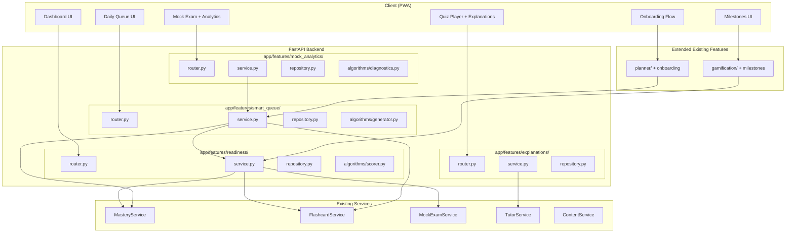
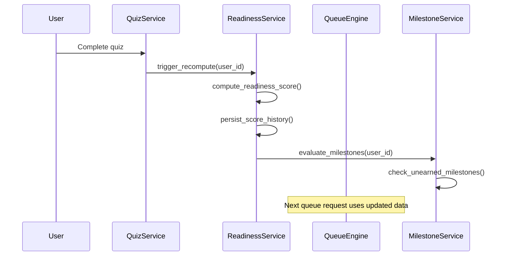
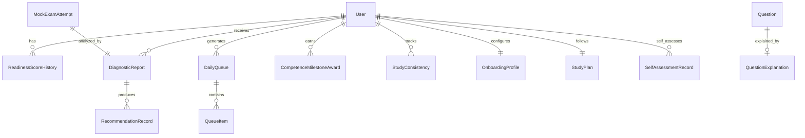

# Design Document: Intelligent Learning Engine

## Overview

This design describes the implementation of fourteen interconnected learning intelligence capabilities across CSNexus, organized into seven core phases (Readiness Score, Smart Daily Queue, Inline Explanations, Post-Mock Exam Analytics, Competence-Based Gamification, Exam Date Onboarding, Readiness Self-Assessment Calibration) and seven research-backed learning technique extensions (Pretesting, Elaborative Interrogation, Generation Effect/Recall Mode, Sleep-Aware Review, Metacognitive Reflection, Concrete Examples, Productive Failure). Together these transform CSNexus from a content delivery platform into an adaptive exam preparation engine.

The system is implemented as four new feature slices (`readiness`, `smart_queue`, `explanations`, `mock_analytics`) and extensions to two existing slices (`gamification`, `planner`). Algorithm modules containing pure computation logic are isolated under each feature's `algorithms/` subdirectory, following the pattern established by `flashcards/algorithms/`.

### Key Design Decisions

1. **Four new feature slices + two extensions** — Readiness, Smart Queue, Explanations, and Mock Analytics are distinct domains with independent data models. Competence milestones extend the existing `gamification` slice. Onboarding extends the existing `planner` slice.
2. **Algorithm isolation** — All scoring, queue generation, and analytics computations are pure functions with no DB access. Services orchestrate between repositories and algorithms.
3. **Event-driven score updates** — Readiness score recomputation is triggered by study activity completion (quiz, mock exam, flashcard review) within the same request transaction, not via background jobs.
4. **Idempotent queue generation** — Daily queues are generated once per UTC day and cached. Subsequent requests return the same queue unless items are completed or explicit regeneration is requested.
5. **Graceful degradation** — All components return stale/cached data with appropriate flags when computation fails, never blocking the user's study flow.
6. **Existing Tutor integration** — AI Tutor escalation delegates to the existing `tutor` feature service rather than implementing a new LLM integration.

## Architecture

### High-Level System Diagram



### Cross-Feature Data Flow



## Components and Interfaces

### File Structure

```
app/features/readiness/
├── __init__.py
├── models.py              # ReadinessScoreHistory
├── schemas.py             # ReadinessResponse, DashboardResponse, TrendResponse
├── repository.py          # ReadinessRepository
├── service.py             # ReadinessService (orchestrator)
├── router.py              # /v1/readiness/* endpoints
└── algorithms/
    ├── __init__.py
    └── scorer.py          # Pure scoring functions

app/features/smart_queue/
├── __init__.py
├── models.py              # DailyQueue, QueueItem
├── schemas.py             # QueueResponse, QueueItemSchema
├── repository.py          # QueueRepository
├── service.py             # QueueService (orchestrator)
├── router.py              # /v1/queue/* endpoints
└── algorithms/
    ├── __init__.py
    └── generator.py       # Pure queue generation logic

app/features/explanations/
├── __init__.py
├── models.py              # QuestionExplanation
├── schemas.py             # ExplanationResponse, BulkExplanationRequest
├── repository.py          # ExplanationRepository
├── service.py             # ExplanationService
└── router.py              # /v1/explanations/* endpoints

app/features/mock_analytics/
├── __init__.py
├── models.py              # DiagnosticReport, Recommendation
├── schemas.py             # DiagnosticResponse, PredictionResponse
├── repository.py          # MockAnalyticsRepository
├── service.py             # MockAnalyticsService
├── router.py              # /v1/mock-analytics/* endpoints
└── algorithms/
    ├── __init__.py
    ├── diagnostics.py     # Pure diagnostic computation
    └── prediction.py      # Predicted score range computation
```

### Readiness Score Service Interface

```python
# app/features/readiness/service.py

class ReadinessService:
    """Orchestrates readiness score computation and persistence."""

    def __init__(
        self,
        *,
        readiness_repo: ReadinessRepository,
        mastery_repo: MasteryRepository,
        flashcard_repo: FlashcardRepository,
        mock_exam_repo: MockExamRepository,
        content_repo: ContentRepository,
    ) -> None: ...

    def compute_and_persist(self, user_id: int) -> ReadinessScoreHistory:
        """Recompute readiness score and persist to history. Called after study activity."""
        ...

    def get_current(self, user_id: int) -> ReadinessResponse:
        """Return most recent score with component breakdown and 7-day delta."""
        ...

    def get_dashboard(self, user_id: int) -> DashboardResponse:
        """Return dashboard payload: score, components, delta, top 3 point-impact subtopics."""
        ...

    def get_trend(self, user_id: int, days: int = 30) -> list[TrendPoint]:
        """Return one score per day for the past N days, carrying forward gaps."""
        ...

    def get_readiness_level(self, score: int) -> str:
        """Classify score into readiness level."""
        ...

    def submit_self_assessment(self, user_id: int, self_assessed_score: int) -> SelfAssessmentResponse:
        """Record user's self-assessed readiness, compare against computed score,
        and return calibration status with appropriate messaging.
        Delta > +15 = overconfident, -10 to +15 = well_calibrated, < -10 = underconfident."""
        ...

    def get_self_assessment_history(self, user_id: int) -> list[SelfAssessmentRecord]:
        """Return all self-assessment records for calibration trend visualization."""
        ...

    def is_self_assessment_due(self, user_id: int) -> bool:
        """Return True if 7+ days have elapsed since the user's last self-assessment."""
        ...
```

### Readiness Scorer Algorithm Interface (Pure Functions)

```python
# app/features/readiness/algorithms/scorer.py

@dataclass(frozen=True)
class ComponentWeights:
    mastery: float = 0.40
    retention: float = 0.25
    mock_exam: float = 0.25
    coverage: float = 0.10

@dataclass(frozen=True)
class ReadinessComponents:
    mastery_component: float      # 0-100
    retention_component: float    # 0-100
    mock_component: float         # 0-100
    coverage_component: float     # 0-100

@dataclass(frozen=True)
class ReadinessResult:
    score: int                    # 0-100, clamped and rounded
    components: ReadinessComponents
    weights: ComponentWeights

def compute_mastery_component(
    mastery_scores: list[tuple[float, float]],  # (mastery_score, exam_weight)
) -> float:
    """Weighted average of mastery scores by exam question proportion."""
    ...

def compute_retention_component(
    fsrs_retentions: list[float] | None,
    subtopic_retention_scores: list[float] | None,
    days_until_exam: int,
) -> float:
    """Average FSRS retention projected to exam date, or fallback to subtopic retention."""
    ...

def compute_mock_component(
    mock_scores: list[tuple[float, int]],  # (percentage_correct, days_since_exam)
) -> float:
    """Recency-weighted average of mock exam scores."""
    ...

def compute_coverage_component(
    subtopic_coverage: list[tuple[int, int]],  # (attempted, available) per subtopic
    threshold: float = 0.10,
) -> float:
    """Percentage of subtopics where user attempted >= 10% of available questions."""
    ...

def compute_readiness_score(
    components: ReadinessComponents,
    weights: ComponentWeights,
) -> int:
    """Combine components with weights, round half-up, clamp to 0-100."""
    ...

def redistribute_weights_no_mock() -> ComponentWeights:
    """Return adjusted weights when user has no mock exam history."""
    ...
```

### Queue Engine Algorithm Interface (Pure Functions)

```python
# app/features/smart_queue/algorithms/generator.py

@dataclass(frozen=True)
class QueueConfig:
    time_budget_minutes: int          # 15, 30, or 60
    days_until_exam: int | None
    has_exam_date: bool

@dataclass(frozen=True)
class FlashcardBatch:
    card_ids: list[int]               # max 30
    estimated_seconds: int            # count × 8
    deck_name: str

@dataclass(frozen=True)
class QuizPracticeItem:
    subtopic_id: int
    question_count: int               # 5-10
    estimated_seconds: int            # count × 45
    difficulty_distribution: dict[str, float]  # easy/medium/hard percentages

@dataclass(frozen=True)
class NewContentItem:
    subtopic_id: int
    lesson_id: int
    section_index: int
    estimated_seconds: int            # 300 (5 min)

@dataclass(frozen=True)
class GeneratedQueue:
    items: list[FlashcardBatch | QuizPracticeItem | NewContentItem]
    total_estimated_seconds: int
    items_by_type: dict[str, int]

def generate_daily_queue(
    due_flashcards: list[tuple[int, int, str]],  # (card_id, days_overdue, deck_name)
    weak_subtopics: list[tuple[int, float, float]],  # (subtopic_id, accuracy_7d, mastery_score)
    coverage_gaps: list[tuple[int, int, float]],  # (subtopic_id, lesson_id, exam_weight)
    config: QueueConfig,
) -> GeneratedQueue:
    """Generate ordered queue respecting priority and time budget. Pure function."""
    ...

def generate_exam_crunch_queue(
    due_flashcards: list[tuple[int, int, str]],
    high_impact_subtopics: list[tuple[int, float]],  # (subtopic_id, point_impact)
    low_accuracy_subtopics: list[tuple[int, float]],  # (subtopic_id, mock_accuracy)
    config: QueueConfig,
) -> GeneratedQueue:
    """Generate queue for <14 days or <7 days until exam. Pure function."""
    ...

def compute_difficulty_distribution(mastery_score: float) -> dict[str, float]:
    """Return difficulty percentages based on mastery level."""
    ...

def enforce_variety_constraint(
    items: list[FlashcardBatch | QuizPracticeItem | NewContentItem],
) -> list[FlashcardBatch | QuizPracticeItem | NewContentItem]:
    """Reorder items so no more than 2 consecutive share the same type."""
    ...

def enforce_cross_module_interleaving(
    quiz_items: list[QuizPracticeItem],
    subtopic_module_map: dict[int, str],  # subtopic_id -> "Verbal Ability" | "Numerical Ability" | "Analytical Ability"
) -> list[QuizPracticeItem]:
    """Reorder quiz_practice items so consecutive items draw from different modules where possible.
    If all items belong to the same module, return them unchanged."""
    ...
```

### Mock Analytics Algorithm Interface (Pure Functions)

```python
# app/features/mock_analytics/algorithms/diagnostics.py

@dataclass(frozen=True)
class SubtopicDiagnostic:
    subtopic_id: int
    questions_attempted: int
    questions_correct: int
    points_lost: int
    avg_seconds_per_question: float
    accuracy_percentage: float

@dataclass(frozen=True)
class DiagnosticResult:
    total_score: float                          # percentage, 1 decimal
    subtopic_breakdowns: list[SubtopicDiagnostic]
    highest_impact_areas: list[SubtopicDiagnostic]  # top 5 by points_lost
    regression_alerts: list[tuple[int, float]]  # (subtopic_id, decline_pct)
    difficulty_performance: dict[str, float]    # easy/medium/hard accuracy

def compute_diagnostic(
    answers: list[tuple[int, bool, int, float]],  # (subtopic_id, is_correct, question_id, seconds)
    historical_accuracy: dict[int, float],         # subtopic_id -> historical avg accuracy
) -> DiagnosticResult:
    """Compute full diagnostic breakdown from exam answers. Pure function."""
    ...

# app/features/mock_analytics/algorithms/prediction.py

@dataclass(frozen=True)
class PredictedRange:
    lower_bound: float
    midpoint: float
    upper_bound: float
    confidence_level: str  # "low", "medium", "high"

def compute_predicted_score(
    mock_scores: list[tuple[float, int]],  # (score_pct, days_since)
    avg_retention: float,
) -> PredictedRange | None:
    """Compute predicted score range. Returns None if < 2 exams."""
    ...

@dataclass(frozen=True)
class ActionableRecommendation:
    subtopic_id: int
    subtopic_name: str
    current_accuracy: float
    target_accuracy: float
    estimated_point_gain: float
    recommended_action: str  # "review", "practice", "re-learn"

def generate_recommendations(
    subtopic_diagnostics: list[SubtopicDiagnostic],
    subtopic_names: dict[int, str],
    questions_per_subtopic_in_exam: dict[int, int],
    mastery_scores: dict[int, float],
    target_accuracy: float = 0.80,
) -> list[ActionableRecommendation]:
    """Generate up to 5 recommendations sorted by estimated point gain. Pure function."""
    ...
```

### API Endpoints

| Method | Path | Description | Auth |
|--------|------|-------------|------|
| GET | `/v1/readiness` | Get current readiness score + components | Required |
| GET | `/v1/readiness/dashboard` | Dashboard payload (score, delta, top impact areas) | Required |
| GET | `/v1/readiness/trend` | 30-day score trend | Required |
| GET | `/v1/queue` | Get today's daily queue | Required |
| POST | `/v1/queue/items/{id}/:complete` | Mark queue item as completed | Required |
| POST | `/v1/queue/:regenerate` | Force regenerate today's queue | Required |
| GET | `/v1/queue/preferences` | Get user's time budget preference | Required |
| PATCH | `/v1/queue/preferences` | Update time budget (15/30/60) | Required |
| GET | `/v1/explanations/{question_id}` | Get explanation for a question | Required |
| POST | `/v1/explanations/bulk` | Bulk fetch explanations (1-50 IDs) | Required |
| POST | `/v1/explanations/{question_id}/:escalate` | Escalate to AI Tutor | Required |
| GET | `/v1/mock-analytics/{attempt_id}` | Get diagnostic report for a mock exam | Required |
| GET | `/v1/mock-analytics/{attempt_id}/recommendations` | Get actionable recommendations | Required |
| POST | `/v1/mock-analytics/{attempt_id}/recommendations/:accept` | Accept recommendation into queue | Required |
| GET | `/v1/mock-analytics/prediction` | Get predicted score range | Required |
| GET | `/v1/milestones` | Get all milestones with status | Required |
| GET | `/v1/consistency` | Get study consistency metric | Required |
| POST | `/v1/onboarding` | Submit exam date + preferences | Required |
| PATCH | `/v1/onboarding/exam-date` | Update exam date | Required |
| GET | `/v1/onboarding/plan-summary` | Get generated plan summary | Required |
| POST | `/v1/readiness/self-assessment` | Submit self-assessed readiness (0–100) | Required |
| GET | `/v1/readiness/self-assessment/history` | Get calibration history | Required |
| GET | `/v1/readiness/self-assessment/prompt` | Check if self-assessment prompt is due | Required |

## Data Models

### Entity Relationship Diagram



### New SQLAlchemy Models

#### ReadinessScoreHistory

```python
class ReadinessScoreHistory(Base):
    """Append-only history of readiness score computations."""
    __tablename__ = "readiness_score_history"

    id: Mapped[int] = mapped_column(Integer, primary_key=True, index=True)
    user_id: Mapped[int] = mapped_column(Integer, ForeignKey("users.id", ondelete="CASCADE"), nullable=False, index=True)
    score: Mapped[int] = mapped_column(Integer, nullable=False)  # 0-100
    mastery_component: Mapped[float] = mapped_column(Float, nullable=False)
    retention_component: Mapped[float] = mapped_column(Float, nullable=False)
    mock_component: Mapped[float] = mapped_column(Float, nullable=False)
    coverage_component: Mapped[float] = mapped_column(Float, nullable=False)
    weights_used: Mapped[str] = mapped_column(String(100), nullable=False)  # JSON: {"mastery":0.4,...}
    computed_at: Mapped[datetime] = mapped_column(DateTime(timezone=True), server_default=func.now(), nullable=False)

    __table_args__ = (
        Index("ix_readiness_history_user_computed", "user_id", "computed_at"),
    )
```

#### DailyQueue and QueueItem

```python
class DailyQueue(Base):
    """One queue per user per UTC day."""
    __tablename__ = "daily_queues"

    id: Mapped[int] = mapped_column(Integer, primary_key=True, index=True)
    user_id: Mapped[int] = mapped_column(Integer, ForeignKey("users.id", ondelete="CASCADE"), nullable=False, index=True)
    queue_date: Mapped[date] = mapped_column(Date, nullable=False)
    time_budget_minutes: Mapped[int] = mapped_column(Integer, nullable=False)
    total_estimated_seconds: Mapped[int] = mapped_column(Integer, nullable=False)
    items_total: Mapped[int] = mapped_column(Integer, nullable=False)
    items_completed: Mapped[int] = mapped_column(Integer, nullable=False, default=0, server_default="0")
    created_at: Mapped[datetime] = mapped_column(DateTime(timezone=True), server_default=func.now(), nullable=False)

    __table_args__ = (
        UniqueConstraint("user_id", "queue_date", name="uq_daily_queue_user_date"),
    )


class QueueItemType(str, Enum):
    FLASHCARD_REVIEW = "flashcard_review"
    QUIZ_PRACTICE = "quiz_practice"
    NEW_CONTENT = "new_content"


class QueueItem(Base):
    """Individual item within a daily queue."""
    __tablename__ = "queue_items"

    id: Mapped[int] = mapped_column(Integer, primary_key=True, index=True)
    queue_id: Mapped[int] = mapped_column(Integer, ForeignKey("daily_queues.id", ondelete="CASCADE"), nullable=False, index=True)
    position: Mapped[int] = mapped_column(Integer, nullable=False)
    item_type: Mapped[str] = mapped_column(String(20), nullable=False)
    payload: Mapped[str] = mapped_column(Text, nullable=False)  # JSON: type-specific data
    estimated_seconds: Mapped[int] = mapped_column(Integer, nullable=False)
    completed_at: Mapped[datetime | None] = mapped_column(DateTime(timezone=True), nullable=True)

    __table_args__ = (
        CheckConstraint("item_type IN ('flashcard_review', 'quiz_practice', 'new_content')", name="ck_queue_items_type"),
        Index("ix_queue_items_queue_position", "queue_id", "position"),
    )
```

#### QuestionExplanation

```python
class QuestionExplanation(Base):
    """Static explanation attached to a question."""
    __tablename__ = "question_explanations"

    id: Mapped[int] = mapped_column(Integer, primary_key=True, index=True)
    question_id: Mapped[int] = mapped_column(Integer, ForeignKey("questions.id", ondelete="CASCADE"), nullable=False, unique=True, index=True)
    explanation_text: Mapped[str] = mapped_column(Text, nullable=False)  # 50-2000 chars, markdown
    key_concept: Mapped[str] = mapped_column(String(100), nullable=False)
    related_subtopics: Mapped[str] = mapped_column(Text, nullable=False)  # JSON array of subtopic IDs, max 10
    cache_version: Mapped[int] = mapped_column(Integer, nullable=False, default=1, server_default="1")
    created_at: Mapped[datetime] = mapped_column(DateTime(timezone=True), server_default=func.now(), nullable=False)
    updated_at: Mapped[datetime] = mapped_column(DateTime(timezone=True), server_default=func.now(), onupdate=func.now(), nullable=False)
```

#### DiagnosticReport and RecommendationRecord

```python
class DiagnosticReport(Base):
    """Persisted diagnostic analysis of a completed mock exam."""
    __tablename__ = "diagnostic_reports"

    id: Mapped[int] = mapped_column(Integer, primary_key=True, index=True)
    user_id: Mapped[int] = mapped_column(Integer, ForeignKey("users.id", ondelete="CASCADE"), nullable=False, index=True)
    mock_exam_attempt_id: Mapped[int] = mapped_column(Integer, ForeignKey("mock_exam_attempts.id", ondelete="CASCADE"), nullable=False, unique=True)
    total_score: Mapped[float] = mapped_column(Float, nullable=False)  # percentage, 1 decimal
    subtopic_breakdowns: Mapped[str] = mapped_column(Text, nullable=False)  # JSON
    highest_impact_areas: Mapped[str] = mapped_column(Text, nullable=False)  # JSON
    regression_alerts: Mapped[str] = mapped_column(Text, nullable=False)  # JSON
    difficulty_performance: Mapped[str] = mapped_column(Text, nullable=False)  # JSON
    predicted_score_range: Mapped[str | None] = mapped_column(Text, nullable=True)  # JSON
    generated_at: Mapped[datetime] = mapped_column(DateTime(timezone=True), server_default=func.now(), nullable=False)


class RecommendationRecord(Base):
    """Persisted actionable recommendation from a diagnostic report."""
    __tablename__ = "recommendation_records"

    id: Mapped[int] = mapped_column(Integer, primary_key=True, index=True)
    report_id: Mapped[int] = mapped_column(Integer, ForeignKey("diagnostic_reports.id", ondelete="CASCADE"), nullable=False, index=True)
    subtopic_id: Mapped[int] = mapped_column(Integer, ForeignKey("subtopics.id", ondelete="CASCADE"), nullable=False)
    subtopic_name: Mapped[str] = mapped_column(String(255), nullable=False)
    current_accuracy: Mapped[float] = mapped_column(Float, nullable=False)
    target_accuracy: Mapped[float] = mapped_column(Float, nullable=False)
    estimated_point_gain: Mapped[float] = mapped_column(Float, nullable=False)
    recommended_action: Mapped[str] = mapped_column(String(16), nullable=False)  # review, practice, re-learn
    accepted_at: Mapped[datetime | None] = mapped_column(DateTime(timezone=True), nullable=True)
    created_at: Mapped[datetime] = mapped_column(DateTime(timezone=True), server_default=func.now(), nullable=False)

    __table_args__ = (
        CheckConstraint("recommended_action IN ('review', 'practice', 're-learn')", name="ck_recommendations_action"),
    )
```

#### CompetenceMilestoneAward and StudyConsistency

```python
class CompetenceMilestone(Base):
    """Definition of a competence milestone (seeded, not user-created)."""
    __tablename__ = "competence_milestones"

    id: Mapped[int] = mapped_column(Integer, primary_key=True, index=True)
    slug: Mapped[str] = mapped_column(String(50), nullable=False, unique=True)
    name: Mapped[str] = mapped_column(String(100), nullable=False)
    description: Mapped[str] = mapped_column(Text, nullable=False)
    category: Mapped[str] = mapped_column(String(20), nullable=False)  # mastery, readiness, recovery
    threshold_config: Mapped[str] = mapped_column(Text, nullable=False)  # JSON: milestone-specific criteria
    created_at: Mapped[datetime] = mapped_column(DateTime(timezone=True), server_default=func.now(), nullable=False)


class CompetenceMilestoneAward(Base):
    """Record of a user earning a milestone — permanent, never revoked."""
    __tablename__ = "competence_milestone_awards"

    id: Mapped[int] = mapped_column(Integer, primary_key=True, index=True)
    user_id: Mapped[int] = mapped_column(Integer, ForeignKey("users.id", ondelete="CASCADE"), nullable=False, index=True)
    milestone_id: Mapped[int] = mapped_column(Integer, ForeignKey("competence_milestones.id", ondelete="CASCADE"), nullable=False)
    triggering_values: Mapped[str] = mapped_column(Text, nullable=False)  # JSON: metric values at award time
    awarded_at: Mapped[datetime] = mapped_column(DateTime(timezone=True), server_default=func.now(), nullable=False)

    __table_args__ = (
        UniqueConstraint("user_id", "milestone_id", name="uq_milestone_award_user_milestone"),
    )


class StudyConsistency(Base):
    """Per-user study consistency tracking (replaces raw login streaks)."""
    __tablename__ = "study_consistency"

    id: Mapped[int] = mapped_column(Integer, primary_key=True, index=True)
    user_id: Mapped[int] = mapped_column(Integer, ForeignKey("users.id", ondelete="CASCADE"), nullable=False, unique=True)
    current_streak: Mapped[int] = mapped_column(Integer, nullable=False, default=0, server_default="0")
    longest_streak: Mapped[int] = mapped_column(Integer, nullable=False, default=0, server_default="0")
    total_consistent_days: Mapped[int] = mapped_column(Integer, nullable=False, default=0, server_default="0")
    last_qualifying_date: Mapped[date | None] = mapped_column(Date, nullable=True)
    updated_at: Mapped[datetime] = mapped_column(DateTime(timezone=True), server_default=func.now(), onupdate=func.now(), nullable=False)
```

#### OnboardingProfile (extends existing planner)

```python
class OnboardingProfile(Base):
    """User's onboarding configuration — exam date, category, preferences."""
    __tablename__ = "onboarding_profiles"

    id: Mapped[int] = mapped_column(Integer, primary_key=True, index=True)
    user_id: Mapped[int] = mapped_column(Integer, ForeignKey("users.id", ondelete="CASCADE"), nullable=False, unique=True)
    exam_date: Mapped[date] = mapped_column(Date, nullable=False)
    exam_category: Mapped[str] = mapped_column(String(20), nullable=False)  # Professional, Sub-Professional
    time_budget_minutes: Mapped[int] = mapped_column(Integer, nullable=False, default=30, server_default="30")
    onboarding_completed_at: Mapped[datetime] = mapped_column(DateTime(timezone=True), server_default=func.now(), nullable=False)
    created_at: Mapped[datetime] = mapped_column(DateTime(timezone=True), server_default=func.now(), nullable=False)
    updated_at: Mapped[datetime] = mapped_column(DateTime(timezone=True), server_default=func.now(), onupdate=func.now(), nullable=False)

    __table_args__ = (
        CheckConstraint("exam_category IN ('Professional', 'Sub-Professional')", name="ck_onboarding_category"),
        CheckConstraint("time_budget_minutes IN (15, 30, 60)", name="ck_onboarding_time_budget"),
    )
```

#### StudyPlan (generated from OnboardingProfile)

```python
class StudyPlan(Base):
    """Generated study plan with daily task assignments across the exam prep timeline."""
    __tablename__ = "study_plans"

    id: Mapped[int] = mapped_column(Integer, primary_key=True, index=True)
    user_id: Mapped[int] = mapped_column(Integer, ForeignKey("users.id", ondelete="CASCADE"), nullable=False, unique=True)
    target_exam_date: Mapped[date] = mapped_column(Date, nullable=False)
    exam_category: Mapped[str] = mapped_column(String(20), nullable=False)
    available_hours_per_day: Mapped[float] = mapped_column(Float, nullable=False)  # 0.25, 0.5, or 1.0
    total_days: Mapped[int] = mapped_column(Integer, nullable=False)
    subtopics_per_week: Mapped[int] = mapped_column(Integer, nullable=False)
    mock_exams_scheduled: Mapped[int] = mapped_column(Integer, nullable=False)
    plan_data: Mapped[str] = mapped_column(Text, nullable=False)  # JSON: array of daily assignments
    estimated_readiness_at_exam: Mapped[float] = mapped_column(Float, nullable=False)  # projected score
    created_at: Mapped[datetime] = mapped_column(DateTime(timezone=True), server_default=func.now(), nullable=False)
    updated_at: Mapped[datetime] = mapped_column(DateTime(timezone=True), server_default=func.now(), onupdate=func.now(), nullable=False)
```

### Study Plan Generation Algorithm Interface

```python
# app/features/planner/algorithms/plan_generator.py

@dataclass(frozen=True)
class PlanConfig:
    target_exam_date: date
    available_hours_per_day: float
    exam_category: str
    mastered_subtopic_ids: list[int]  # subtopics with mastery ≥ 0.8 (skipped)

@dataclass(frozen=True)
class DailyAssignment:
    day_number: int
    date: date
    phase: str  # "coverage", "weakness", "review"
    new_subtopics: list[int]  # max 3 per day
    review_subtopics: list[int]
    mock_exam_scheduled: bool

@dataclass(frozen=True)
class GeneratedPlan:
    assignments: list[DailyAssignment]
    total_days: int
    subtopics_per_week: int
    mock_exams_scheduled: int
    estimated_readiness_at_exam: float

def generate_study_plan(
    all_subtopic_ids: list[int],
    config: PlanConfig,
) -> GeneratedPlan:
    """Generate a phased study plan: coverage (introduce all subtopics) → weakness (deepen) → review (final 20%).
    Max 3 new subtopics/day, review every 3 study days, mock exams 1/week from week 2 (2/week in final 2 weeks).
    Pure function."""
    ...

def regenerate_plan_from_today(
    existing_plan: GeneratedPlan,
    new_exam_date: date,
    completed_days: int,
    config: PlanConfig,
) -> GeneratedPlan:
    """Regenerate plan from current date forward, preserving completed days. Pure function."""
    ...
```

### Gamification Migration Service Interface

```python
# Added to gamification service (app/features/gamification/service.py)

class GamificationMigrationService:
    """Handles transition from XP-based to competence-based gamification."""

    def activate_competence_system(self, user_id: int) -> list[CompetenceMilestoneAward]:
        """Activate competence milestones for a user. Retroactively evaluates all milestones
        against existing mastery data. Awards any already-satisfied milestones with original dates.
        XP system continues earning alongside — milestones replace generic achievements as primary indicator."""
        ...

    def map_existing_badges(self, user_id: int) -> list[tuple[int, int]]:
        """Map existing achievement badges to competence milestones where applicable.
        Returns list of (old_badge_id, new_milestone_id) mappings.
        Preserves original awarded_at date for retroactively matched milestones."""
        ...

    def replace_streak_with_consistency(self, user_id: int) -> StudyConsistency:
        """Replace the existing gamification streak logic with the Study_Consistency metric.
        Migrates longest_streak from old system. Called when user opts into intelligent learning engine."""
        ...
```

### Dashboard Performance Strategy

The `GET /v1/readiness/dashboard` endpoint must respond within 2 seconds (Requirement 3.4). To achieve this:

1. **The dashboard serves precomputed data** — it reads the most recent `ReadinessScoreHistory` record (already computed and persisted during the last study activity). It does NOT recompute the score on every dashboard load.
2. **Point-impact calculation is lightweight** — it queries the top 3 subtopics with lowest mastery × highest exam weight, which is a simple sorted query over ~60 rows.
3. **Trend data uses a simple query** — `SELECT score, computed_at FROM readiness_score_history WHERE user_id = ? AND computed_at >= ? ORDER BY computed_at` with carry-forward logic applied in Python (not SQL).
4. **If no score exists yet** — return score 0 immediately without any computation.

### Explanation Caching Strategy (Backend)

The `GET /v1/explanations/{question_id}` and `POST /v1/explanations/bulk` endpoints support conditional requests:

1. **ETag header** — Each explanation response includes an `ETag` header with value equal to the `cache_version` field (integer stringified).
2. **If-None-Match** — When the client sends `If-None-Match: "3"` and the current `cache_version` is 3, the server returns `304 Not Modified` with no body.
3. **Bulk endpoint** — Returns a `max_cache_version` field representing the highest cache_version across all returned explanations. The client can use this for staleness detection.
4. **cache_version increment** — Only incremented when an explanation's content is updated (not on read). Default value is 1 for all seeded explanations.

#### SelfAssessmentRecord

```python
class SelfAssessmentRecord(Base):
    """Record of a user's self-assessed readiness vs computed readiness."""
    __tablename__ = "self_assessment_records"

    id: Mapped[int] = mapped_column(Integer, primary_key=True, index=True)
    user_id: Mapped[int] = mapped_column(Integer, ForeignKey("users.id", ondelete="CASCADE"), nullable=False, index=True)
    self_assessed_score: Mapped[int] = mapped_column(Integer, nullable=False)  # 0-100
    computed_score: Mapped[int] = mapped_column(Integer, nullable=False)  # 0-100
    delta: Mapped[int] = mapped_column(Integer, nullable=False)  # self - computed
    calibration_status: Mapped[str] = mapped_column(String(20), nullable=False)  # overconfident, well_calibrated, underconfident
    assessed_at: Mapped[datetime] = mapped_column(DateTime(timezone=True), server_default=func.now(), nullable=False)

    __table_args__ = (
        CheckConstraint("self_assessed_score BETWEEN 0 AND 100", name="ck_self_assessment_score_range"),
        CheckConstraint("calibration_status IN ('overconfident', 'well_calibrated', 'underconfident')", name="ck_calibration_status"),
        Index("ix_self_assessment_user_date", "user_id", "assessed_at"),
    )
```

## Correctness Properties

*A property is a characteristic or behavior that should hold true across all valid executions of a system — essentially, a formal statement about what the system should do. Properties serve as the bridge between human-readable specifications and machine-verifiable correctness guarantees.*

### Property 1: Readiness score is a valid weighted composite

*For any* set of component values (mastery, retention, mock, coverage each in [0, 100]) and any valid weight configuration (standard or redistributed-no-mock), the computed readiness score SHALL equal the weighted sum of components, rounded to the nearest integer using half-up rounding, and clamped to the range [0, 100] inclusive.

**Validates: Requirements 1.1, 1.6, 1.8**

### Property 2: Mastery component is a weighted average by exam proportion

*For any* list of (mastery_score, exam_weight) pairs where mastery_score ∈ [0.0, 1.0] and exam_weights sum to 1.0, the mastery component SHALL equal the weighted average scaled to 0–100. Subtopics with no mastery record (score 0.0) SHALL reduce the average proportionally.

**Validates: Requirements 1.2**

### Property 3: Retention component uses FSRS with subtopic fallback

*For any* list of FSRS retention predictions (each ∈ [0.0, 1.0]) and a days_until_exam value, the retention component SHALL equal the average of those predictions scaled to 0–100. When the FSRS list is empty but subtopic retention scores exist, the component SHALL equal the average of subtopic retention_score values scaled to 0–100.

**Validates: Requirements 1.3**

### Property 4: Mock component applies recency weighting

*For any* list of (mock_score_percentage, days_since_completion) pairs where only fully completed exams are included, the mock component SHALL equal the weighted average where weight = 1.0 for days ≤ 14, weight = 0.7 for days 15–30, and weight = 0.4 for days > 30.

**Validates: Requirements 1.4**

### Property 5: Coverage component counts threshold-meeting subtopics

*For any* list of (questions_attempted, questions_available) pairs representing 60 subtopics, the coverage component SHALL equal (count of subtopics where attempted/available ≥ 0.10) / 60 × 100.

**Validates: Requirements 1.5**

### Property 6: Trend carry-forward produces complete 30-day series

*For any* sparse set of (date, score) records over a 30-day window, the trend output SHALL contain exactly 30 entries (one per day) with no gaps, where days without a computed score carry forward the most recent prior score.

**Validates: Requirements 2.4**

### Property 7: Point-impact ranking returns correct top-N subtopics

*For any* set of subtopic data with mastery scores and exam weights, the top 3 point-impact subtopics SHALL be those with the highest computed point_impact value (exam_weight × (target_mastery − current_mastery)), sorted descending.

**Validates: Requirements 3.1**

### Property 8: Readiness level classification matches defined ranges

*For any* readiness score in [0, 100], the classification SHALL be "Not Ready" for 0–39, "Getting There" for 40–59, "Almost Ready" for 60–79, and "Exam Ready" for 80–100.

**Validates: Requirements 3.2**

### Property 9: Queue respects priority ordering

*For any* generated daily queue with items from multiple priority levels, all priority-1 items (FSRS-due flashcards) SHALL appear before priority-2 items (weak subtopic quizzes), which SHALL appear before priority-3 items (new content), subject to the variety constraint.

**Validates: Requirements 4.1**

### Property 10: Queue total duration never exceeds time budget

*For any* generated daily queue and configured time budget (15, 30, or 60 minutes), the sum of all item estimated_seconds SHALL NOT exceed time_budget × 60 seconds.

**Validates: Requirements 4.2**

### Property 11: Exam crunch mode enforces correct time allocation

*For any* queue generated with days_until_exam < 14, FSRS-due items SHALL consume approximately 60% of the time budget and no new content SHALL be introduced unless FSRS items consume less than 60%. For days_until_exam < 7, FSRS-due items SHALL consume approximately 80% and new content SHALL be entirely excluded.

**Validates: Requirements 4.3, 4.4**

### Property 12: Flashcard batch respects size and duration invariants

*For any* flashcard_review queue item, the card count SHALL be at most 30, and the estimated_seconds SHALL equal card_count × 8.

**Validates: Requirements 5.2**

### Property 13: Difficulty distribution matches mastery score ranges

*For any* mastery_score value, the difficulty distribution SHALL be: mastery < 0.4 yields 60% easy / 30% medium / 10% hard; mastery 0.4–0.7 yields 30% easy / 50% medium / 20% hard; mastery > 0.7 yields 10% easy / 40% medium / 50% hard.

**Validates: Requirements 5.3**

### Property 14: Queue variety constraint limits consecutive same-type items

*For any* generated queue containing at least 2 distinct item types, no more than 2 consecutive items SHALL share the same item_type.

**Validates: Requirements 5.5**

### Property 15: AI Tutor escalation respects daily rate limit

*For any* user and any sequence of escalation requests within a single UTC day, the system SHALL allow at most 20 escalations and reject all subsequent requests.

**Validates: Requirements 8.3**

### Property 16: Diagnostic total score equals percentage correct

*For any* set of mock exam answers, the total_score SHALL equal (questions_correct / questions_attempted) × 100, rounded to one decimal place. Time outliers (< 2s or > 600s) SHALL be excluded from time_per_subtopic averages but NOT from correctness calculations.

**Validates: Requirements 10.1**

### Property 17: Highest impact areas are top-5 by points lost

*For any* diagnostic result with subtopic breakdowns, the highest_impact_areas SHALL contain at most 5 subtopics, sorted by points_lost descending, and SHALL only include subtopics with points_lost > 0.

**Validates: Requirements 10.2**

### Property 18: Regression alerts fire on >15 percentage point decline

*For any* subtopic where the user has historical accuracy data, a regression alert SHALL be raised if and only if the current exam accuracy is more than 15 percentage points below the historical average accuracy for that subtopic.

**Validates: Requirements 10.3**

### Property 19: Difficulty performance computes per-level accuracy

*For any* set of exam answers tagged with difficulty levels, the difficulty_performance SHALL contain the percentage correct at each difficulty level (easy, medium, hard), computed as correct_at_level / total_at_level × 100.

**Validates: Requirements 10.4**

### Property 20: Predicted score range follows formula with clamping

*For any* set of ≥ 2 mock exam scores with recency weights and an average retention value, the predicted midpoint SHALL equal the recency-weighted average, lower_bound SHALL equal max(0, midpoint − stddev), and upper_bound SHALL equal min(100, midpoint + 0.5 × stddev).

**Validates: Requirements 11.1, 11.2**

### Property 21: Confidence level matches exam count ranges

*For any* exam count ≥ 2, the confidence_level SHALL be "low" for 2–3 exams, "medium" for 4–6 exams, and "high" for 7+ exams.

**Validates: Requirements 11.4**

### Property 22: Recommendations are ranked by estimated point gain

*For any* set of subtopic diagnostics with exam question counts and mastery scores, the recommendations SHALL contain at most 5 entries, each with estimated_point_gain = questions_in_exam × (target_accuracy − current_accuracy) / 100, sorted by estimated_point_gain descending. The formatted string SHALL contain the subtopic name and point gain value.

**Validates: Requirements 12.1, 12.2, 12.3**

### Property 23: Mastery milestone evaluates all subtopics in category

*For any* user's mastery data and a mastery milestone definition (e.g., "Verbal Mastery" requiring all 23 verbal subtopics with mastery_score ≥ 0.8), the milestone SHALL be satisfied if and only if every subtopic in the category meets the threshold.

**Validates: Requirements 13.1**

### Property 24: Readiness milestone requires 7 consecutive qualifying days

*For any* sequence of daily readiness scores, a readiness milestone (e.g., "Exam Ready: Professional" at threshold 80) SHALL be satisfied if and only if there exist 7 consecutive calendar days where the end-of-day score meets or exceeds the threshold.

**Validates: Requirements 13.2**

### Property 25: Recovery milestone detects mastery recovery within 14 days

*For any* subtopic mastery history, a "Comeback" milestone SHALL be satisfied if and only if the mastery_score transitions from below 0.5 to at or above 0.8 within 14 calendar days of the last sub-0.5 recording.

**Validates: Requirements 13.3**

### Property 26: Awarded milestones are never revoked

*For any* sequence of mastery or readiness changes after a milestone has been awarded, the milestone status SHALL remain "earned" regardless of whether the triggering metrics subsequently drop below the threshold.

**Validates: Requirements 13.6**

### Property 27: Milestone progress percentage matches formula

*For any* unearned milestone and current user state, the progress percentage SHALL equal: for mastery milestones, qualifying_subtopics / required_subtopics; for readiness milestones, consecutive_qualifying_days / 7; for recovery milestones, comeback_count / 3.

**Validates: Requirements 13.7**

### Property 28: Study consistency qualifies on ≥50% queue completion

*For any* daily queue with items_total > 0, the day SHALL qualify for consistency credit if and only if items_completed / items_total ≥ 0.50.

**Validates: Requirements 14.1**

### Property 29: Streak reset preserves longest streak

*For any* study consistency state where a day does not qualify, the current_streak SHALL reset to 0, longest_streak SHALL equal max(previous_longest_streak, previous_current_streak), and total_consistent_days SHALL remain unchanged.

**Validates: Requirements 14.3**

### Property 30: Onboarding date validation accepts 1–365 days in future

*For any* submitted exam_date, the validation SHALL accept dates that are between 1 and 365 calendar days from today (inclusive) and reject dates in the past or more than 365 days in the future.

**Validates: Requirements 16.2**

### Property 31: Study plan follows phase ordering (coverage → weakness → review)

*For any* generated study plan, the timeline SHALL be divided into phases where coverage-gap subtopics are introduced first, weak areas are deepened second, and review/mock practice occupies the final 20% of the timeline.

**Validates: Requirements 17.1**

### Property 32: Plan respects spaced introduction limits

*For any* generated study plan, no single day SHALL introduce more than 3 new subtopics, and review days SHALL be interspersed every 3 study days.

**Validates: Requirements 17.2**

### Property 33: Plan schedules mock exams at correct frequency

*For any* generated study plan with sufficient timeline (≥ 2 weeks), mock exams SHALL be scheduled once per week starting from week 2, increasing to twice per week in the final 2 weeks before the exam date.

**Validates: Requirements 17.3**

### Property 34: Plan excludes already-mastered subtopics

*For any* returning user with existing mastery data, subtopics with mastery_score ≥ 0.8 SHALL NOT appear as new content introductions in the generated study plan.

**Validates: Requirements 17.5**

### Property 35: Cross-module interleaving distributes quiz items across modules

*For any* generated queue containing multiple quiz_practice items where the weak subtopics span more than one module, consecutive quiz_practice items SHALL draw from different modules (Verbal Ability, Numerical Ability, Analytical Ability). If all weak subtopics belong to the same module, the constraint is relaxed.

**Validates: Requirements 5.6**

### Property 36: Self-assessment calibration status matches delta ranges

*For any* self-assessment submission where delta = self_assessed_score − computed_score, the calibration_status SHALL be "overconfident" when delta > +15, "well_calibrated" when delta is between −10 and +15 inclusive, and "underconfident" when delta < −10.

**Validates: Requirements 19.3, 19.4, 19.5**

### Property 37: Self-assessment prompt respects 7-day interval

*For any* user with a self-assessment history, the prompt SHALL be due (is_self_assessment_due returns True) if and only if the most recent assessed_at timestamp is more than 7 calendar days before the current date. For users with no self-assessment history, the prompt SHALL always be due.

**Validates: Requirements 19.1, 19.7**

### Property 38: Self-assessment scores are clamped to valid range

*For any* self-assessment submission, the self_assessed_score SHALL be an integer in the range [0, 100] inclusive. Submissions outside this range SHALL be rejected with a validation error.

**Validates: Requirements 19.1**

### Property 39: Pretest scores SHALL NOT affect mastery component

*For any* pretest submission (assessment_type: "pretest"), the pretest score SHALL NOT be included in the mastery component calculation. Only post-lesson quiz performance (assessment_type: "quiz") SHALL affect the mastery_score for a subtopic.

**Validates: Requirements 21.2**

### Property 40: Recall grading uses Levenshtein distance ≤ 2 for fuzzy matching

*For any* user_response and expected_keywords list, the grade_recall_answer function SHALL return is_correct=True with match_type="exact" if the response contains an exact keyword (case-insensitive), match_type="fuzzy" if the response contains a word within Levenshtein distance ≤ 2 of any keyword, and is_correct=False with match_type="needs_review" otherwise.

**Validates: Requirements 24.3, 24.4**

### Property 41: Goodnight Review contains only items studied today

*For any* generated Goodnight Review session, every card_id in the session's items list SHALL correspond to an item that was studied (flashcard reviewed, quiz attempted, or lesson read) on the same calendar day as the session_date.

**Validates: Requirements 25.1, 25.7**

### Property 42: Goodnight Review session is ≤ 10 items

*For any* generated Goodnight Review session, the items list SHALL contain at most 10 card_ids, regardless of how many items were studied that day.

**Validates: Requirements 25.1, 25.3**

### Property 43: Session reflection confidence 1-2 boosts next-day queue priority

*For any* session reflection where confidence_rating is 1 or 2, the Queue_Engine SHALL add extra review items for the subtopic(s) covered in that session to the next day's queue, treating them as priority level 2 (weak-subtopic) items.

**Validates: Requirements 26.4, 26.5**

### Property 44: Challenge Problems only appear for mastery < 0.4

*For any* generated daily queue containing a Challenge Problem item, the associated subtopic SHALL have a mastery_score strictly less than 0.4. Challenge Problems SHALL NOT be generated for subtopics with mastery_score ≥ 0.4.

**Validates: Requirements 28.1, 28.6**

### Property 45: Maximum 1 Challenge Problem per daily queue

*For any* generated daily queue, the queue SHALL contain at most 1 Challenge Problem item, regardless of how many subtopics have mastery_score < 0.4.

**Validates: Requirements 28.7**

---

## New Data Models (Phases 8–14)

### PretestAttempt

```python
class PretestAttempt(Base):
    """Stores pretest results before lesson for pre/post comparison."""
    __tablename__ = "pretest_attempts"

    id: Mapped[int] = mapped_column(Integer, primary_key=True, index=True)
    user_id: Mapped[int] = mapped_column(Integer, ForeignKey("users.id", ondelete="CASCADE"), nullable=False, index=True)
    subtopic_id: Mapped[int] = mapped_column(Integer, ForeignKey("subtopics.id", ondelete="CASCADE"), nullable=False)
    questions: Mapped[str] = mapped_column(Text, nullable=False)  # JSON array of {question_id, answer, is_correct}
    score: Mapped[float] = mapped_column(Float, nullable=False)
    created_at: Mapped[datetime] = mapped_column(DateTime(timezone=True), server_default=func.now(), nullable=False)

    __table_args__ = (
        Index("ix_pretest_attempts_user_subtopic", "user_id", "subtopic_id"),
    )
```

### PersonalNote

```python
class PersonalNote(Base):
    """User-generated elaborative interrogation note linked to a question."""
    __tablename__ = "personal_notes"

    id: Mapped[int] = mapped_column(Integer, primary_key=True, index=True)
    user_id: Mapped[int] = mapped_column(Integer, ForeignKey("users.id", ondelete="CASCADE"), nullable=False, index=True)
    question_id: Mapped[int] = mapped_column(Integer, ForeignKey("questions.id", ondelete="CASCADE"), nullable=False)
    note_text: Mapped[str] = mapped_column(String(500), nullable=False)
    created_at: Mapped[datetime] = mapped_column(DateTime(timezone=True), server_default=func.now(), nullable=False)

    __table_args__ = (
        Index("ix_personal_notes_user_question", "user_id", "question_id"),
    )
```

### LessonReflection

```python
class LessonReflection(Base):
    """User reflection at key concept points within a lesson."""
    __tablename__ = "lesson_reflections"

    id: Mapped[int] = mapped_column(Integer, primary_key=True, index=True)
    user_id: Mapped[int] = mapped_column(Integer, ForeignKey("users.id", ondelete="CASCADE"), nullable=False, index=True)
    lesson_id: Mapped[int] = mapped_column(Integer, ForeignKey("lessons.id", ondelete="CASCADE"), nullable=False)
    section_index: Mapped[int] = mapped_column(Integer, nullable=False)
    reflection_text: Mapped[str] = mapped_column(Text, nullable=False)
    created_at: Mapped[datetime] = mapped_column(DateTime(timezone=True), server_default=func.now(), nullable=False)

    __table_args__ = (
        Index("ix_lesson_reflections_user_lesson", "user_id", "lesson_id"),
    )
```

### RecallAnswer

```python
class RecallAnswer(Base):
    """User response to a generation-effect fill-in-the-blank recall question."""
    __tablename__ = "recall_answers"

    id: Mapped[int] = mapped_column(Integer, primary_key=True, index=True)
    user_id: Mapped[int] = mapped_column(Integer, ForeignKey("users.id", ondelete="CASCADE"), nullable=False, index=True)
    question_id: Mapped[int] = mapped_column(Integer, ForeignKey("questions.id", ondelete="CASCADE"), nullable=False)
    user_response: Mapped[str] = mapped_column(Text, nullable=False)
    is_correct: Mapped[bool] = mapped_column(Boolean, nullable=False)
    match_type: Mapped[str] = mapped_column(String(20), nullable=False)  # exact, keyword, fuzzy, needs_review
    created_at: Mapped[datetime] = mapped_column(DateTime(timezone=True), server_default=func.now(), nullable=False)

    __table_args__ = (
        CheckConstraint("match_type IN ('exact', 'keyword', 'fuzzy', 'needs_review')", name="ck_recall_match_type"),
        Index("ix_recall_answers_user_question", "user_id", "question_id"),
    )
```

### GoodnightReviewSession

```python
class GoodnightReviewSession(Base):
    """Sleep-aware review session generated at bedtime."""
    __tablename__ = "goodnight_review_sessions"

    id: Mapped[int] = mapped_column(Integer, primary_key=True, index=True)
    user_id: Mapped[int] = mapped_column(Integer, ForeignKey("users.id", ondelete="CASCADE"), nullable=False, index=True)
    session_date: Mapped[date] = mapped_column(Date, nullable=False)
    items: Mapped[str] = mapped_column(Text, nullable=False)  # JSON array of card_ids
    completed_at: Mapped[datetime | None] = mapped_column(DateTime(timezone=True), nullable=True)
    bedtime_preference: Mapped[str] = mapped_column(String(5), nullable=False, default="22:00", server_default="22:00")  # HH:MM format
    created_at: Mapped[datetime] = mapped_column(DateTime(timezone=True), server_default=func.now(), nullable=False)

    __table_args__ = (
        Index("ix_goodnight_sessions_user_date", "user_id", "session_date"),
    )
```

### SessionReflection

```python
class SessionReflection(Base):
    """Post-session metacognitive reflection record."""
    __tablename__ = "session_reflections"

    id: Mapped[int] = mapped_column(Integer, primary_key=True, index=True)
    user_id: Mapped[int] = mapped_column(Integer, ForeignKey("users.id", ondelete="CASCADE"), nullable=False, index=True)
    session_date: Mapped[date] = mapped_column(Date, nullable=False)
    hardest_item_id: Mapped[int] = mapped_column(Integer, nullable=False)
    confidence_rating: Mapped[int] = mapped_column(Integer, nullable=False)  # 1-5
    review_note: Mapped[str | None] = mapped_column(Text, nullable=True)
    created_at: Mapped[datetime] = mapped_column(DateTime(timezone=True), server_default=func.now(), nullable=False)

    __table_args__ = (
        CheckConstraint("confidence_rating BETWEEN 1 AND 5", name="ck_session_reflection_confidence"),
        Index("ix_session_reflections_user_date", "user_id", "session_date"),
    )
```

### QuestionExplanation Extension (concrete_examples field)

```python
# Add to existing QuestionExplanation model:
concrete_examples: Mapped[str | None] = mapped_column(Text, nullable=True)  # JSON array of strings, max 3 items × 100 chars each
```

### ChallengeAttempt

```python
class ChallengeAttempt(Base):
    """Productive failure sequence — challenge problem before instruction."""
    __tablename__ = "challenge_attempts"

    id: Mapped[int] = mapped_column(Integer, primary_key=True, index=True)
    user_id: Mapped[int] = mapped_column(Integer, ForeignKey("users.id", ondelete="CASCADE"), nullable=False, index=True)
    subtopic_id: Mapped[int] = mapped_column(Integer, ForeignKey("subtopics.id", ondelete="CASCADE"), nullable=False)
    question_id: Mapped[int] = mapped_column(Integer, ForeignKey("questions.id", ondelete="CASCADE"), nullable=False)
    pre_lesson_answer: Mapped[str] = mapped_column(Text, nullable=False)
    pre_lesson_correct: Mapped[bool] = mapped_column(Boolean, nullable=False)
    post_lesson_answer: Mapped[str | None] = mapped_column(Text, nullable=True)
    post_lesson_correct: Mapped[bool | None] = mapped_column(Boolean, nullable=True)
    is_productive_failure_success: Mapped[bool] = mapped_column(Boolean, nullable=False, default=False, server_default="0")
    created_at: Mapped[datetime] = mapped_column(DateTime(timezone=True), server_default=func.now(), nullable=False)

    __table_args__ = (
        Index("ix_challenge_attempts_user_subtopic", "user_id", "subtopic_id"),
    )
```

---

## New API Endpoints (Phases 8–14)

| Method | Path | Description | Auth |
|--------|------|-------------|------|
| POST | `/v1/pretests/{subtopic_id}/start` | Start a pretest for a subtopic | Required |
| POST | `/v1/pretests/{pretest_id}/submit` | Submit pretest answers | Required |
| GET | `/v1/pretests/{subtopic_id}/comparison` | Get pre vs post comparison | Required |
| POST | `/v1/explanations/{question_id}/note` | Submit elaborative note | Required |
| GET | `/v1/notes` | Get all personal notes | Required |
| POST | `/v1/lessons/{lesson_id}/reflections` | Submit lesson reflection | Required |
| POST | `/v1/quiz-attempts/{attempt_id}/recall-answer` | Submit recall mode answer | Required |
| GET | `/v1/queue/goodnight` | Get goodnight review session | Required |
| POST | `/v1/queue/goodnight/:complete` | Mark goodnight review completed | Required |
| PATCH | `/v1/preferences/bedtime` | Set bedtime preference | Required |
| POST | `/v1/sessions/{date}/reflection` | Submit session reflection | Required |
| GET | `/v1/sessions/reflections` | Get reflection history | Required |
| POST | `/v1/challenges/{subtopic_id}/attempt` | Submit challenge problem attempt | Required |
| POST | `/v1/challenges/{challenge_id}/retest` | Submit post-lesson retest | Required |

---

## New Algorithm Interfaces (Phases 8–14)

### Queue Generator Additions

```python
# app/features/smart_queue/algorithms/generator.py (additions)

def generate_goodnight_review(
    today_studied_items: list[tuple[int, float]],  # (card_id, confidence_score)
    max_items: int = 10,
) -> list[int]:
    """Select lowest-confidence items from today's study. Pure function."""
    ...

def generate_pretest(
    subtopic_id: int,
    question_pool: list[tuple[int, str, str]],  # (question_id, difficulty, key_concept)
    count: int = 5,
) -> list[int]:
    """Select 3-5 questions covering distinct key_concepts at easy-medium difficulty."""
    ...
```

### Recall Grader Algorithm

```python
# app/features/explanations/algorithms/recall_grader.py (new file)

def grade_recall_answer(
    user_response: str,
    expected_keywords: list[str],
    levenshtein_threshold: int = 2,
) -> tuple[bool, str]:
    """Grade a recall answer by keyword matching. Returns (is_correct, match_type).
    
    match_type values:
    - "exact": response contains an exact keyword (case-insensitive)
    - "keyword": response contains a keyword substring match
    - "fuzzy": response contains a word within Levenshtein distance ≤ threshold
    - "needs_review": no clear match found
    """
    ...
```

## Error Handling

### Graceful Degradation Strategy

All services follow a "stale data over no data" principle. Users should never be blocked from studying due to a computation failure.

| Scenario | Behavior | Response Flag |
|----------|----------|---------------|
| Readiness score computation fails | Return last persisted score | `stale_score: true` |
| Queue generation fails | Return empty queue with error message | `generation_error: true` |
| Explanation not found for question | Return `null` explanation field | — |
| AI Tutor service unavailable | Return error suggesting lesson review | HTTP 503 |
| Mock analytics computation fails | Return partial report with available data | `partial_report: true` |
| Milestone evaluation fails | Skip evaluation, retry on next trigger | Logged server-side |
| Onboarding plan generation fails | Accept onboarding data, generate plan async | `plan_pending: true` |

### Validation Errors

| Input | Constraint | Error Code |
|-------|-----------|------------|
| Time budget | Must be 15, 30, or 60 | `INVALID_TIME_BUDGET` |
| Exam date | Must be 1–365 days in future | `INVALID_EXAM_DATE` |
| Exam category | Must be "Professional" or "Sub-Professional" | `INVALID_CATEGORY` |
| Bulk explanation IDs | Must be 1–50 items | `INVALID_BULK_SIZE` |
| AI Tutor escalation | Max 20 per user per day | `RATE_LIMIT_EXCEEDED` |
| Self-assessment score | Must be integer 0–100 | `INVALID_SELF_ASSESSMENT_SCORE` |

### Service-Level Error Handling

```python
# Pattern: all services follow this error handling approach

class ReadinessService:
    def get_current(self, user_id: int) -> ReadinessResponse:
        try:
            score = self.compute_and_persist(user_id)
            return ReadinessResponse.from_history(score)
        except Exception:
            # Log full exception server-side
            logger.exception("Readiness computation failed for user %d", user_id)
            # Return stale data
            stale = self.readiness_repo.get_latest(user_id)
            if stale is None:
                return ReadinessResponse(score=0, stale_score=True, ...)
            return ReadinessResponse.from_history(stale, stale_score=True)
```

### Transaction Boundaries

- Readiness score recomputation runs within the same DB transaction as the triggering activity (quiz completion, mock exam submission, flashcard review).
- If the readiness computation fails, the triggering activity is NOT rolled back — the study data is preserved and the score will be recomputed on the next trigger.
- Queue generation is idempotent — if it fails mid-generation, the next request will regenerate from scratch.

## Testing Strategy

### Dual Testing Approach

This feature uses both unit tests and property-based tests for comprehensive coverage:

- **Unit tests** — Verify specific examples, edge cases, integration points, and error conditions at each architectural layer (repository, service, router).
- **Property-based tests** — Verify universal correctness properties across all valid inputs for the pure algorithm modules.

### Property-Based Testing Configuration

- **Library**: Hypothesis (already in dev dependencies, version ≥ 6.100)
- **Minimum iterations**: 100 per property test (via `@settings(max_examples=100)`)
- **Tag format**: Each test is annotated with a comment referencing the design property:
  ```python
  # Feature: intelligent-learning-engine, Property 1: Readiness score is a valid weighted composite
  ```

### Test File Organization

```
tests/features/
├── readiness/
│   ├── test_repository.py          # Real DB, no mocks
│   ├── test_service.py             # Mocked repository
│   ├── test_router.py              # Mocked service, HTTP assertions
│   └── test_scorer_properties.py   # Property-based tests for algorithms/scorer.py
├── smart_queue/
│   ├── test_repository.py
│   ├── test_service.py
│   ├── test_router.py
│   └── test_generator_properties.py  # Property-based tests for algorithms/generator.py
├── explanations/
│   ├── test_repository.py
│   ├── test_service.py
│   ├── test_router.py
│   └── test_recall_grader_properties.py  # Property-based tests for algorithms/recall_grader.py
├── mock_analytics/
│   ├── test_repository.py
│   ├── test_service.py
│   ├── test_router.py
│   ├── test_diagnostics_properties.py  # Property-based tests for algorithms/diagnostics.py
│   └── test_prediction_properties.py   # Property-based tests for algorithms/prediction.py
├── gamification/
│   └── test_milestones_properties.py   # Property-based tests for milestone evaluation
├── planner/
│   └── test_plan_generator_properties.py  # Property-based tests for plan generation
├── pretests/
│   ├── test_repository.py
│   ├── test_service.py
│   └── test_router.py
├── elaboration/
│   ├── test_repository.py
│   ├── test_service.py
│   └── test_router.py
├── recall/
│   ├── test_repository.py
│   ├── test_service.py
│   └── test_router.py
├── goodnight_review/
│   ├── test_repository.py
│   ├── test_service.py
│   └── test_router.py
├── session_reflection/
│   ├── test_repository.py
│   ├── test_service.py
│   └── test_router.py
└── challenges/
    ├── test_repository.py
    ├── test_service.py
    └── test_router.py
```

### Property Test Coverage Map

| Property | Test File | Algorithm Under Test |
|----------|-----------|---------------------|
| 1–5 | `test_scorer_properties.py` | `readiness/algorithms/scorer.py` |
| 6–8 | `test_scorer_properties.py` | `readiness/algorithms/scorer.py` |
| 9–14 | `test_generator_properties.py` | `smart_queue/algorithms/generator.py` |
| 15 | `test_service.py` (explanations) | Rate limit logic in service |
| 16–19 | `test_diagnostics_properties.py` | `mock_analytics/algorithms/diagnostics.py` |
| 20–22 | `test_prediction_properties.py` | `mock_analytics/algorithms/prediction.py` |
| 23–27 | `test_milestones_properties.py` | Milestone evaluation logic |
| 28–29 | `test_milestones_properties.py` | Study consistency logic |
| 30 | `test_plan_generator_properties.py` | Onboarding validation |
| 31–34 | `test_plan_generator_properties.py` | `planner/algorithms/plan_generator.py` |
| 35 | `test_generator_properties.py` | Cross-module interleaving in `smart_queue/algorithms/generator.py` |
| 36–38 | `test_scorer_properties.py` | Self-assessment calibration in `readiness/service.py` |
| 39 | `test_generator_properties.py` | Pretest isolation from mastery in `smart_queue/algorithms/generator.py` |
| 40 | `test_recall_grader_properties.py` | Recall grading in `explanations/algorithms/recall_grader.py` |
| 41–42 | `test_generator_properties.py` | Goodnight review generation in `smart_queue/algorithms/generator.py` |
| 43 | `test_generator_properties.py` | Reflection queue boost in `smart_queue/algorithms/generator.py` |
| 44–45 | `test_generator_properties.py` | Challenge problem constraints in `smart_queue/algorithms/generator.py` |

### Unit Test Coverage Requirements

Per the project's testing standards:
- **Repository layer**: All custom query methods (get_latest, get_trend, get_by_date_range)
- **Service layer**: Every branch — happy path + each exception/fallback case
- **Router layer**: Every endpoint with happy-path + validation-failure tests

### Integration Test Scenarios

| Scenario | What It Verifies |
|----------|-----------------|
| Quiz completion triggers readiness recompute | End-to-end score update flow |
| Queue idempotency within same UTC day | Same response on repeated requests |
| Milestone retroactive evaluation on activation | Existing data correctly evaluated |
| Exam date update regenerates plan | Plan redistribution logic |
| AI Tutor rate limit across requests | Counter persists across requests |
