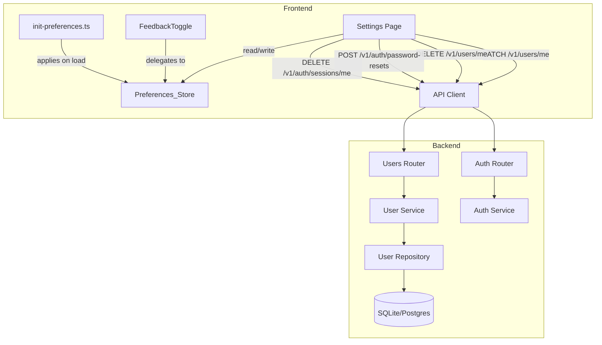

# Design Document: User Settings

## Overview

The User Settings feature adds a dedicated `/settings` route that consolidates all user-configurable preferences into a single, well-organized page. It replaces the inline "Preferences" section currently in the Profile page with a full settings experience spanning four sections: Profile, Study Preferences, Accessibility & Display, and Account Management.

The design separates concerns into two persistence layers:
- **Server-persisted** (Profile): `display_name`, `username`, `tz_name` via the existing `PATCH /v1/users/me` endpoint.
- **Client-persisted** (Study + Accessibility): localStorage-backed `Preferences_Store` with typed getters and fallback defaults.
- **Account actions** (Password change, logout, deletion): leverage existing auth API surface plus a new `DELETE /v1/users/me` endpoint for account deletion.

A new `Preferences_Store` module replaces the ad-hoc `csnexus-feedback-enabled` localStorage key with a structured, JSON-serialized, namespaced store while maintaining backward compatibility by reading the legacy key on first load and migrating it.

## Architecture



**Key architectural decisions:**

1. **Preferences_Store as single source of truth** for client-side settings. The existing `FeedbackToggle` component will delegate to the store rather than managing its own localStorage key. On first load, the store migrates the legacy `csnexus-feedback-enabled` key into its own namespace, then deletes the old key.

2. **Early preference application** via a synchronous inline `<script>` in `index.html` (or an eagerly-imported module `init-preferences.ts`) that reads reduced motion and font size from localStorage and applies CSS classes to `<html>` before React hydrates. This prevents FOUC (flash of unstyled content).

3. **Account deletion as soft-delete** — the new `DELETE /v1/users/me` endpoint sets `account_state` to a new `DELETED` value and revokes all sessions. Actual data purge is a future concern (GDPR-style deferred deletion). The user model gains a `DELETED` enum value for `AccountState`.

4. **Password change reuses existing reset flow** — the Settings UI collects current password + new password, then calls a new `POST /v1/auth/password-change` endpoint that verifies the current password inline (no OTP needed since the user is already authenticated) and rotates to the new password + revokes all sessions.

## Components and Interfaces

### Frontend Components

| Component | Responsibility |
|-----------|---------------|
| `Settings.tsx` | Page component, renders all four sections in GlassCards |
| `ProfileSection.tsx` | Display name, username (with availability check), timezone inputs |
| `StudySection.tsx` | Daily goal slider, quiz mode selector, exam date picker + countdown |
| `AccessibilitySection.tsx` | Reduced motion, font size, sound toggle, haptic toggle |
| `AccountSection.tsx` | Change password form, logout button, delete account with confirmation |
| `DeleteAccountDialog.tsx` | Modal requiring typed confirmation phrase |
| `Preferences_Store` (`stores/preferences.ts`) | Typed localStorage wrapper with migration logic |
| `init-preferences.ts` | Synchronous preference loader for pre-paint application |

### Preferences_Store Interface

```typescript
// stores/preferences.ts

interface StudyPreferences {
  dailyGoalMinutes: number;      // 5–180, step 5, default 30
  defaultQuizMode: 'practice' | 'exam' | 'power';  // default 'practice'
  examDate: string | null;       // ISO date string or null
}

interface AccessibilityPreferences {
  reducedMotion: 'system' | 'on' | 'off';  // default 'system'
  fontSize: 'compact' | 'default' | 'large';  // default 'default'
  soundEnabled: boolean;          // default true
  hapticEnabled: boolean;         // default true
}

interface PreferencesStore {
  // Study
  getStudyPreferences(): StudyPreferences;
  setStudyPreference<K extends keyof StudyPreferences>(key: K, value: StudyPreferences[K]): void;

  // Accessibility
  getAccessibilityPreferences(): AccessibilityPreferences;
  setAccessibilityPreference<K extends keyof AccessibilityPreferences>(key: K, value: AccessibilityPreferences[K]): void;

  // Convenience (used by FeedbackToggle, sound utilities)
  isSoundEnabled(): boolean;
  setSoundEnabled(enabled: boolean): void;
  isHapticEnabled(): boolean;
  setHapticEnabled(enabled: boolean): void;

  // Apply accessibility preferences to DOM (called by init script and on change)
  applyAccessibilityToDOM(): void;
}
```

**Storage keys:**
- `csnexus-settings-study` → JSON of `StudyPreferences`
- `csnexus-settings-accessibility` → JSON of `AccessibilityPreferences`

**Backward compatibility:** On first access, if `csnexus-settings-accessibility` doesn't exist but `csnexus-feedback-enabled` does, migrate its boolean value into `soundEnabled` (and default `hapticEnabled` to the same value for continuity). Then remove the legacy key.

### Backend: New Endpoints

#### `POST /v1/auth/password-change`

Authenticated endpoint for in-app password rotation (no OTP required — user is already logged in and provides current password).

```python
class PasswordChangeRequest(BaseModel):
    current_password: str
    new_password: str
```

**Flow:**
1. Verify `current_password` against `user.password_hash`.
2. Validate `new_password` against Req 1.3 rules via `validate_password()`.
3. Hash and persist new password.
4. Revoke all sessions for the user.
5. Return 204.

**Errors:**
- 401 — current password incorrect (`invalid_credentials`)
- 400 — new password fails validation rules (detail specifies which rule)

#### `DELETE /v1/users/me`

Authenticated endpoint for account deletion (soft-delete).

```python
class AccountDeleteRequest(BaseModel):
    confirmation_phrase: str  # must equal "DELETE MY ACCOUNT"
```

**Flow:**
1. Verify `confirmation_phrase == "DELETE MY ACCOUNT"`.
2. Set `user.account_state = "DELETED"`.
3. Revoke all sessions via `AuthRepository.revoke_all_for_user()`.
4. Return 204.

**Errors:**
- 400 — confirmation phrase mismatch (`invalid_confirmation`)

### Frontend: Routing Integration

Add to `App.tsx`:
```tsx
<Route path="/settings" element={<AuthGuard><Settings /></AuthGuard>} />
```

Add a "Settings" link to the Profile page (replacing the inline Preferences section) and optionally to the GlassNavbar user menu.

## Data Models

### Updated `AccountState` Enum (Backend)

```python
class AccountState(str, Enum):
    UNVERIFIED = "UNVERIFIED"
    VERIFIED = "VERIFIED"
    DELETED = "DELETED"        # NEW
```

The DB `CheckConstraint` on `account_state` must be updated to include `'DELETED'`.

### Preferences Data Model (Frontend — localStorage)

```typescript
// Stored under "csnexus-settings-study"
{
  "dailyGoalMinutes": 30,
  "defaultQuizMode": "practice",
  "examDate": "2025-03-15"  // or null
}

// Stored under "csnexus-settings-accessibility"
{
  "reducedMotion": "system",
  "fontSize": "default",
  "soundEnabled": true,
  "hapticEnabled": true
}
```

### CSS Custom Properties for Font Size

| Preference | `--font-scale` | Effect |
|-----------|----------------|--------|
| `compact` | `0.875` | All fluid type values scaled down 12.5% |
| `default` | `1` | No override (baseline tokens apply) |
| `large` | `1.15` | All fluid type values scaled up 15% |

Applied via `<html data-font-size="compact|default|large">` with a CSS selector:
```css
html[data-font-size="compact"] { font-size: 87.5%; }
html[data-font-size="large"] { font-size: 115%; }
```

### CSS Class for Reduced Motion

```css
html[data-reduced-motion="on"] *,
html[data-reduced-motion="on"] *::before,
html[data-reduced-motion="on"] *::after {
  animation-duration: 0.01ms !important;
  transition-duration: 0.01ms !important;
}
```

When `data-reduced-motion="system"`, no override is applied and the native `@media (prefers-reduced-motion: reduce)` queries in the design system take effect.

## Correctness Properties

*A property is a characteristic or behavior that should hold true across all valid executions of a system — essentially, a formal statement about what the system should do. Properties serve as the bridge between human-readable specifications and machine-verifiable correctness guarantees.*

### Property 1: Preferences Store Round-Trip

*For any* valid preferences object (study or accessibility), writing it to the Preferences_Store and then reading it back SHALL produce an equivalent object.

**Validates: Requirements 6.3, 6.2, 3.5, 4.9**

### Property 2: Username Validation Consistency

*For any* string, the frontend username validation function SHALL accept the string if and only if it matches the pattern `^[A-Za-z][A-Za-z0-9_]{2,29}$` (the backend `_USERNAME_RE`).

**Validates: Requirements 2.2**

### Property 3: Partial Update Payload Correctness

*For any* subset of profile fields (display_name, username, tz_name) that a user modifies, the PATCH request payload SHALL contain exactly those fields and no others.

**Validates: Requirements 2.8**

### Property 4: Exam Countdown Calculation

*For any* target exam date that is today or in the future, the displayed countdown SHALL equal the non-negative integer difference in days between the target date and today.

**Validates: Requirements 3.4**

### Property 5: Password Validation Consistency

*For any* string, the frontend password validation function SHALL reject the string if and only if it fails at least one of: length < 8, no uppercase letter, no lowercase letter, no digit, no symbol from the allowed set.

**Validates: Requirements 5.2**

## Error Handling

### Frontend Errors

| Scenario | Handling |
|----------|----------|
| `PATCH /v1/users/me` returns 409 (username_taken) | Inline error on username field |
| `PATCH /v1/users/me` returns 422 (validation) | Parse field errors, display inline |
| `POST /v1/auth/password-change` returns 401 | "Current password is incorrect" inline error |
| `POST /v1/auth/password-change` returns 400 | Display password policy violation inline |
| `DELETE /v1/users/me` returns 400 | "Confirmation phrase doesn't match" inline error |
| Network failure on any request | Toast with generic "Connection error, try again" |
| localStorage throws (quota / disabled) | Preferences_Store silently falls back to in-memory defaults |
| Username check returns network error | Clear loading indicator, allow form submission (backend validates) |

### Backend Errors

| Endpoint | Error | Status | Detail |
|----------|-------|--------|--------|
| `POST /v1/auth/password-change` | Wrong current password | 401 | `invalid_credentials` |
| `POST /v1/auth/password-change` | New password fails policy | 400 | Specific rule violation |
| `DELETE /v1/users/me` | Bad confirmation phrase | 400 | `invalid_confirmation` |
| `DELETE /v1/users/me` | Already deleted account | 409 | `account_already_deleted` |

All unhandled exceptions are caught by the global error handler middleware and return a generic 500 without leaking internals.

## Testing Strategy

### Unit Tests (Example-Based)

**Frontend (Vitest + React Testing Library):**
- `Settings.test.tsx` — Page renders four sections in correct order, back navigation works
- `ProfileSection.test.tsx` — Input rendering, debounced username check, availability indicators, save/error flows
- `StudySection.test.tsx` — Control rendering with defaults, persistence on change
- `AccessibilitySection.test.tsx` — Toggle states, CSS application, FeedbackToggle sync
- `AccountSection.test.tsx` — Password change form validation, logout flow, delete confirmation dialog
- `PreferencesStore.test.ts` — Migration from legacy key, fallback on storage failure, typed getters

**Backend (pytest):**
- `test_password_change_router.py` — 204 on success, 401 on wrong password, 400 on bad new password
- `test_account_delete_router.py` — 204 on correct phrase, 400 on wrong phrase, 409 on already-deleted
- `test_account_delete_service.py` — Soft-delete sets state + revokes sessions
- `test_password_change_service.py` — Verifies current password, validates new, hashes, revokes sessions

### Property-Based Tests (fast-check)

**Library:** [fast-check](https://github.com/dubzzz/fast-check) for TypeScript property-based testing.

**Configuration:** Minimum 100 iterations per property test.

Each property test references its design document property:

```typescript
// Feature: user-settings, Property 1: Preferences Store Round-Trip
test.prop([validPreferencesArb], { numRuns: 100 }, (prefs) => { ... });

// Feature: user-settings, Property 2: Username Validation Consistency
test.prop([fc.string()], { numRuns: 100 }, (input) => { ... });

// Feature: user-settings, Property 3: Partial Update Payload Correctness
test.prop([subsetOfFieldsArb, profileDataArb], { numRuns: 100 }, (fields, data) => { ... });

// Feature: user-settings, Property 4: Exam Countdown Calculation
test.prop([futureDateArb, todayArb], { numRuns: 100 }, (target, today) => { ... });

// Feature: user-settings, Property 5: Password Validation Consistency
test.prop([fc.string()], { numRuns: 100 }, (input) => { ... });
```

### Integration Tests

- **Pre-paint preferences:** Verify that the init script applies `data-font-size` and `data-reduced-motion` attributes to `<html>` before React mounts (Playwright or manual verification).
- **End-to-end password change:** Verify the full flow from form submission through session revocation to login redirect.
- **Backward compatibility migration:** Verify that a fresh install with only `csnexus-feedback-enabled` in localStorage correctly migrates to the new store format.
