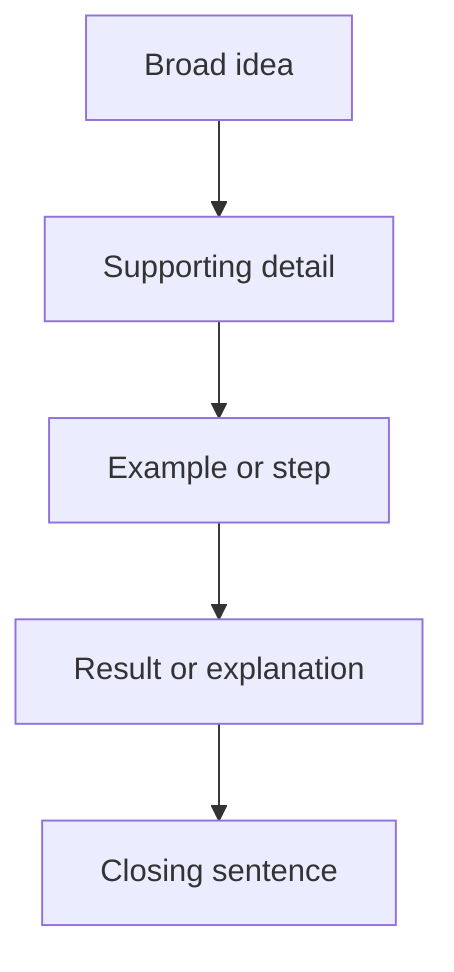
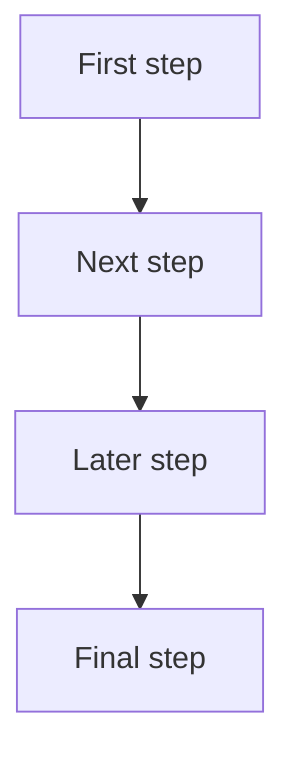
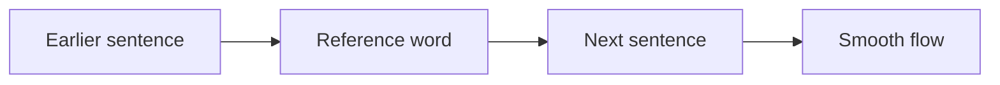

# Logical Sequence

## Explanations

### Introduction

Logical sequence questions ask you to arrange sentences so the paragraph reads naturally from start to finish. In the Civil Service Exam, the correct order usually follows a clear pattern: broad idea first, details next, and a closing thought last. Some items also depend on time words, cause-and-effect links, or pronouns that point back to an earlier sentence.

> [!TIP]
> Ask: "What has to happen or be said first for the next sentence to make sense?"

### Why Topic Is Tested

The CSE uses logical sequence to check whether you can track the flow of ideas, not just read individual sentences. A strong examinee can spot what comes before a reference word, what follows a cause, and what belongs at the end of a paragraph.

### Common Mistakes

- Putting an example before the sentence that introduces the idea.
- Ignoring clue words like first, next, therefore, however, and finally.
- Letting a pronoun appear before its noun.
- Choosing a sentence that sounds important but breaks the flow.
- Ending with a new idea instead of a closing thought.

### Learning Objectives

- Arrange sentences in a logical paragraph order.
- Identify broad openings and fitting conclusions.
- Follow time, cause-effect, and problem-solution patterns.
- Use transitions and reference words to test sequence.
- Remove sentences that break coherence.

## Logical Flow Basics

### Overview

A logical paragraph usually starts with a broad idea, moves through support, and closes with a result or summary. The order should feel natural when the sentences are read aloud together.

### Core Principle

The best sequence is the one that makes each sentence depend on the sentence before it in a clear way.

### Visualization

### Common Mistakes

- Starting with a detail before the topic is introduced.
- Putting the result before the action that causes it.
- Ending with a sentence that opens a new topic.

### Worked Mini Example

A school garden watering plan helps plants stay healthy. Students check the soil before watering. They water the beds early in the morning. The schedule changes when rain is expected. Regular care helps the plants grow well.

Question: Which sentence should come first?
Choices:
- A school garden watering plan helps plants stay healthy.
- They water the beds early in the morning.
- The schedule changes when rain is expected.
Answer: A school garden watering plan helps plants stay healthy.
Rationale: It introduces the broad idea before the details.

### Key Insight

If the paragraph feels natural only when one sentence comes first, that sentence is probably the opening sentence.

### Quick Check

Question: Which sentence should come first in a paragraph about a storm emergency kit?
Choices:
- Preparing an emergency kit helps families stay ready during storms.
- They pack water, batteries, and a flashlight.
- The bag stays near the door.
Answer: Preparing an emergency kit helps families stay ready during storms.
Rationale: It sets up the rest of the paragraph.

Question: Which sentence is the best closing sentence for a paragraph about a community library shelf system?
Choices:
- Good labels make the library easier to use.
- Fiction, nonfiction, and reference sections are marked separately.
- New books are placed on the correct shelf.
Answer: Good labels make the library easier to use.
Rationale: It wraps up the paragraph with the benefit.

Question: Which sentence is too narrow to open a paragraph about office filing?
Choices:
- An office filing workflow helps workers find papers quickly.
- Old files are stored in the archive cabinet.
- Each folder gets a clear label.
Answer: Old files are stored in the archive cabinet.
Rationale: It is only one detail, not the broad idea.

## Sequence Patterns in Paragraphs

### Overview

Not all paragraphs follow the same pattern. Some move from general to specific, some from one step to the next, and some from a problem to its solution.

### Core Principle

A pattern is the hidden order that tells you where each sentence belongs.

### Visualization

| Pattern | What it looks like | Common clue |
|---|---|---|
| General to specific | broad idea → details → closing | topic sentence first |
| Chronological | first → next → then → finally | time words |
| Cause and effect | cause → result | because, therefore, as a result |
| Problem and solution | problem → action → improvement | fix, solve, reduce |

### Common Mistakes

- Assuming every paragraph is chronological.
- Looking for time clues when the paragraph is really about cause and effect.
- Mixing up a problem sentence with a result sentence.

### Worked Mini Example

A classroom morning announcement helps the day start in order. The teacher shares the schedule for the morning. Students listen for reminders about homework and events. The class checks for any changes before the first lesson begins. Clear announcements keep everyone informed.

Question: Which pattern best fits the paragraph?
Choices:
- General to specific
- Cause and effect
- Description only
Answer: General to specific
Rationale: The paragraph opens broadly and then adds details and a closing thought.

### Key Insight

The right sequence is not random; it follows a pattern that the sentences themselves reveal.

### Quick Check

Question: Which pattern best fits a paragraph about a kitchen cleanup order?
Choices:
- Chronological
- Cause and effect
- Compare and contrast
Answer: Chronological
Rationale: The steps happen in a time order.

Question: Which pattern best fits a paragraph about computer password safety?
Choices:
- Problem and solution
- Chronological
- Narration
Answer: Problem and solution
Rationale: The paragraph explains a safety problem and how to fix it.

Question: Which pattern best fits a paragraph about farm irrigation?
Choices:
- Cause and effect
- Description only
- Dialogue
Answer: Cause and effect
Rationale: The watering schedule causes the crops to get water at the right time.

## Time Order and Process Steps

### Overview

Many logical sequence items describe what happens first, what comes next, and what happens after that. Others explain a process or routine.

### Core Principle

Time order follows the order of events. Process order follows the order of actions needed to complete a task.

### Visualization

### Common Mistakes

- Swapping two steps that clearly happen in sequence.
- Ignoring words like first, next, then, and finally.
- Putting the final result before the steps that lead to it.

### Worked Mini Example

Students line up at the bus stop to board smoothly. The driver opens the doors after the bus stops completely. Passengers move forward one at a time. An orderly routine prevents pushing and confusion.

Question: What sentence should come immediately after "The driver opens the doors after the bus stops completely."?
Choices:
- Passengers move forward one at a time.
- Students line up at the bus stop to board smoothly.
- An orderly routine prevents pushing and confusion.
Answer: Passengers move forward one at a time.
Rationale: It is the next step in the routine.

### Key Insight

If one sentence tells you what to do next, the next sentence in the paragraph should follow that direction.

### Quick Check

Question: Which sentence should come immediately after "They pack water, batteries, and a flashlight." in a paragraph about an emergency kit?
Choices:
- They add medicines and important papers.
- Preparing an emergency kit helps families stay ready during storms.
- The bag stays near the door.
Answer: They add medicines and important papers.
Rationale: It is the next step in building the kit.

Question: Which sentence should come last in a paragraph about a rainwater collection system?
Choices:
- Saving rainwater reduces waste during dry days.
- A screen keeps leaves out of the container.
- Gutters guide rain into a storage barrel.
Answer: Saving rainwater reduces waste during dry days.
Rationale: It ends the paragraph with the result or benefit.

Question: Which sentence comes first in a paragraph about school clinic triage?
Choices:
- A triage desk helps a school clinic handle students quickly.
- Serious cases are sent in before minor complaints.
- The queue moves more smoothly when each case is sorted.
Answer: A triage desk helps a school clinic handle students quickly.
Rationale: It introduces the process before the details.

## Cause, Effect, Problem, and Solution

### Overview

Some paragraphs move from a cause to its effect. Others start with a problem and then explain a solution or improvement.

### Core Principle

A cause or problem usually comes before the effect or solution it creates.

### Visualization

| Relationship | Order | Clue |
|---|---|---|
| Cause and effect | cause → effect | because, therefore, as a result |
| Problem and solution | problem → action → improvement | solve, fix, help, reduce |

### Common Mistakes

- Placing the effect before the cause.
- Choosing the solution before the problem is stated.
- Treating a benefit as if it were a new topic.

### Worked Mini Example

Good password safety protects personal information online. Users create passwords that are hard to guess. They avoid sharing passwords with other people. Many accounts also use two-step verification. Careful habits make online accounts harder to break into.

Question: Which sentence best shows the effect of good password safety?
Choices:
- Careful habits make online accounts harder to break into.
- Users create passwords that are hard to guess.
- Many accounts also use two-step verification.
Answer: Careful habits make online accounts harder to break into.
Rationale: It is the result of the safe habits.

### Key Insight

When you see a result word or an improvement, check whether a cause or problem came before it.

### Quick Check

Question: Which sentence best follows the clue word "therefore" in a paragraph about road crossing safety?
Choices:
- Safe road crossing helps students avoid accidents.
- They stop at the curb and look both ways.
- Careful habits keep everyone safer near traffic.
Answer: Careful habits keep everyone safer near traffic.
Rationale: "Therefore" signals a result.

Question: Which sentence best shows the solution in a paragraph about neighborhood watch?
Choices:
- Volunteers check streetlights and report unusual activity.
- Working together helps the block stay secure.
- A neighborhood watch patrol helps residents stay alert.
Answer: Volunteers check streetlights and report unusual activity.
Rationale: It is the action that helps solve the safety concern.

Question: Which sentence comes after the problem in a paragraph about market stall restocking?
Choices:
- Unsold vegetables are moved to the cooler.
- Restocking a market stall keeps fresh goods available.
- A tidy stall helps shoppers buy quickly.
Answer: Unsold vegetables are moved to the cooler.
Rationale: It is the next step after identifying the restocking need.

## Clues That Control the Order

### Overview

Pronouns, transitions, and reference words are tiny clues that decide what comes before or after a sentence. They often reveal the correct logical sequence faster than the topic itself.

### Core Principle

If a sentence says this, they, it, therefore, next, or finally, something earlier usually explains or supports it.

### Visualization

### Common Mistakes

- Starting with a sentence that uses a pronoun without a clear noun.
- Ignoring clue words because the sentence still sounds grammatical.
- Choosing a sentence only because it has the same keyword as the topic.

### Worked Mini Example

A community watch patrol helps residents stay alert. Volunteers check streetlights and report unusual activity. They share emergency numbers with each other. Regular patrols make the street feel safer. Working together helps the block stay secure.

Question: In the paragraph, what does "They" refer to?
Choices:
- volunteers
- streetlights
- emergency numbers
Answer: volunteers
Rationale: The pronoun points back to the people doing the patrol.

### Key Insight

If the sentence depends on a pronoun or transition word, the sentence it refers to usually has to come first.

### Quick Check

Question: Which sentence should come immediately before "They share emergency numbers with each other." in a paragraph about neighborhood watch?
Choices:
- Volunteers check streetlights and report unusual activity.
- Regular patrols make the street feel safer.
- Working together helps the block stay secure.
Answer: Volunteers check streetlights and report unusual activity.
Rationale: The pronoun "They" needs its noun first.

Question: Which sentence should come immediately after "The schedule changes when rain is expected." in a paragraph about school garden watering?
Choices:
- Regular care helps the plants grow well.
- Students check the soil before watering.
- They water the beds early in the morning.
Answer: Regular care helps the plants grow well.
Rationale: It closes the idea with the result of the schedule.

Question: Which sentence is least likely to come first because it depends on earlier information?
Choices:
- The bag stays near the door.
- Preparing an emergency kit helps families stay ready during storms.
- They add medicines and important papers.
Answer: They add medicines and important papers.
Rationale: The pronoun "They" needs a noun before it.

## Worked Examples

### Example 1

An office filing workflow helps workers find papers quickly. Documents are sorted by project and date. Each folder gets a clear label. Old files are stored in the archive cabinet. Good filing saves time and prevents confusion.

Question: Which sentence should come last?
Choices:
- Good filing saves time and prevents confusion.
- Documents are sorted by project and date.
- Each folder gets a clear label.
Answer: Good filing saves time and prevents confusion.
Rationale: It is the closing thought.

### Example 2

A school clinic triage desk helps students get help quickly. Staff ask which student needs help first. Serious cases are sent in before minor complaints. The queue moves more smoothly when each case is sorted. Careful sorting helps the clinic stay organized.

Question: What sentence should come immediately after "Staff ask which student needs help first."?
Choices:
- Serious cases are sent in before minor complaints.
- A school clinic triage desk helps students get help quickly.
- The queue moves more smoothly when each case is sorted.
Answer: Serious cases are sent in before minor complaints.
Rationale: It follows the triage step logically.

### Example 3

Restocking a market stall keeps fresh goods available. Unsold vegetables are moved to the cooler. New produce is arranged by size and color. Prices are checked before customers arrive. A tidy stall helps shoppers buy quickly.

Question: Which sentence does not belong?
Choices:
- Unsold vegetables are moved to the cooler.
- Prices are checked before customers arrive.
- The basketball court was painted green.
Answer: The basketball court was painted green.
Rationale: It breaks the paragraph's focus on restocking.

## Key Takeaways

- Logical sequence is about how one sentence leads to the next.
- Paragraphs often move from a broad idea to details and then to a closing result.
- Time words, cause-effect words, and pronouns are strong clues.
- The wrong order often sounds slightly awkward, even if every sentence is true.
- If a sentence breaks the flow, it should be moved or removed.

## Summary

Logical sequence questions in paragraph organization test whether you can recognize the order that ideas naturally take. When you can spot the opening, the steps, the result, and the sentences that depend on earlier clues, the correct paragraph becomes much easier to build.

## Final Challenge

### Mixed Practice Set

Question: Which order best arranges the sentences into a logical paragraph about rainwater collection?
Choices:
- A-B-C-D
- B-A-C-D
- A-C-B-D
- D-C-B-A
Answer: A-B-C-D
Rationale: The broad idea comes first, followed by the steps and the result.

Question: Which sentence is off-topic in a paragraph about computer password safety?
Choices:
- Users create passwords that are hard to guess.
- Many accounts also use two-step verification.
- The jeepney changed its route.
- They avoid sharing passwords with other people.
Answer: The jeepney changed its route.
Rationale: It breaks the paragraph's focus on online safety.

Question: Which sentence best concludes a paragraph about classroom morning announcements?
Choices:
- Clear announcements keep everyone informed.
- The teacher shares the schedule for the morning.
- Students listen for reminders about homework and events.
Answer: Clear announcements keep everyone informed.
Rationale: It wraps up the paragraph with a benefit.

### Self Assessment

- I can identify the sentence that has to come first.
- I can follow time, cause, and problem-solution patterns.
- I can use transitions and pronouns to test the order.
- I can spot a sentence that breaks coherence.

### What's Next?

Next, practice with longer sets of sentences and fewer obvious clues. The more you train yourself to read for flow, the faster logical sequence questions become on the CSE.
