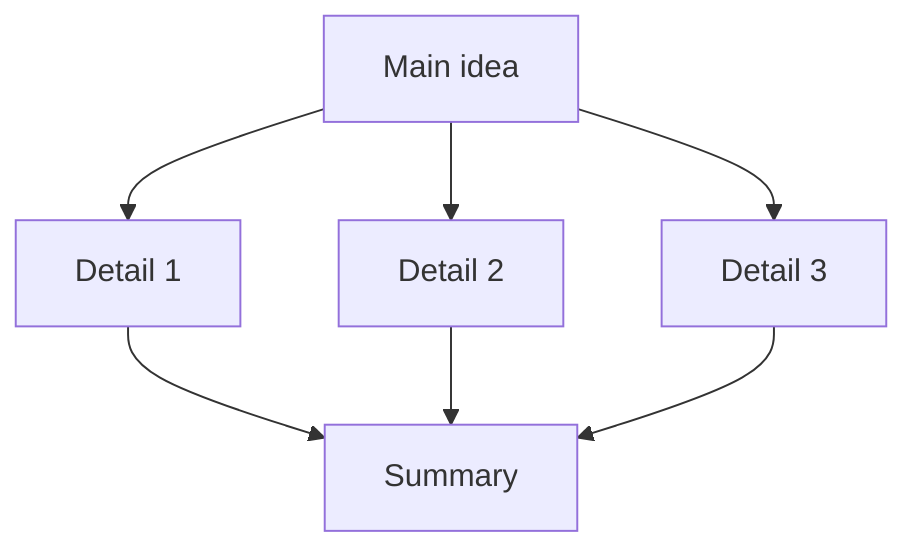
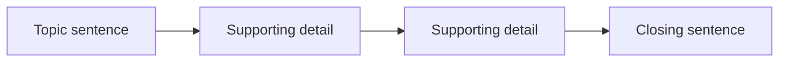
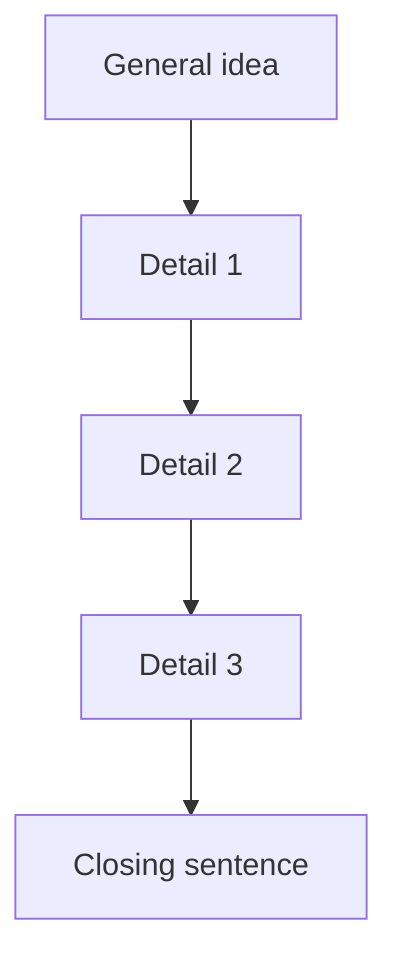

# Main Idea

## Explanations

### Introduction

Paragraph organization questions ask you to see how sentences work together around one controlling thought. In the CSE, that thought may appear as the main idea, the best title, the best summary, the best topic sentence, or the sentence that does not belong.

> [!TIP]
> Ask, “What is every other sentence helping the writer say?”

### Why Topic Is Tested

The exam uses paragraph organization to check whether you can read for structure, scope, and flow. A strong reader can tell when a sentence is broad enough to guide the paragraph and when it is only a detail.

### Common Mistakes

- Choosing a detail because it sounds more specific.
- Picking a title that is too broad or too narrow.
- Assuming the first sentence is always the main idea.
- Following a pronoun or transition word without checking the full paragraph focus.

### Learning Objectives

- Identify the controlling idea of a paragraph.
- Tell broad ideas, narrow details, and off-topic sentences apart.
- Match titles and summaries to the same central point.
- Use sentence order and reference words to test coherence.

## Main Idea

### Overview

The main idea is the broad point the paragraph develops. The rest of the sentences should fit under it.

### Core Principle

A good main idea is wide enough to include every important detail, but tight enough to point to one clear topic.

### Visualization

### Common Mistakes

> [!WARNING]
> A sentence can be true and still be wrong if it only describes one small part of the paragraph.

| Too broad | Just right | Too narrow |
|---|---|---|
| Covers many paragraphs | Covers this paragraph | Covers only one detail |

### Worked Mini Example

A community garden can help neighbors share space, food, and responsibility. Volunteers water the beds and clear the paths. Children learn how vegetables grow.

Question: What is the main idea?
Choices:
- A community garden can help neighbors share space, food, and responsibility.
- Children learn how vegetables grow.
- The garden has three raised beds.
Answer: A community garden can help neighbors share space, food, and responsibility.
Rationale: It is broad enough to cover the other sentences.

### Key Insight

If one sentence can sit above the rest like an umbrella, it is probably the main idea.

### Quick Check

Question: What is the main idea of this paragraph? A library reading club helps students build confidence, vocabulary, and discussion skills. Members read the same book and talk about unfamiliar words. They practice sharing opinions aloud.
Choices:
- A library reading club helps students build confidence, vocabulary, and discussion skills.
- Members read the same book and talk about unfamiliar words.
- The club meets every Tuesday afternoon.
Answer: A library reading club helps students build confidence, vocabulary, and discussion skills.
Rationale: It is the broad point that the details support.

Question: Which choice is too narrow to be the main idea of a paragraph about storm preparedness?
Choices:
- Families can prepare for bad weather in several important ways.
- The family keeps flashlights in a drawer.
- Weather can change quickly.
Answer: The family keeps flashlights in a drawer.
Rationale: It is only one detail, not the whole point.

Question: Which title best fits a paragraph about a school recycling drive?
Choices:
- How a School Recycling Drive Teaches Responsibility
- The Principal's Office Hours
- Why Paper Is White
Answer: How a School Recycling Drive Teaches Responsibility
Rationale: It matches the paragraph's central idea.

## Topic Sentence

### Overview

The topic sentence usually announces the main idea at the start of a paragraph.

### Core Principle

A strong topic sentence is broad, neutral, and ready to support the details that follow.

### Visualization

### Common Mistakes

- Starting with a detail that depends on earlier context.
- Using a pronoun with no clear noun before it.
- Writing a sentence that already sounds like a conclusion.

### Worked Mini Example

An organized filing system helps workers find records quickly and avoid mistakes. Folders are labeled by date. Old files are archived in order.

Question: Which sentence would best open a paragraph about an office filing system?
Choices:
- An organized filing system helps workers find records quickly and avoid mistakes.
- The red folder is on the top shelf.
- The office bought a new coffee maker.
Answer: An organized filing system helps workers find records quickly and avoid mistakes.
Rationale: It is broad enough for the details that follow.

### Key Insight

If the paragraph can grow from the sentence, the sentence is probably a topic sentence.

### Quick Check

Question: Which sentence would best open a paragraph about hospital handwashing?
Choices:
- Careful handwashing helps prevent infection in hospitals.
- The sink is near the door.
- Nurses wear blue gloves.
Answer: Careful handwashing helps prevent infection in hospitals.
Rationale: It gives the broad idea that the rest of the paragraph can explain.

Question: Which sentence is most likely a topic sentence because it is broad enough for the details?
Choices:
- A clear transit schedule helps riders plan trips and avoid delays.
- The first bus leaves at 6:10 a.m.
- The station sold souvenirs near the entrance.
Answer: A clear transit schedule helps riders plan trips and avoid delays.
Rationale: It is broad enough to support the details.

Question: Which sentence should stay out of the opening because it is only a detail?
Choices:
- Volunteer tutoring gives students extra practice and encouragement.
- The tutor checks homework after school.
- Extra help can improve learning.
Answer: The tutor checks homework after school.
Rationale: It is a supporting detail, not a broad opener.

## Supporting Details

### Overview

Supporting details explain, prove, or illustrate the main idea.

### Core Principle

Details should stay inside the paragraph's scope and make the main point clearer.

### Visualization

| Detail type | What it does | Example |
|---|---|---|
| Example | Shows the idea in action | A student sorts bottles into bins |
| Reason | Explains why the idea matters | Recycling reduces trash |
| Evidence | Adds proof or support | The school tracks how much waste it diverts |

### Common Mistakes

- Confusing a detail with the main idea.
- Choosing a sentence that is true but off-topic.
- Picking a sentence that repeats the title without adding support.

### Worked Mini Example

A coastal cleanup protects marine life and keeps the shore pleasant for visitors. Volunteers collect plastic from the sand. They remove fishing line that can hurt animals. Recyclable items are sorted before disposal.

Question: Which sentence best supports the main idea?
Choices:
- Volunteers collect plastic from the sand.
- Keeping beaches clean is important.
- The town opened a new fountain downtown.
Answer: Volunteers collect plastic from the sand.
Rationale: It is a direct detail that supports the cleanup.

### Key Insight

A supporting detail adds proof; it does not restart the topic.

### Quick Check

Question: Which sentence best supports the main idea of a paragraph about park maintenance?
Choices:
- Workers trim overgrown grass and empty trash bins.
- Parks are public spaces.
- The city painted a mural on the library wall.
Answer: Workers trim overgrown grass and empty trash bins.
Rationale: It stays inside the paragraph's focus on maintenance.

Question: Which sentence does not belong in a paragraph about public transit schedules?
Choices:
- The schedule lists exact departure times and transfer points.
- Riders can plan trips more easily.
- The station sells bottled water.
Answer: The station sells bottled water.
Rationale: It is unrelated to the schedule.

Question: Which detail stays closest to the paragraph's focus on volunteer tutoring?
Choices:
- Tutors explain difficult lessons slowly.
- The gym has a new scoreboard.
- Students like summer break.
Answer: Tutors explain difficult lessons slowly.
Rationale: It directly supports the idea of tutoring.

## Scope Control

### Overview

Scope control is the skill of deciding whether an idea is too broad, too narrow, or just right for the paragraph.

### Core Principle

Too broad covers more than the paragraph explains. Too narrow covers only one detail. Just right covers the whole paragraph.

### Visualization

| Scope | Meaning | Typical clue |
|---|---|---|
| Too broad | Much wider than the paragraph | Could fit many different passages |
| Just right | Matches the paragraph exactly | Covers all details |
| Too narrow | Only one small detail | Sounds specific but incomplete |

### Common Mistakes

- Picking a general statement that is true but not focused enough.
- Picking one detail and treating it as the whole point.
- Choosing a sentence that shifts to a related but different idea.

### Worked Mini Example

Using mobile payments safely means checking details before confirming a transaction. Users verify the recipient name. They review the amount. They keep login information private.

Question: Which sentence is too broad to serve as the main idea?
Choices:
- Digital payments can make buying and selling easier.
- Using mobile payments safely means checking details before confirming a transaction.
- The phone case comes in a red box.
Answer: Digital payments can make buying and selling easier.
Rationale: It is true, but it is broader than the paragraph's focus.

### Key Insight

The best answer sits in the same size range as the paragraph.

### Quick Check

Question: Which choice is too broad to serve as the main idea of a paragraph about farm irrigation?
Choices:
- Farming depends on many systems.
- A reliable irrigation system gives crops water when rain is scarce.
- The pump sits near the field gate.
Answer: Farming depends on many systems.
Rationale: It covers far more than the paragraph explains.

Question: Which choice is too narrow to serve as the main idea of a paragraph about neighborhood watch?
Choices:
- A neighborhood watch can make a street feel safer and more connected.
- Residents share emergency contacts.
- Communities need ways to stay safe.
Answer: Residents share emergency contacts.
Rationale: It is only one detail, not the full point.

Question: Which sentence best keeps the paragraph focused on its main point?
Choices:
- A school recycling drive teaches students to sort waste and reduce trash.
- The principal bought new basketballs.
- The cafeteria serves lunch at noon.
Answer: A school recycling drive teaches students to sort waste and reduce trash.
Rationale: It matches the paragraph's scope.

## Sentence Order and Coherence

### Overview

Paragraphs read best when general ideas, details, and conclusions appear in a logical order.

### Core Principle

Good order usually moves from general to specific, from cause to effect, or from problem to solution. Reference words and transition words help you test the flow.

### Visualization

### Common Mistakes

- Putting a detail before the sentence it refers to.
- Ignoring pronouns and transition words.
- Ending with a sentence that introduces a new idea.

### Worked Mini Example

A storm can be easier to handle when families prepare ahead of time. They store water and flashlights. They secure loose items outside. They know evacuation routes. Preparation makes the storm easier to face.

Question: What is the correct order of the sentences to form a paragraph about storm preparedness?
Choices:
- A-B-C-D-E
- B-A-C-D-E
- A-C-B-D-E
Answer: A-B-C-D-E
Rationale: The broad idea comes first, followed by the details and the closing sentence.

### Key Insight

If a pronoun or connector points back to another sentence, that earlier sentence probably has to come first.

### Quick Check

Question: What is the correct order of the sentences to form a paragraph about a science fair?
Choices:
- A-B-C-D
- B-A-C-D
- A-C-B-D
Answer: A-B-C-D
Rationale: The broad idea comes first, then the details, then the conclusion.

Question: Which sentence best concludes the paragraph about a community garden?
Choices:
- Together, these details show that the garden gives neighbors a useful shared space.
- The garden has three raised beds.
- The city painted the bus terminal red.
Answer: Together, these details show that the garden gives neighbors a useful shared space.
Rationale: It wraps up the details without adding a new idea.

Question: In a paragraph about recycling, what does "they" refer to?
Choices:
- the students
- the bins
- the bottles
Answer: the students
Rationale: The pronoun should point back to the people doing the action.

## Worked Examples

### Example 1

A library reading club helps students build confidence, vocabulary, and discussion skills. Members read the same book and talk about unfamiliar words. They practice sharing opinions aloud.

Question: What is the main idea of the paragraph?
Choices:
- A library reading club helps students build confidence, vocabulary, and discussion skills.
- Members read the same book and talk about unfamiliar words.
- The club meets every Tuesday afternoon.
Answer: A library reading club helps students build confidence, vocabulary, and discussion skills.
Rationale: It is the broad point that the details support.

### Example 2

An organized filing system helps workers find records quickly and avoid mistakes. Folders are labeled by date. Old files are archived in order.

Question: Which sentence best fits as the title?
Choices:
- Why an Organized Filing System Helps
- A New Coffee Machine in the Office
- The Red Folder on the Shelf
Answer: Why an Organized Filing System Helps
Rationale: It matches the paragraph's main idea.

### Example 3

A school recycling drive teaches students to sort waste and reduce trash. Bins are labeled paper, plastic, and metal. Classes track how much waste they divert.

Question: Which sentence does not belong?
Choices:
- A school recycling drive teaches students to sort waste and reduce trash.
- Bins are labeled paper, plastic, and metal.
- The principal bought new basketballs.
Answer: The principal bought new basketballs.
Rationale: It breaks the paragraph's focus on recycling.

## Key Takeaways

- The main idea is the broad point that all the details support.
- A topic sentence usually introduces that broad point.
- Supporting details should stay inside the paragraph's scope.
- Titles, summaries, and conclusions must match the same central idea.
- Sentence order often reveals the main idea if you track pronouns and transitions.

## Summary

Main idea questions in paragraph organization are really scope questions. When you know the paragraph's controlling idea, you can pick the best title, the best topic sentence, the best summary, the best supporting detail, and the sentence that does not belong.

## Final Challenge

### Mixed Practice Set

Question: Which statement best summarizes a paragraph about volunteer tutoring?
Choices:
- Volunteer tutoring gives students extra practice and encouragement.
- The tutor meets the class after school.
- The gym has a new scoreboard.
- Students enjoy the weekend.
Answer: Volunteer tutoring gives students extra practice and encouragement.
Rationale: It captures the paragraph's main point without drifting into a detail.

Question: Which sentence does not belong in a paragraph about storm preparedness?
Choices:
- Families store water and flashlights before a storm.
- They secure loose items outside.
- They know evacuation routes.
- The school painted the library door green.
Answer: The school painted the library door green.
Rationale: It shifts away from the paragraph's focus on preparation.

Question: Which order best arranges the sentences into a coherent paragraph about park maintenance?
Choices:
- A-B-C-D
- B-A-C-D
- A-C-B-D
- D-C-B-A
Answer: A-B-C-D
Rationale: The general idea comes first, followed by the supporting details and the closing idea.

### Self Assessment

- I can tell a main idea from a detail.
- I can spot a sentence that is too broad or too narrow.
- I can check whether a title matches the paragraph's scope.
- I can test order by looking for pronouns and transitions.

### What's Next?

The next step is to practice the same thinking with topic sentences, supporting details, and sentence order on longer passages. Once that feels natural, paragraph organization items become much faster to solve.
