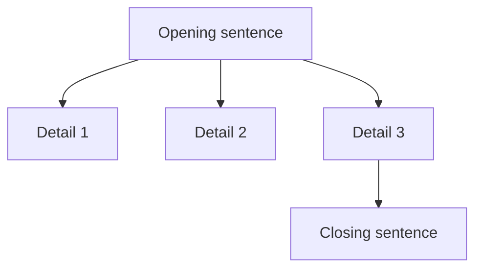
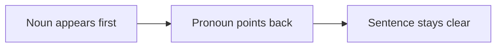
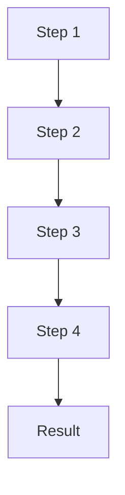

# Sentence Order

## Explanations

### Introduction

Sentence order questions ask you to arrange sentences into a paragraph that reads smoothly and logically. In Civil Service Exam paragraph organization items, the clue may be a topic sentence, a pronoun, a transition word, a time word, or a cause-and-effect link.

> [!TIP]
> Ask: "Which sentence must come first so the other sentences make sense?"

### Why Topic Is Tested

The CSE uses sentence order to check whether you can track how ideas connect. A good reader notices when a sentence depends on another sentence before it, and when a closing thought should stay at the end.

### Common Mistakes

- Putting a detail before the sentence that introduces it.
- Ignoring pronouns, transition words, and time clues.
- Choosing the sentence that sounds most interesting instead of the one that fits the flow.
- Ending with a new idea instead of a wrap-up.
- Assuming the first sentence is always correct without checking the whole paragraph.

### Learning Objectives

- Arrange sentences in a logical order.
- Identify the opening and closing sentences.
- Use pronouns and transition words to test sequence.
- Recognize chronological, cause-and-effect, and problem-solution flow.
- Reject sentences that break coherence or belong somewhere else.

## Finding the Opening Sentence

### Overview

The opening sentence usually gives the broad idea. It sets the frame for the details that follow.

### Core Principle

A strong opening sentence is general enough to support the paragraph, but focused enough to stay on one topic.

### Visualization

### Common Mistakes

- Starting with a tiny detail before the topic is introduced.
- Picking a sentence that already sounds like a conclusion.
- Choosing a sentence that depends on a pronoun with no clear antecedent.

### Worked Mini Example

A fire drill helps students leave the building safely and quickly. Teachers point to the nearest exits before the drill begins. Students walk in line to the assembly area. Repeated drills make the response automatic.

Question: Which sentence should come first?
Choices:
- A fire drill helps students leave the building safely and quickly.
- Students walk in line to the assembly area.
- Repeated drills make the response automatic.
Answer: A fire drill helps students leave the building safely and quickly.
Rationale: It introduces the paragraph's broad idea.

### Key Insight

If the rest of the paragraph can grow from the sentence, it is probably the opening sentence.

### Quick Check

Question: Which sentence should come first in a paragraph about a classroom recycling routine?
Choices:
- A classroom recycling routine helps students keep the room tidy and reduce waste.
- They save used worksheets in one tray for collection.
- The teacher sees fewer mixed trash bags at the end of the week.
Answer: A classroom recycling routine helps students keep the room tidy and reduce waste.
Rationale: It gives the paragraph its broad focus.

Question: Which sentence is too narrow to open a paragraph about a bus stop queue?
Choices:
- Good queue etiquette at a bus stop keeps riders orderly and safe.
- Passengers line up behind the painted mark.
- Simple courtesy makes public transport easier for everyone.
Answer: Passengers line up behind the painted mark.
Rationale: It is only one detail, not the full idea.

Question: Which sentence best opens a paragraph about a library return policy?
Choices:
- A clear book return policy helps a library keep materials available.
- Books are due back by a fixed date printed on the card.
- Late returns delay other readers who need the same book.
Answer: A clear book return policy helps a library keep materials available.
Rationale: It is broad enough to support the details that follow.

## Clue Words and Sentence Links

### Overview

Transition words and connecting phrases help you decide what comes next. They show addition, contrast, cause, result, and sequence.

### Core Principle

Words like first, next, then, however, therefore, and as a result tell you how one sentence depends on another.

### Visualization

| Clue type | Example words | What it signals |
|---|---|---|
| Time | first, next, then, finally | Order of steps |
| Cause and effect | because, therefore, as a result | Result after reason |
| Contrast | however, but, instead | A shift in direction |
| Addition | also, moreover, in addition | Another related detail |

### Common Mistakes

- Ignoring a clue word because the sentence looks short.
- Putting a result before the reason.
- Treating a contrast word like a time word.

### Worked Mini Example

A meeting agenda helps a team cover important topics in order. The list shows the welcome, report, and action items. This clear order prevents people from repeating the same points. The chair can check off each item as it is discussed.

Question: Which sentence should come after the sentence that says, "The list shows the welcome, report, and action items"?
Choices:
- This clear order prevents people from repeating the same points.
- A meeting agenda helps a team cover important topics in order.
- The chair can check off each item as it is discussed.
Answer: This clear order prevents people from repeating the same points.
Rationale: The transition from the list to its benefit is the natural next step.

### Key Insight

When a transition word points forward, the next sentence is usually the one that explains it.

### Quick Check

Question: Which sentence best follows the clue word "therefore" in a paragraph about school canteen cleanliness?
Choices:
- Workers wipe tables after each lunch period.
- A clean area reduces germs and spills.
- Regular cleaning makes the canteen healthier and more pleasant.
Answer: Regular cleaning makes the canteen healthier and more pleasant.
Rationale: "Therefore" points to a result.

Question: Which sentence best follows the clue word "next" in a paragraph about farm composting?
Choices:
- Farmers pile leaves, stalks, and scraps in one area.
- They mix fruit peels with dry grass.
- What was once waste becomes a resource for planting.
Answer: They mix fruit peels with dry grass.
Rationale: "Next" signals the following step.

Question: Which sentence should come after the sentence that says, "It weakens waves before they hit the sand"?
Choices:
- A coastal barrier helps slow erosion and protect the shoreline.
- Rocks placed along the coast absorb force.
- Barriers help preserve the coast over time.
Answer: Rocks placed along the coast absorb force.
Rationale: The sentence after the clue should continue the explanation.

## Pronouns and Reference Words

### Overview

Pronouns such as it, they, this, and these point back to earlier ideas. If the noun has not appeared yet, the sentence order is probably wrong.

### Core Principle

A pronoun must have a clear antecedent before it. That earlier sentence often has to come first.

### Visualization

### Common Mistakes

- Putting the pronoun sentence before the noun it refers to.
- Guessing from grammar alone without checking the paragraph.
- Choosing a sentence because it has the right pronoun but the wrong meaning.

### Worked Mini Example

An emergency contact card helps adults reach the right people quickly. The card lists names and phone numbers. It includes a parent, a guardian, and a neighbor. Keeping the card updated makes it more useful.

Question: In the paragraph, what does "It" refer to?
Choices:
- the card
- the neighbor
- the phone number
Answer: the card
Rationale: The pronoun points back to the emergency contact card.

### Key Insight

If you cannot identify the pronoun's noun yet, the sentence probably needs to come later.

### Quick Check

Question: In the paragraph about neighborhood drainage cleanup, what does "They" refer to?
Choices:
- residents
- channels
- rain
Answer: residents
Rationale: The people doing the cleanup are the ones who "they" refers to.

Question: Which sentence should come before the sentence "They keep food and drinks outside the lab"?
Choices:
- Computer lab rules help students use equipment carefully and respectfully.
- Careful habits protect the computers from damage.
- Students log off before leaving the station.
Answer: Students log off before leaving the station.
Rationale: The pronoun sentence needs a clear noun before it.

Question: Which sentence is the best antecedent for the pronoun "They" in a paragraph about bus queue etiquette?
Choices:
- Passengers line up behind the painted mark.
- Simple courtesy makes public transport easier for everyone.
- The bus stop is near the market.
Answer: Passengers line up behind the painted mark.
Rationale: The pronoun refers to the passengers.

## Chronological and Process Order

### Overview

Some paragraphs move through steps in time order. Others explain a process from start to finish.

### Core Principle

Chronological order follows what happens first, next, and last. Process order follows the steps needed to complete a task.

### Visualization

### Common Mistakes

- Swapping two steps that happen in a clear time sequence.
- Putting the result before the action that causes it.
- Forgetting that process sentences must be read in order.

### Worked Mini Example

Cleaning neighborhood drains helps prevent flooding during heavy rain. Residents remove leaves, mud, and plastic from the channels. They clear the drain near the corner store first. Open drains allow water to flow away from the street.

Question: What is the correct order of the sentences?
Choices:
- A-B-C-D
- B-A-C-D
- A-C-B-D
Answer: A-B-C-D
Rationale: The idea opens the paragraph, then the steps and result follow in order.

### Key Insight

If a sentence says "next" or "first," it is probably part of the path you should follow.

### Quick Check

Question: Which order best shows the time sequence in a paragraph about a fire drill?
Choices:
- A-B-C-D
- B-A-C-D
- A-C-B-D
Answer: A-B-C-D
Rationale: The drill begins with the general idea, then the steps, then the result.

Question: Which sentence should come immediately after "Workers water the trays each morning" in a paragraph about a seedling nursery?
Choices:
- They shade fragile leaves from harsh sun.
- A seedling nursery helps young plants grow strong before they are transplanted.
- Careful nursery work leads to better planting later.
Answer: They shade fragile leaves from harsh sun.
Rationale: It is the next process step.

Question: Which sentence should come last in a paragraph about a clinic appointment board?
Choices:
- Patients are called in the order listed on the board.
- Staff write each patient's name, time, and reason for the visit.
- This clear schedule keeps the waiting room from becoming crowded.
Answer: This clear schedule keeps the waiting room from becoming crowded.
Rationale: It gives the ending effect of the process.

## Logical Patterns: Cause, Effect, Problem, and Solution

### Overview

Many CSE items use logic patterns. One sentence gives the cause or problem, another gives the effect or solution, and the order must reflect that relationship.

### Core Principle

A cause comes before its effect. A problem comes before its solution. A paragraph often closes with the result or benefit.

### Visualization

| Pattern | Usual order | Example cue |
|---|---|---|
| Cause and effect | cause → result | because, therefore, as a result |
| Problem and solution | problem → action → result | helps, solves, prevents |
| General to specific | broad idea → details → close | first sentence, supporting lines |

### Common Mistakes

- Putting the effect before the cause.
- Choosing the solution before the problem has been stated.
- Missing the closing sentence that sums up the benefit.

### Worked Mini Example

A classroom recycling routine helps students keep the room tidy and reduce waste. Students separate paper, plastic, and metal into labeled bins. They save used worksheets in one tray for collection. The teacher sees fewer mixed trash bags at the end of the week. The routine makes recycling part of daily class life.

Question: Which sentence best shows the result of the routine?
Choices:
- The teacher sees fewer mixed trash bags at the end of the week.
- Students separate paper, plastic, and metal into labeled bins.
- A classroom recycling routine helps students keep the room tidy and reduce waste.
Answer: The teacher sees fewer mixed trash bags at the end of the week.
Rationale: It is the effect that follows the recycling habit.

### Key Insight

If the sentence explains what happens because of the action, it probably belongs after the action.

### Quick Check

Question: Which order best shows the problem and solution in a paragraph about bus queue etiquette?
Choices:
- A-B-C-D
- B-A-C-D
- A-C-B-D
Answer: A-B-C-D
Rationale: The paragraph starts with the problem, then shows the solution, then gives the result.

Question: Which sentence best comes after "A clear book return policy helps a library keep materials available"?
Choices:
- Books are due back by a fixed date printed on the card.
- Late returns delay other readers who need the same book.
- When everyone follows the rule, more people can borrow books.
Answer: Books are due back by a fixed date printed on the card.
Rationale: It is the next step in explaining the policy.

Question: Which sentence gives the effect of a coastal barrier?
Choices:
- Rocks placed along the coast absorb force.
- A coastal barrier helps slow erosion and protect the shoreline.
- After the barrier is built, the beach loses less sand.
Answer: After the barrier is built, the beach loses less sand.
Rationale: It describes what happens because the barrier exists.

## Worked Examples

### Example 1

A community mural project can turn a blank wall into a brighter public space. Residents sketch ideas on a shared wall. Children paint small leaves around the border. More neighbors stop to take part when they see the design taking shape. The finished mural shows shared effort and local pride.

Question: Which sentence should come first?
Choices:
- A community mural project can turn a blank wall into a brighter public space.
- Children paint small leaves around the border.
- More neighbors stop to take part when they see the design taking shape.
Answer: A community mural project can turn a blank wall into a brighter public space.
Rationale: It gives the paragraph its opening idea.

### Example 2

A meeting agenda helps a team cover important topics in order. The list shows the welcome, report, and action items. The chair can check off each item as it is discussed. This clear order prevents people from repeating the same points. An agenda keeps the meeting focused and efficient.

Question: What does "This clear order" refer to?
Choices:
- the agenda's sequence of items
- the chair's pen
- the meeting room
Answer: the agenda's sequence of items
Rationale: The phrase points back to the ordered agenda.

### Example 3

Composting on a farm turns waste into useful fertilizer. Farmers pile leaves, stalks, and scraps in one area. They mix fruit peels with dry grass. The decaying material returns nutrients to the soil. What was once waste becomes a resource for planting.

Question: Which sentence best shows the result of composting?
Choices:
- The decaying material returns nutrients to the soil.
- Farmers pile leaves, stalks, and scraps in one area.
- Composting on a farm turns waste into useful fertilizer.
Answer: The decaying material returns nutrients to the soil.
Rationale: It is the effect of the composting process.

## Key Takeaways

- Sentence order is about logical flow, not guessing.
- The opening sentence is usually broad enough to support the rest.
- Pronouns and transition words often reveal what must come before or after.
- Chronological, cause-and-effect, and problem-solution patterns are common.
- If a sentence breaks the flow, it probably does not belong.

## Summary

Sentence order questions in paragraph organization test whether you can see how one sentence depends on another. When you track openings, endings, pronouns, transitions, and logical patterns, the correct sequence becomes much easier to see.

## Final Challenge

### Mixed Practice Set

Question: Which sentence does not belong in a paragraph about a fire drill?
Choices:
- A fire drill helps students leave the building safely and quickly.
- Teachers point to the nearest exits before the drill begins.
- Students walk in line to the assembly area.
- The cafeteria served mango shakes.
Answer: The cafeteria served mango shakes.
Rationale: It breaks the paragraph's focus on emergency practice.

Question: Which sentence should come immediately before "They keep food and drinks outside the lab" in a paragraph about computer lab rules?
Choices:
- Students log off before leaving the station.
- Computer lab rules help students use equipment carefully and respectfully.
- Rules keep the lab safe and usable for the next class.
Answer: Students log off before leaving the station.
Rationale: The pronoun sentence needs a clear noun before it.

Question: Which order best arranges the sentences into a coherent paragraph about neighborhood drainage cleanup?
Choices:
- A-B-C-D-E
- B-A-C-D-E
- A-C-B-D-E
- E-D-C-B-A
Answer: A-B-C-D-E
Rationale: The broad idea comes first, followed by the steps and the result.

### Self Assessment

- I can identify the opening and closing sentences.
- I can use pronouns and clue words to decide sequence.
- I can spot cause-and-effect and problem-solution flow.
- I can tell when a sentence should be moved or removed.

### What's Next?

Next, practice sentence order with longer paragraphs and subtler clues. The more you train your eye for structure, the faster you can solve paragraph organization items on the CSE.
