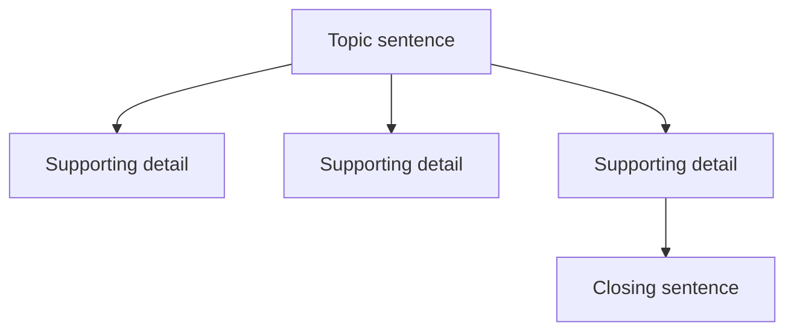
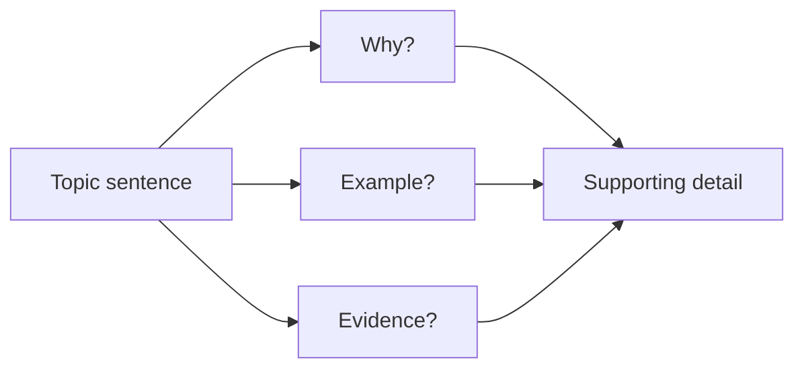
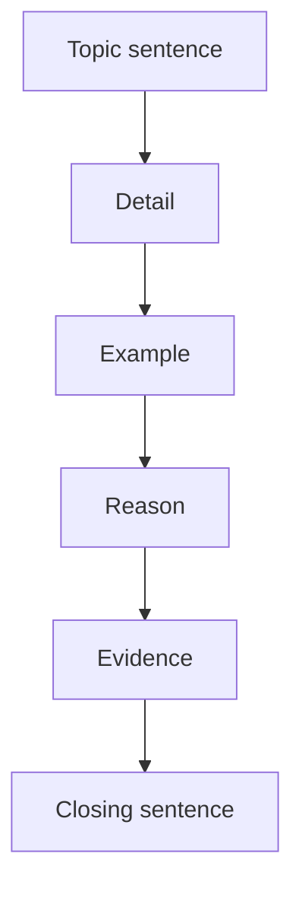

# Supporting Details

## Explanations

### Introduction

Supporting details are the sentences that explain, prove, describe, or illustrate the main point of a paragraph. In Civil Service Exam paragraph organization items, they often help you confirm the topic sentence, spot the correct order, and remove sentences that do not belong.

> [!TIP]
> Ask: "Does this sentence help develop the paragraph's main point, or does it drift away from it?"

### Why Topic Is Tested

The CSE uses paragraph organization to check whether you can follow the structure of a paragraph instead of just reading each sentence in isolation. Supporting details are a big clue because they show which sentence belongs under the paragraph's focus.

### Common Mistakes

- Picking a sentence because it sounds interesting, even if it does not support the topic.
- Confusing a supporting detail with the topic sentence.
- Choosing a detail that is true but too narrow or too broad.
- Missing a sentence that gives an example, reason, or piece of evidence.
- Ignoring the way the details connect to one another.

### Learning Objectives

- Identify the sentence that best supports a topic sentence.
- Tell examples, reasons, facts, and evidence apart.
- Spot irrelevant details quickly.
- Use supporting sentences to test paragraph coherence.
- Match the right detail to the right paragraph focus.

## Supporting Detail Basics

### Overview

A supporting detail is a sentence that helps explain the topic sentence. It does not replace the main idea; it develops it.

### Core Principle

Good supporting details stay inside the paragraph's scope. They make the main point clearer by adding information the reader can use.

### Visualization

### Common Mistakes

- Treating one small fact as if it were the whole paragraph.
- Choosing a sentence that restates the topic but adds nothing.
- Selecting a detail that belongs to a different paragraph.

### Worked Mini Example

A classroom recycling routine helps students keep the room tidy and reduce waste. Students separate paper, plastic, and metal into labeled bins. They save used worksheets in one tray for collection.

Question: Which sentence best supports the topic sentence?
Choices:
- Students separate paper, plastic, and metal into labeled bins.
- The principal bought new curtains for the office.
- A recycling routine is important.
Answer: Students separate paper, plastic, and metal into labeled bins.
Rationale: It gives a direct detail that develops the topic sentence.

### Key Insight

If a sentence helps the paragraph grow, it is probably a supporting detail.

### Quick Check

Question: Which sentence best supports a paragraph about a clinic appointment board?
Choices:
- Staff write each patient's name, time, and reason for the visit.
- The pharmacy displayed a poster about summer classes.
- The clinic painted the waiting room wall yellow.
Answer: Staff write each patient's name, time, and reason for the visit.
Rationale: It stays inside the paragraph's focus on appointments.

Question: Which sentence is too narrow to serve as a useful supporting detail?
Choices:
- Students separate paper, plastic, and metal into labeled bins.
- The green bin is next to the door.
- Recycling helps keep the room tidy.
Answer: The green bin is next to the door.
Rationale: It is only a small location detail, not a helpful support sentence.

Question: Which choice best adds support to a paragraph about a fire drill?
Choices:
- Teachers point to the nearest exit before the drill starts.
- The cafeteria served noodles at lunch.
- The gym floor was painted blue.
Answer: Teachers point to the nearest exit before the drill starts.
Rationale: It helps explain how the drill prepares students.

## Kinds of Supporting Details

### Overview

Supporting details can take different forms. Some give examples, some give reasons, and some provide facts or evidence.

### Core Principle

The best supporting detail is the one that matches the job the paragraph needs at that moment.

### Visualization

| Kind of detail | What it does | Example |
|---|---|---|
| Example | Shows the idea in action | A class sorts bottles into bins |
| Reason | Explains why the idea matters | The room stays cleaner |
| Fact or evidence | Adds proof or specific information | Fewer mixed trash bags appear |

### Common Mistakes

- Thinking every support sentence must sound the same.
- Choosing an example when the paragraph needs a reason.
- Picking a fact that is true but does not match the topic.

### Worked Mini Example

A clinic appointment board helps patients get care without long waits. Staff write each patient's name, time, and reason for the visit. Morning slots are reserved for checkups.

Question: Which sentence is the best example detail?
Choices:
- Morning slots are reserved for checkups.
- A clinic appointment board helps patients get care without long waits.
- The pharmacy displayed a poster about summer classes.
Answer: Morning slots are reserved for checkups.
Rationale: It gives a specific example of how the board is used.

### Key Insight

Supporting details can look different, but they must all serve the same paragraph focus.

### Quick Check

Question: Which sentence gives the best example for a paragraph about a community mural project?
Choices:
- Children paint small leaves around the border.
- The market closed early because of rain.
- The mural project is exciting.
Answer: Children paint small leaves around the border.
Rationale: It gives a concrete example of the project in action.

Question: Which sentence gives the strongest reason for a paragraph about bus queue etiquette?
Choices:
- A neat line prevents pushing and confusion.
- The newsstand sold comic books.
- Passengers line up behind the painted mark.
Answer: A neat line prevents pushing and confusion.
Rationale: It explains why the etiquette matters.

Question: Which sentence gives evidence for a paragraph about farm composting?
Choices:
- Crops often grow better in fields that receive compost.
- The store sold umbrellas by the entrance.
- Composting is a useful habit.
Answer: Crops often grow better in fields that receive compost.
Rationale: It offers proof that composting helps the farm.

## Matching Details to the Topic Sentence

### Overview

The topic sentence tells you what kind of support belongs in the paragraph. Details must stay close to that focus.

### Core Principle

A strong supporting detail should answer the question, "How does this detail help explain the topic sentence?"

### Visualization

### Common Mistakes

- Choosing a detail that belongs to a related but different topic.
- Adding a sentence that sounds broad but does not explain anything.
- Forgetting that the best support is the one that fits the paragraph's focus most closely.

### Worked Mini Example

A school canteen cleanliness routine helps keep food safe for students. Workers wipe tables after each lunch period. Trash is sorted before the floor is mopped.

Question: Which sentence best matches the topic sentence?
Choices:
- Workers wipe tables after each lunch period.
- The library added a comic book shelf.
- The school canteen is in the front building.
Answer: Workers wipe tables after each lunch period.
Rationale: It directly supports the idea of keeping the canteen clean.

### Key Insight

The paragraph's topic sentence acts like a magnet for relevant details.

### Quick Check

Question: Which sentence best matches a paragraph about emergency contact cards?
Choices:
- The card lists names and phone numbers.
- The class painted a mural about summer.
- The school gate was repaired last week.
Answer: The card lists names and phone numbers.
Rationale: It directly supports the idea of reaching the right people quickly.

Question: Which sentence best supports a paragraph about computer lab rules?
Choices:
- Students log off before leaving the station.
- The basketball court was repainted blue.
- The lab chairs were arranged in rows.
Answer: Students log off before leaving the station.
Rationale: It matches the paragraph's focus on careful equipment use.

Question: Which sentence best supports a paragraph about neighborhood drainage cleanup?
Choices:
- Residents remove leaves, mud, and plastic from the channels.
- The bakery made a larger birthday cake.
- The drain is near the corner store.
Answer: Residents remove leaves, mud, and plastic from the channels.
Rationale: It shows the cleanup that prevents flooding.

## Weak Support and Off-Topic Sentences

### Overview

Not every true sentence belongs in a paragraph. The best test is whether the sentence actually supports the topic sentence.

### Core Principle

A weak support sentence may be true, but it does not develop the paragraph's main idea. An off-topic sentence breaks the focus completely.

### Visualization

| Sentence type | Relationship to the topic | What to do |
|---|---|---|
| Strong support | Directly develops the topic | Keep it |
| Weak support | Barely helps or adds little | Recheck it |
| Off-topic | Breaks the paragraph's focus | Remove it |

### Common Mistakes

- Choosing a sentence because it has a keyword from the paragraph.
- Missing a sentence that switches to a different topic.
- Confusing a tiny supporting detail with a useful one.

### Worked Mini Example

A neighborhood drainage cleanup helps prevent flooding during heavy rain. Residents remove leaves, mud, and plastic from the channels. Open drains allow water to flow away from the street.

Question: Which sentence does not belong?
Choices:
- Residents remove leaves, mud, and plastic from the channels.
- Open drains allow water to flow away from the street.
- The bakery made a larger birthday cake.
Answer: The bakery made a larger birthday cake.
Rationale: It breaks the paragraph's focus on drainage cleanup.

### Key Insight

If a sentence would fit better in a different paragraph, it does not belong here.

### Quick Check

Question: Which sentence is off-topic in a paragraph about a seedling nursery?
Choices:
- Workers water the trays each morning.
- Shaded nets protect fragile leaves from harsh sun.
- The shopkeeper stacked bottled drinks near the door.
Answer: The shopkeeper stacked bottled drinks near the door.
Rationale: It does not help explain how seedlings grow.

Question: Which sentence is too weak to serve as support in a paragraph about a meeting agenda?
Choices:
- The chair can check off each item as it is discussed.
- The list shows the welcome, report, and action items.
- The janitor polished the hallway floor.
Answer: The janitor polished the hallway floor.
Rationale: It is unrelated to the meeting agenda.

Question: Which sentence should be removed from a paragraph about a coastal barrier?
Choices:
- The structure weakens waves before they hit the sand.
- After the barrier is built, the beach loses less sand.
- The village held a karaoke contest.
Answer: The village held a karaoke contest.
Rationale: It shifts away from coastal protection.

## Order, Coherence, and Closing Lines

### Overview

Supporting details usually appear after the topic sentence and before the closing sentence. Their order should make the paragraph easy to follow.

### Core Principle

Good paragraphs move from the topic sentence to the details, and then to a closing thought that wraps up the point.

### Visualization

### Common Mistakes

- Putting a detail before the sentence it depends on.
- Ending with a new idea instead of a wrap-up.
- Ignoring words that signal order or connection.

### Worked Mini Example

A bus queue at a stop keeps riders orderly and safe. Passengers line up behind the painted mark. Each rider lets others board in the same order. A neat line prevents pushing and confusion.

Question: Which sentence best concludes the paragraph?
Choices:
- Simple courtesy makes public transport easier for everyone.
- Passengers line up behind the painted mark.
- The newsstand sold comic books.
Answer: Simple courtesy makes public transport easier for everyone.
Rationale: It wraps up the paragraph without introducing a new idea.

### Key Insight

If the closing sentence restates the paragraph's benefit, it often fits better than a new detail.

### Quick Check

Question: Which sentence should come first in a paragraph about a community mural project?
Choices:
- A community mural project can make a neighborhood more colorful and united.
- Children paint small leaves around the border.
- More neighbors stop to take part when they see the design taking shape.
Answer: A community mural project can make a neighborhood more colorful and united.
Rationale: It gives the paragraph its broad opening idea.

Question: Which sentence best concludes a paragraph about farm composting?
Choices:
- What was once waste becomes a resource for planting.
- Farmers pile leaves, stalks, and scraps in one area.
- Fruit peels are mixed with dry grass.
Answer: What was once waste becomes a resource for planting.
Rationale: It ends the paragraph with a clear wrap-up.

Question: Which sentence best fits the end of a paragraph about computer lab rules?
Choices:
- Rules keep the lab safe and usable for the next class.
- Students log off before leaving the station.
- Food and drinks stay outside the lab.
Answer: Rules keep the lab safe and usable for the next class.
Rationale: It closes the paragraph by summarizing the benefit of the rules.

## Worked Examples

### Example 1

A clinic appointment board helps patients get care without long waits. Staff write each patient's name, time, and reason for the visit. Morning slots are reserved for checkups. Patients are called in the order listed on the board.

Question: Which sentence is the best supporting detail?
Choices:
- Staff write each patient's name, time, and reason for the visit.
- A clinic appointment board helps patients get care without long waits.
- The pharmacy displayed a poster about summer classes.
Answer: Staff write each patient's name, time, and reason for the visit.
Rationale: It explains how the board works in practice.

### Example 2

Clean canteen habits help keep food safe for students. Workers wipe tables after each lunch period. Trash is sorted before the floor is mopped. Students can sit down without seeing leftover food on the tables.

Question: Which sentence is the best evidence detail?
Choices:
- Students can sit down without seeing leftover food on the tables.
- Clean canteen habits help keep food safe for students.
- The library added a comic book shelf.
Answer: Students can sit down without seeing leftover food on the tables.
Rationale: It gives a specific sign that the cleaning is working.

### Example 3

Composting on a farm turns waste into useful fertilizer. Farmers pile leaves, stalks, and scraps in one area. Fruit peels are mixed with dry grass. Crops often grow better in fields that receive compost.

Question: Which sentence does not belong?
Choices:
- Farmers pile leaves, stalks, and scraps in one area.
- Crops often grow better in fields that receive compost.
- The store sold umbrellas by the entrance.
Answer: The store sold umbrellas by the entrance.
Rationale: It does not support the paragraph's focus on composting.

## Key Takeaways

- Supporting details explain, prove, or illustrate the topic sentence.
- The best detail is the one that fits the paragraph's focus most closely.
- Examples, reasons, facts, and evidence can all serve as supporting details.
- Off-topic sentences break the paragraph's focus and should be removed.
- The order of details should help the paragraph move smoothly to a clear ending.

## Summary

Supporting details are the backbone of paragraph organization. Once you can identify the sentence that best develops the topic sentence, you can also spot the wrong detail, the wrong order, the best concluding line, and the sentence that does not belong.

## Final Challenge

### Mixed Practice Set

Question: Which sentence best supports a paragraph about a school recycling routine?
Choices:
- Students separate paper, plastic, and metal into labeled bins.
- The principal bought new curtains for the office.
- The green bin is next to the door.
- The cafeteria served noodles at lunch.
Answer: Students separate paper, plastic, and metal into labeled bins.
Rationale: It directly develops the topic sentence about recycling.

Question: Which sentence is the best reason detail for a paragraph about bus queue etiquette?
Choices:
- A neat line prevents pushing and confusion.
- Passengers line up behind the painted mark.
- The newsstand sold comic books.
- The bus stop was repainted yesterday.
Answer: A neat line prevents pushing and confusion.
Rationale: It explains why the etiquette matters.

Question: Which order best arranges the sentences into a coherent paragraph about a fire drill?
Choices:
- A-B-C-D-E-F
- B-A-C-D-E-F
- A-C-B-D-E-F
- F-E-D-C-B-A
Answer: A-B-C-D-E-F
Rationale: The topic sentence comes first, then the supporting details, then the closing idea.

### Self Assessment

- I can tell strong support from weak support.
- I can spot an off-topic sentence quickly.
- I can recognize examples, reasons, and evidence.
- I can check whether the details stay in order and lead to a proper conclusion.

### What's Next?

Next, practice the same skill on longer paragraphs with more subtle distractors. The faster you can test each detail against the topic sentence, the easier paragraph organization becomes.
