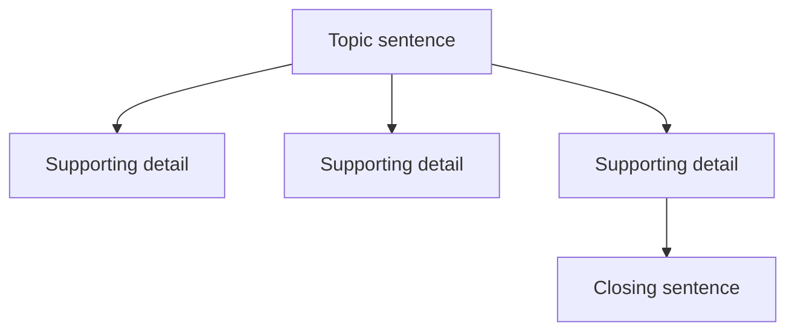
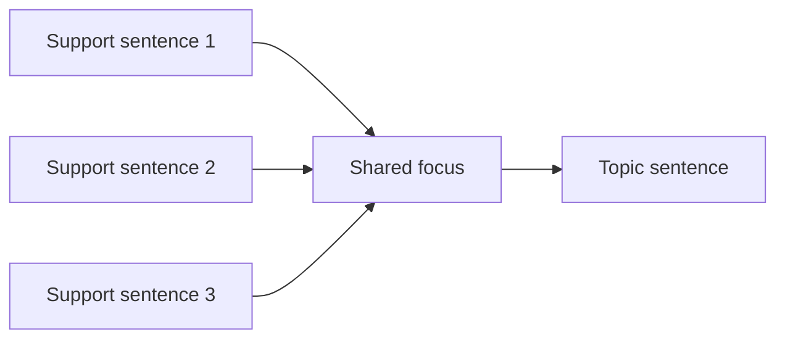
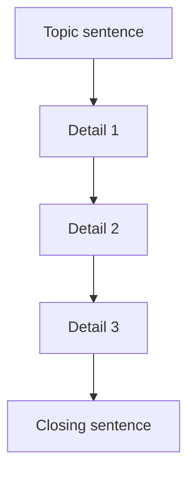

# Topic Sentence

## Explanations

### Introduction

A topic sentence is usually the broad opening sentence that introduces the central idea of a paragraph. In Civil Service Exam paragraph organization items, you often need to choose the sentence that can safely open the paragraph and support all the details that follow.

> [!TIP]
> Ask: "Does this sentence give the paragraph a clear focus without becoming too narrow?"

### Why Topic Is Tested

The CSE uses paragraph organization to check whether you can spot structure, scope, and flow. A strong examinee can tell when a sentence is broad enough to guide the paragraph and when it is only one supporting detail.

### Common Mistakes

- Choosing a detail that should come after the opening sentence.
- Picking a sentence that is too broad and could fit many different paragraphs.
- Using a pronoun or reference word before the noun it refers to.
- Confusing a topic sentence with a title, summary, or conclusion.
- Assuming the first sentence is always correct without checking the paragraph's focus.

### Learning Objectives

- Identify a clear topic sentence.
- Distinguish broad openers from narrow details.
- Use supporting sentences to test whether an opening fits.
- Match titles and summaries to the same central idea.
- Check order and coherence before choosing an answer.

## Topic Sentence Basics

### Overview

A topic sentence introduces the paragraph's main focus. It gives readers a place to start and tells them what the paragraph will develop.

### Core Principle

A good topic sentence is broad enough to include the important details, but focused enough to stay on one idea.

### Visualization

### Common Mistakes

- Starting with a small detail instead of a broad opener.
- Using a sentence that already sounds like a conclusion.
- Beginning with "it," "this," or "they" when the noun has not appeared yet.

### Worked Mini Example

A school recycling drive teaches students to sort waste and reduce trash. Bins are labeled paper, plastic, and metal. Classes track how much waste they divert.

Question: Which sentence would best open a paragraph about the recycling drive?
Choices:
- A school recycling drive teaches students to sort waste and reduce trash.
- The paper bin is next to the cafeteria.
- The principal bought new basketballs.
Answer: A school recycling drive teaches students to sort waste and reduce trash.
Rationale: It is broad enough to support the details that follow.

### Key Insight

If the paragraph can grow naturally from the sentence, the sentence is probably a topic sentence.

### Quick Check

Question: Which sentence would best open a paragraph about hospital handwashing?
Choices:
- Careful handwashing helps prevent infection in hospitals.
- Nurses wear blue gloves.
- The cafeteria serves mango shakes.
Answer: Careful handwashing helps prevent infection in hospitals.
Rationale: It gives the paragraph a broad, clear focus.

Question: Which sentence is too narrow to serve as a topic sentence for a paragraph about a farmers market?
Choices:
- A farmers market gives shoppers fresh food and supports local growers.
- One vendor sells sweet corn on Saturdays.
- Local markets can help communities.
Answer: One vendor sells sweet corn on Saturdays.
Rationale: It is only one detail, not the whole point.

Question: Which sentence is most likely a topic sentence because it is broad enough for the details that follow?
Choices:
- A clear school schedule helps students manage time and avoid confusion.
- The first class starts at 7:10 a.m.
- The bulletin board is painted blue.
Answer: A clear school schedule helps students manage time and avoid confusion.
Rationale: It can support several related details.

## Broad vs Narrow Openers

### Overview

Topic sentence questions often test scope. The correct answer is not just true; it also has to fit the size of the paragraph.

### Core Principle

Too broad covers more than the paragraph explains. Too narrow covers only one detail. Just right covers the full paragraph without wandering.

### Visualization

| Scope | What it means | Example clue |
|---|---|---|
| Too broad | Wider than the paragraph | Could fit many passages |
| Just right | Matches the paragraph exactly | Covers all the details |
| Too narrow | Only one small point | Sounds specific but incomplete |

### Common Mistakes

- Choosing a sentence that is true but too general.
- Choosing one supporting detail and treating it like a full opener.
- Selecting a sentence that shifts to a related but different idea.

### Worked Mini Example

Preparing for a storm helps families stay calm and safe when bad weather arrives. Households store water and flashlights. They secure loose items outside. They know evacuation routes.

Question: Which sentence is too broad to serve as the topic sentence?
Choices:
- Weather can change quickly.
- Preparing for a storm helps families stay calm and safe when bad weather arrives.
- Households store water and flashlights.
Answer: Weather can change quickly.
Rationale: It is true, but it is broader than the paragraph's focus.

### Key Insight

The best opener and the paragraph should be about the same size.

### Quick Check

Question: Which choice is too broad to serve as the topic sentence of a paragraph about park maintenance?
Choices:
- Public spaces need regular care.
- Workers trim overgrown grass and empty trash bins.
- The bench near the entrance was repainted.
Answer: Public spaces need regular care.
Rationale: It is broader than the paragraph's actual focus.

Question: Which choice is too narrow to serve as the topic sentence of a paragraph about office filing?
Choices:
- A filing system helps workers find records quickly and avoid mistakes.
- The red folder holds payroll forms.
- Organization saves time in the office.
Answer: The red folder holds payroll forms.
Rationale: It is only one detail, not the full idea.

Question: Which sentence best keeps the paragraph focused on one clear idea?
Choices:
- A coastal cleanup protects marine life and keeps the shore pleasant for visitors.
- Volunteers collect plastic from the sand.
- The town built a new fountain downtown.
Answer: A coastal cleanup protects marine life and keeps the shore pleasant for visitors.
Rationale: It is broad enough to support the related details.

## Reading the Support Sentences

### Overview

The sentences that follow the opening help reveal what the topic sentence must be. If the details all point in one direction, the opening sentence should point there too.

### Core Principle

Look for the shared idea across the support sentences. That shared idea is usually the best clue to the topic sentence.

### Visualization

### Common Mistakes

- Ignoring repeated nouns and reference words.
- Choosing an opener that sounds nice but does not match the details.
- Looking at only one supporting sentence instead of the full set.

### Worked Mini Example

Volunteer tutoring gives students extra practice and personal encouragement. Tutors review homework. They explain difficult lessons slowly. They praise small improvements.

Question: Which sentence would best open this paragraph?
Choices:
- Volunteer tutoring gives students extra practice and personal encouragement.
- The gym replaced the broken mirror.
- Tutors review homework after school.
Answer: Volunteer tutoring gives students extra practice and personal encouragement.
Rationale: The support sentences all fit that broad idea.

### Key Insight

The details act like guardrails. They show where the topic sentence must stay.

### Quick Check

Question: Which sentence best opens a paragraph whose details explain exact departure times and transfer points?
Choices:
- A clear transit schedule helps riders plan trips and avoid delays.
- The station sold souvenirs near the entrance.
- The first bus leaves at 6:10 a.m.
Answer: A clear transit schedule helps riders plan trips and avoid delays.
Rationale: It matches the shared focus of the details.

Question: Which sentence best opens a paragraph whose details explain trash collection and animal protection on the shore?
Choices:
- A coastal cleanup protects marine life and keeps the shore pleasant for visitors.
- The town built a new fountain downtown.
- Volunteers collect plastic from the sand.
Answer: A coastal cleanup protects marine life and keeps the shore pleasant for visitors.
Rationale: It is broad enough to cover both details.

Question: Which sentence best opens a paragraph whose details describe trimming grass, emptying bins, and checking playground equipment?
Choices:
- Regular park maintenance keeps public spaces clean, safe, and pleasant.
- The city opened a new art gallery.
- Workers trim overgrown grass.
Answer: Regular park maintenance keeps public spaces clean, safe, and pleasant.
Rationale: It covers all of the supporting details.

## Topic Sentence, Title, Summary, and Conclusion

### Overview

These four paragraph parts serve different jobs. A topic sentence opens the paragraph. A title names it. A summary condenses it. A conclusion wraps it up.

### Core Principle

All four should point to the same central idea, but they should not do the same job.

### Visualization

| Part | Job | What to look for |
|---|---|---|
| Topic sentence | Opens the paragraph | Broad and focused |
| Title | Names the paragraph | Short and accurate |
| Summary | Condenses the paragraph | Complete but brief |
| Conclusion | Ends the paragraph | Wraps up the idea |

### Common Mistakes

- Using a title as if it were a full topic sentence.
- Using a summary as an opening line.
- Ending with a brand-new idea instead of a closing thought.

### Worked Mini Example

A community garden helps neighbors share food, space, and responsibility. Volunteers water the beds. Children learn how vegetables grow. Families bring compost and extra seedlings.

Question: Which sentence would best serve as a topic sentence?
Choices:
- A community garden helps neighbors share food, space, and responsibility.
- Volunteers water the beds.
- Families bring compost and extra seedlings.
Answer: A community garden helps neighbors share food, space, and responsibility.
Rationale: It opens the paragraph with the broad idea.

### Key Insight

If a sentence sounds like a label or a recap, it may be a title or summary, not a topic sentence.

### Quick Check

Question: Which choice is the best title for a paragraph about a school recycling drive?
Choices:
- How a Recycling Drive Teaches Responsibility
- The Principal's New Chair
- Sorting Paper and Plastic
Answer: How a Recycling Drive Teaches Responsibility
Rationale: It names the paragraph's central idea clearly.

Question: Which sentence is the best summary of a paragraph about volunteer tutoring?
Choices:
- Volunteer tutoring helps students with homework, explanation, and encouragement.
- The tutor meets the class after school.
- The gym has a new scoreboard.
Answer: Volunteer tutoring helps students with homework, explanation, and encouragement.
Rationale: It condenses the paragraph without losing the main point.

Question: Which sentence is the best conclusion for a paragraph about storm preparedness?
Choices:
- Preparation turns a storm from a surprise into a plan.
- Families store water and flashlights.
- Weather can change quickly.
Answer: Preparation turns a storm from a surprise into a plan.
Rationale: It wraps up the paragraph instead of starting a new idea.

## Sentence Order and Coherence

### Overview

A topic sentence often comes first because it gives the paragraph its frame. The rest of the sentences should follow in a logical order.

### Core Principle

Good paragraph order usually moves from general to specific, or from cause to effect. Pronouns and transition words help you test whether a sentence belongs where it appears.

### Visualization

### Common Mistakes

- Putting a detail before the sentence it refers to.
- Ignoring words like "this," "these," "they," or "therefore."
- Ending with a sentence that introduces a new idea.

### Worked Mini Example

A public transit schedule helps riders plan trips and avoid delays. It shows exact departure times. It lists transfer points. Riders can check when buses run less often.

Question: Which sentence should come first in the paragraph?
Choices:
- A public transit schedule helps riders plan trips and avoid delays.
- It shows exact departure times.
- Riders can check when buses run less often.
Answer: A public transit schedule helps riders plan trips and avoid delays.
Rationale: It gives the paragraph its broad opening idea.

### Key Insight

If the first sentence depends on a later sentence to make sense, the order is probably wrong.

### Quick Check

Question: Which sentence should come first in a paragraph about a science fair?
Choices:
- A science fair helps students investigate questions and explain their findings.
- They present conclusions to visitors.
- They record results carefully.
Answer: A science fair helps students investigate questions and explain their findings.
Rationale: It introduces the topic before the details.

Question: In a paragraph about recycling, what does "they" most likely refer to?
Choices:
- the students
- the bins
- the bottles
Answer: the students
Rationale: The pronoun should point back to the people doing the action.

Question: Which sentence best concludes a paragraph about neighborhood watch?
Choices:
- The group helps neighbors look out for one another.
- Neighbors report unusual activity.
- Residents share emergency contacts.
Answer: The group helps neighbors look out for one another.
Rationale: It closes the paragraph without adding a new focus.

## Worked Examples

### Example 1

A hospital handwashing routine helps prevent infection and protect patients. Staff clean their hands before contact. Soap removes germs. Reminders appear near sinks.

Question: Which sentence is the topic sentence?
Choices:
- A hospital handwashing routine helps prevent infection and protect patients.
- Soap removes germs.
- Reminders appear near sinks.
Answer: A hospital handwashing routine helps prevent infection and protect patients.
Rationale: It states the broad idea that the other sentences support.

### Example 2

A farmers market gives shoppers fresh food and supports local growers. Produce is picked close to market day. Farmers keep more of the sale. Shoppers can ask how food is grown.

Question: Which title best fits the paragraph?
Choices:
- Benefits of Buying at a Farmers Market
- The Parking Lot Was Repaved
- The Old Refrigerator at Home
Answer: Benefits of Buying at a Farmers Market
Rationale: It matches the paragraph's central idea.

### Example 3

Preparing for a storm helps families stay calm and safe. They store water and flashlights. They secure loose items outside. They know evacuation routes.

Question: Which sentence is off-topic?
Choices:
- Preparing for a storm helps families stay calm and safe.
- They secure loose items outside.
- The school painted the library door green.
Answer: The school painted the library door green.
Rationale: It breaks the paragraph's focus on storm preparation.

## Key Takeaways

- A topic sentence opens the paragraph with a clear, broad focus.
- The best opener is broad enough for the details but not so broad that it fits many different paragraphs.
- Supporting sentences, titles, summaries, and conclusions all help confirm the paragraph's focus.
- Pronouns, transitions, and repeated ideas can reveal the correct order of sentences.
- If a sentence does not help the paragraph develop one central idea, it is probably the wrong answer.

## Summary

Topic sentence items in paragraph organization are really structure questions. If you can identify the broad idea that supports the details, you can choose the best opening sentence, the best title, the best summary, and the sentence that does not belong.

## Final Challenge

### Mixed Practice Set

Question: Which sentence best opens a paragraph about an office filing system?
Choices:
- A filing system helps workers find records quickly and avoid mistakes.
- The office installed a new coffee machine.
- The red folder holds payroll forms.
- The copier is near the window.
Answer: A filing system helps workers find records quickly and avoid mistakes.
Rationale: It gives the paragraph a clear, broad opening idea.

Question: Which sentence does not belong in a paragraph about park maintenance?
Choices:
- Workers trim overgrown grass.
- They empty trash bins.
- They inspect playground equipment.
- The city opened a new art gallery.
Answer: The city opened a new art gallery.
Rationale: It shifts away from the paragraph's focus on park upkeep.

Question: Which order best arranges the sentences into a coherent paragraph about volunteer tutoring?
Choices:
- A-B-C-D
- B-A-C-D
- A-C-B-D
- D-C-B-A
Answer: A-B-C-D
Rationale: The broad idea comes first, followed by the supporting details and the closing thought.

### Self Assessment

- I can tell a topic sentence from a detail.
- I can check whether a sentence is too broad or too narrow.
- I can match a title, summary, and conclusion to the same focus.
- I can use pronouns and transitions to test sentence order.

### What's Next?

Next, practice the same skills on longer paragraphs with more subtle distractors. Once you can spot the opening idea quickly, paragraph organization questions become much faster to solve.
